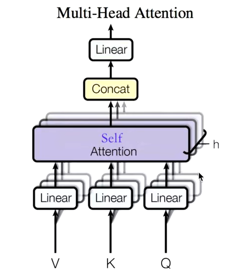
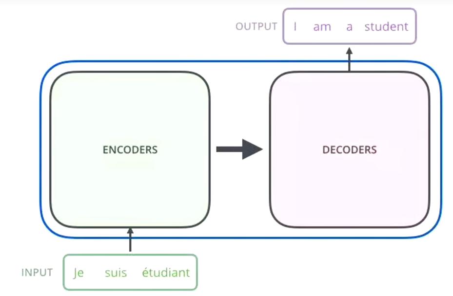

### 一.注意力机制

QK相乘是求相似度，做一个缩放scale（未来做softmax的时候避免出现极端情况，就是求出的概率非常不合理），然后做Softmax得到概率（Q和每一个ki的相似度，K里面的哪一个东西对于Q而言是更重要的），

新的向量表示了K和V（K==V），然后这种表示还暗含了Q的信息（于Q而言，K里面重要的信息），也就是说挑出了K里面的关键点。

- 交叉自注意力机制：Q和K,V不同源，但是K和V同源。

### 二.自注意力机制（Self-Attention, self表示QKV同源）

> Self-Attention的关键点在于，不仅仅是K==V==Q 来源于同一个X，这三者是同源的。通过X找到X里面的关键点。
>
> 并不是K=V=Q=X，而是通过三个参数 Wq, Wk, Wv。
>
> 剩余具体原理参考如下博客：

https://www.cnblogs.com/nickchen121/p/16470569.html#tid-nfhK8B

- self-Attention就是给定一个X，通过一个自注意力模型，得到一个Z，这个Z就是对X的新的表征（词向量），Z这个词向量相比较于X拥有了句法特征和语义特征。（**预训练语言模型一直在追求的一个方向，怎么把词向量做的更准，每个词向量都能精准的描述对应的词，做下游任务就更好。**）

### 三.Self-Attention相比于RNN和LSTM的优缺点

#### 3.1 RNN 

上面的A单元特别简单，就是wx+b，就是一层线性变换。

当t特别大的时候，X0的信息可能会消失，传不到Xt，无法做到参考上文，**无法做长序列。**只适合短序列。

#### 3.2 LSTM

LSTM做了记忆单元（通过记忆门和遗忘门会对前面的信息做出一定的保留）。可以做更长的段落。

#### 3.3 Self-Attention和RNNs的区别：

- 可以看到RNNs和LSTM都是顺序模型，不能并行计算。
- RNNs也无法做长序列依赖问题。

**Self-Attenion解决了长序列依赖关系**：self-attention对每一个词和句子中的每一个单词做一个相似度计算。（解决了长序列依赖关系）

**Self-Attenion可以并行计算：**（同时做，堆积为矩阵即可。）

**Self-Attenion其它优点：**得到的新的词向量具有**句法特征**和**语义特征**（词向量的表征更完善）

**Self-Attenion缺点：**Self-Attenion的计算量非常庞大。

### 四.Masked Self-Attention(掩码自注意力机制)

自注意力机制明确知道这句话有多少个单词，并且一次性给足，而掩码是分批次给，最后一次才给足。（因为对于生成句子的时候，是一个一个生成的。）

- 掩码前：

- 掩码后：

### 五.Multi-Head Self-Attention（多头自注意力机制）

- Z相比较X有了提升，通过Multi-Head Self-Attention，得到的Z'相比较Z又有了进一步提升。

什么是多头：多头的个数用h表示，一般h=8。

- 具体计算过程：https://www.cnblogs.com/nickchen121/p/16470569.html#tid-4fzS4n

对于X，不是直接拿X去得到Z，而是把X做线性变换分成了8块（8头），然后分别做Self-Attention，得到Z0-Z7。然后把Z0和Z7拼接起来，再做一次线性变换（改变维度）得到Z。

- 有什么作用：

机器学习的本质是什么：y=f(wx+b)，在做一件什么事情：wx+b是线性变换，加上f()激活函数后，就变成了非线性变换（把一个看起来不合理的东西，通过某种手段（训练模型），让这个东西变得合理）。

非线性变换的本质又是什么：改变空间上的位置坐标，任何一个点都可以在维度空间上找到，通过某个手段，让一个不合理的点（位置不合理），变得合理。

这就是词向量的本质。

one-hot编码（01010101）

multi-head Attention（123，12，45）又去找了一个点，把X切分为8块，这样一个原先在一个位置上的X，去了空间上的8个位置，通过对8个点进行寻找，找到更合适的位置。

- 缺点：分成了8个点，反向传播backward需要更新的参数也就更多，时间复杂度就更高。

### 六.Position Encoding（为什么需要位置编码：解决Attention的缺陷。）

#### 6.1 为什么Attention需要位置编码：

- Attention的优点：

> 解决了长序列依赖问题，并且可以并行计算

- Attention的缺点：

> 1.需要优化的参数变多，时间复杂度更高，开销变大了。

> 2.既然可以并行，也就是说词与词之间不存在顺序关系了（打乱一句话，这句话里的每个词的词向量依然不会变）。即无位置关系（既然没有，我就加一个，通过位置编码的形式加）。

#### 6.2 如何做位置编码：

包含了X1-X3之间的位置关系，可以回顾前面的RNN是默认包括了位置信息的，因为它是顺序模型，顺序计算的。

- 具体做法：

pos是位置，i是维度（词向量的维度大概是512维）。

- 为什么这样做有用：

pos+k=5，在计算第5个单词的位置编码的时候：

pos=1，k=4

pos=2,   k=3

简单理解：pos+k的的位置向量，可以表示为，pos位置向量与k位置向量的线性组合。这就构建了中心点坐标与其邻域k的位置相关表示。

其实应该举一个有重复词语的例子，比如**他和他的她**。通过计算'他’这个词的注意力得分发现，两个'他'的得分是一致的，无法区分位置关系，因此需要位置编码区分两个'他'的位置。

input embedding：通过 one-hot 或者 word2vec 对单词做出来的词向量。

### 七.Transformer 框架（https://www.cnblogs.com/nickchen121/p/16470569.html#tid-4fzS4n）

**NLP中预训练的目的：**其实就是为了生成词向量，词向量进行下游任务。

- 整体框架：transformer其实就是attention的一个堆叠。

transformer就是一个seq2seq模型：序列（编码器）到序列（解码器）。

通过机器翻译来做解释：给一个输入，给出一个输出（输出是输入翻译的结果）

“我是一个学生”    ----(通过transformer)--->    “I am a student”

编码器：把输入变成一个词向量（self-Attention）

解码器：获取编码器输出的词向量后，生成翻译的结果。

Nx的意思是，编码器里面又有N个小编码器（默认N=6），通过6个编码器，对词向量一步又一步的强化（增强）

我们想要详细了解 Transformer，只要了解 Transformer 中的 Encoder 和 Decoder 单元即可，接下来我们将详细阐述这两个单元。

Encoder-Decoder Attention是交叉注意力（交叉自注意力机制：Q和K,V不同源，但是K和V同源。），Q不等于K，但是K==V。

Feed Forward（FFN）其实就是两层线性变换再套一层激活函数：  ReLu(w2((w1*x+b1))+b2)。

#### 7.1 Transformer的编码器（Encoders）

编码器包括两个子层，Self-Attention和Feed Forward。

每一个子层的传输过程中都会有一个（残差网络+归一化）

Thinking  --->  得到绿色的X1（词向量，可以通过one-hot，word2vec得到） +  叠加位置编码（给X1赋予位置属性）得到黄色的X1 ---> 输入到Self-Attention子层中，做注意力机制，得到Z1（表征的仍然是thinking），Z1拥有了位置特征，句法特征，语义特征（相对Thinking Machines这句话而言的）的词向量。

残差网络：避免梯度消失

归一化（LayerNorm）：做标准化（避免梯度爆炸）。

----> 通过残差连接和归一化（add&Normalize）之后，得到深粉色的Z1  --->  再通过Feed Forward（FNN）:=  Relu(w2(w1x+b)+b)，其中Relu就是激活函数。（前面每一步都在做线性变换，wx+b，线性变换的叠加永远都是线性变换（永远都是一条直线，线性变换就是空间中的平移和缩放），通过Feed Forward中的激活函数Relu做一次非线性变换，这样的空间变换可以无限拟合任何一种状态了） --->然后通过add&Normalize  --->  得到r_1（是thinking的新的表征）。

**总结：**Encoder的核心就是**在做词向量**（让这个词向量能够更加精准的表示这个单词、这句话），词向量作为K,V应用于后面的N个Decoder。

编码器在干嘛？词向量，图片向量，时间序列向量，总而言之，编码器就是让计算机能够更合理地认识人类世界客观存在的一些东西。

#### 7.2 Transformer的解码器（Decoders）

以机器翻译为例：

解码器接受编码器生成的词向量，然后通过这个词向量去生成翻译的结果。

解码器的Self-Attention对已经生成的单词进行自编码。假如目标词“我是一个学生”   --->  masked Self-Attention

训练阶段：目标词“我是一个学生”是已知的，然后Self-Attention是对“我是一个学生”做计算。

如果不做masked，每次训练阶段，都会获得全部的信息。

如果做masked，Self-Attention第一次对“我”做计算，第二次对“我是”做计算，...

测试阶段：

1.目标词未知，假设目标词是“我是一个学生”，Self-Attention第一次对“我”做计算

2.第二次对“我是”做计算

3....

而测试阶段，每生成一点，获得一点

Encoder-Decoder Attention：Q来自Decoder，K和V同源来自Encoder。

**生成词**

Linear层转换为词表的维度，softmax得到最大词的概率。

#### 7.3 为什么Decoder需要做Mask

机器翻译：源语句（我爱中国），目标语句（I love China）

为了解决训练阶段和测试阶段的gap（不匹配）

训练阶段：解码器会有输入，这个输入是目标语句，就是I love China，通过已经生成的词，去让解码器更好的生成。（每一次都会把所有信息告诉解码器）

测试阶段：解码器也有输入，但是此时，测试的时候是不知道目标语句是什么的，这个时候，每生成一个词，就会有多一个词放入目标语句中。（测试阶段只会把已经生成的词告诉解码器）

为了匹配，masked Self-Attention就登场了，我在训练阶段，就做一个masked，

#### 7.4 为什么Encoders给予Decoders的是K，V矩阵

Q来源于解码器，K==V来源于编码器

Q是查询变量，Q是已经生成的词，

K==V是源语句，

当我们生成这个词的时候，通过已经生成的词和源语句做自注意力，就是确定源语句中哪些词对接下来的词的生成更有作用。