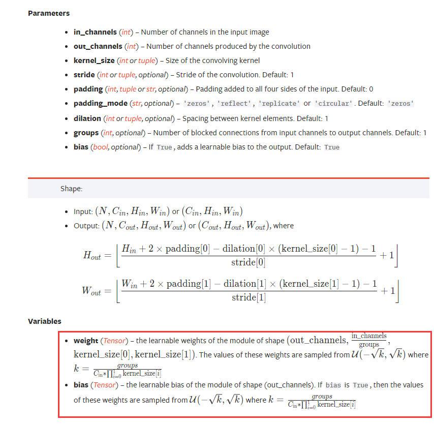
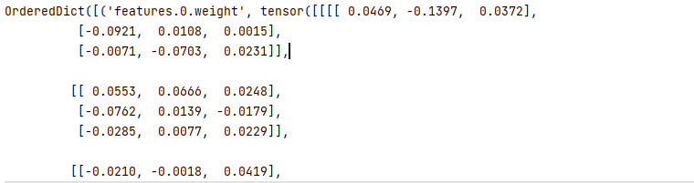

## pytorch学习总结

### 1.处理和加载数据

#### 1.1Dataset抽象类和PIL.Image的使用

> 数据的文件结构如下所示：


```python
from torch.utils.data import Dataset

# help(Dataset)  或者Dataset??  可以查看官方解释  或者按ctrl+左键点击

from PIL import Image
import os


class MyData(Dataset):   # MyData类继承Dataset类

    def __init__(self, root_dir, label_dir):
        self.root_dir = root_dir
        self.label_dir = label_dir
        self.path = os.path.join(self.root_dir, self.label_dir)
        self.img_path = os.listdir(self.path)

    def __getitem__(self, idx):
        img_name = self.img_path[idx]
        img_item_path = os.path.join(self.root_dir, self.label_dir, img_name)   # 下标为idx的图片的地址
        img = Image.open(img_item_path)
        label = self.label_dir
        return img, label

    def __len__(self):
        return len(self.img_path)


root_dir = 'E:\\MyProjects\\PycharmProjects\\review_pytorch\\dataset_bee_ants\\train'
ants_dir = 'ants_images'
ants_dataset = MyData(root_dir, ants_dir)

# 读取第二个蚂蚁图片
image, label = ants_dataset[1]  # 调用的__getitem__函数   等价于ants_dataset.__getitem__(1)
print(len(ants_dataset))  # 调用的__len__函数   等价于ants_dataset.__len()__
# image.show()
```

> 需求：创建两个文件夹分别为ants_labels，bees_labels，将每张图片对应的label存在相应文件里面，例如：ants_images\\5650366_e22b7e1065.jpg这张图片，在ants_labels文件夹下创建一个5650366_e22b7e1065.txt文件，里面写上ants

```python
import os

def get_image_name_list(root_dir):
    # 先读取对应文件的文件名
    list_img_name = os.listdir(root_dir)
    return list_img_name

def work(root_dir, label_dir, label):
    list = get_image_name_list(root_dir)
    n = len(list)
    for idx in range(n):
        file_name = list[idx].split('.')[0] + '.txt'
        with open(os.path.join(label_dir, file_name), "w") as fout:
            fout.write(label)


ants_root_dir = "E:\\MyProjects\\PycharmProjects\\review_pytorch\\dataset_bee_ants\\train\\ants_images"
ant_label_dir = "E:\\MyProjects\\PycharmProjects\\review_pytorch\\dataset_bee_ants\\train\\ants_labels"
bees_root_dir = "E:\\MyProjects\\PycharmProjects\\review_pytorch\\dataset_bee_ants\\train\\bees_images"
bees_label_dir = "E:\\MyProjects\\PycharmProjects\\review_pytorch\\dataset_bee_ants\\train\\bees_labels"


work(ants_root_dir, ant_label_dir,"ant")
work(bees_root_dir, bees_label_dir,"bee")
```

> 效果如下：


### 2.TensorBoard的使用

#### 2.1SummaryWriter类使用


##### 2.1.1add_scalar()方法的使用（一般用来显示train_loss的一种方式）


> 需求：画一个y=2x的函数

```python
from torch.utils.tensorboard import SummaryWriter

# event files 存储在my_logs文件夹下
writer = SummaryWriter("my_logs")

# 绘制一个 y = 2x
for i in range(100):
    writer.add_scalar("y=2x", i * 2, i) # title  保存的value  step

writer.close()
```


> 如何打开这个事件文件event file：在terminal中进入my_logs同级的文件夹，输入指令`tensorboard --logidr=my_logs [--port=6007]` ，其中logdir = 事件文件所在文件夹名，port为可选项，默认打开6006端口。


> 打开网址进入如下所示：


##### 2.1.2add_image()的使用


> 可以看到需要的图片数据类型，我们将图片读为numpy类型。
>
> 方法1：利用opencv读取图片，获得numpy型图片数据。
>
> 方法2：利用numpy.array()，对PIL图片进行转换。

- 方法1：用opencv读图片为numpy类型

```python
import cv2
img_cv = cv2.imread(img_path)  # 读的图片就是numpy类型的
```

- 方法2：利用Image.open()将图片打开为PIL类型，然后利用np.array()转为numpy类型。

```python
from torch.utils.tensorboard import SummaryWriter
import numpy as np
from PIL import Image

# event files 存储在哪个文件夹下
writer = SummaryWriter("my_logs")

image_path = "E:\\MyProjects\\PycharmProjects\\review_pytorch\\dataset_bee_ants\\train\\ants_images\\0013035.jpg"
img_PIL = Image.open(image_path)
img_np = np.array(img_PIL)
print(type(img_np), img_np.shape)  # <class 'numpy.ndarray'> (512, 768, 3)

writer.add_image("add_image_test", img_np, 1, dataformats='HWC')

writer.close()
```


### 3.Transforms的使用

> transforms.py 是一个工具箱，里面有totensor，resize等工具。

> 问题：什么是tensor数据类型，在神经网络中，训练的数据需要转为tensor类型

- 利用transforms.ToTensor类来创建工具，将图片转为tensor类型的数据。

```python
from torchvision import transforms
from PIL import Image

image_path = "E:\\MyProjects\\PycharmProjects\\review_pytorch\\dataset_bee_ants\\train\\ants_images\\0013035.jpg"
img_PIL = Image.open(image_path)
img_PIL.show()

transforms_totensor = transforms.ToTensor()  # 得到totensor类的一个对象
img_tensor = transforms_totensor(img_PIL)


print(type(img_tensor), img_tensor.shape)  # <class 'torch.Tensor'> torch.Size([3, 512, 768])
```

- Normalize、 Resize、Compose等的作用

```python
from PIL import Image
from torch.utils.tensorboard import SummaryWriter
from torchvision import transforms

img_path = "E:\\MyProjects\\PycharmProjects\\review_pytorch\\dataset_bee_ants\\train\\ants_images\\0013035.jpg"

img_PIL = Image.open(img_path)
print(img_PIL) # <PIL.JpegImagePlugin.JpegImageFile image mode=RGB size=768x512 at 0x23513312E80>

# totensor的使用
trans_totensor = transforms.ToTensor()
img_tensor = trans_totensor(img_PIL)
# print(img_tensor)

# normalize的使用
# 计算公式: output[channel] = (input[channel] - mean[channel]) / std[channel]
print(img_tensor[0][0][0])  # tensor(0.3137)
trans_norm = transforms.Normalize([0.5, 0.5, 0.5], [0.5, 0.5, 0.5])   # def __init__(self, mean, std, inplace=False):
img_norm = trans_norm(img_tensor) 
print(img_norm[0][0][0])  # tensor(-0.3725)

#Resize的使用，对图片大小进行缩放（既可以对PIL类型图片进行resize，也可以对tensor图片类型进行resize）
print(img_PIL.size)  # (768, 512)
trans_resize1 = transforms.Resize(1000)
img_resize1 = trans_resize1(img_PIL)

trans_resize2 = transforms.Resize([200, 500])  # (h, w)
img_resize2 = trans_resize2(img_PIL)
print(img_resize1.size, img_resize2.size) # (1500, 1000) (500, 200)

img_resize3 = trans_resize1(img_tensor)
print(type(img_resize3)) # <class 'torch.Tensor'>

#Compose 的使用
trans_compose = transforms.Compose([trans_resize1, transforms.ToTensor()])
img_resize4 = trans_compose(img_PIL)
print(type(img_resize4)) # <class 'torch.Tensor'>

writer = SummaryWriter('my_logs')

writer.add_image("Totensor", img_tensor, 0)
writer.add_image("Normalize", img_norm, 0)
writer.add_image("Resize", trans_totensor(img_resize1), 0)
writer.add_image("Resize", trans_totensor(img_resize2), 1)
writer.add_image("Resize", img_resize3, 2)

writer.close()
```


### 4.torchvision中数据集的使用

- 1.如何下载数据集和训练集

```python
import torchvision
# 在对应文件夹下就会出现下载好的数据。
train_set = torchvision.datasets.CIFAR10("E:\\MyProjects\\PycharmProjects\\review_pytorch\\torchvisionDataset", train=True, download=True)
test_set = torchvision.datasets.CIFAR10("E:\\MyProjects\\PycharmProjects\\review_pytorch\\torchvisionDataset", train=False, download=True)

# print(len(train_set), len(test_set))  # 50000 10000
print(train_set.classes)  # ['airplane', 'automobile', 'bird', 'cat', 'deer', 'dog', 'frog', 'horse', 'ship', 'truck']
img, target = train_set[0]
print(img, target) # <PIL.Image.Image image mode=RGB size=32x32 at 0x299532C0430> 6  可以看到是PIL类型的图片
img.show()  # 可以直接查看PIL类型的图片

```

- 下载好后如下图所示：


- 2.现在需要把PIL的图片数据类型转为tensor类型，可以利用torchvision.transforms。

```python
import torchvision

from torchvision import transforms

trans_totensor = transforms.ToTensor()

train_set = torchvision.datasets.CIFAR10("E:\\MyProjects\\PycharmProjects\\review_pytorch\\torchvisionDataset", train=True, transform=trans_totensor, download=True)
test_set = torchvision.datasets.CIFAR10("E:\\MyProjects\\PycharmProjects\\review_pytorch\\torchvisionDataset", train=False, transform=trans_totensor, download=True)

# print(len(train_set), len(test_set))  # 50000 10000
print(train_set.classes)  # ['airplane', 'automobile', 'bird', 'cat', 'deer', 'dog', 'frog', 'horse', 'ship', 'truck']
img, target = train_set[0]
print(type(img), target) # <class 'torch.Tensor'> 6
```

- 接下来用tensorboard展示一下数据集（展示训练集前10张图片）

```python
import torchvision
from torch.utils.tensorboard import SummaryWriter

from torchvision import transforms

trans_totensor = transforms.ToTensor()

train_set = torchvision.datasets.CIFAR10("E:\\MyProjects\\PycharmProjects\\review_pytorch\\torchvisionDataset", train=True, transform=trans_totensor, download=True)
test_set = torchvision.datasets.CIFAR10("E:\\MyProjects\\PycharmProjects\\review_pytorch\\torchvisionDataset", train=False, transform=trans_totensor, download=True)

# print(len(train_set), len(test_set))  # 50000 10000
print(train_set.classes)  # ['airplane', 'automobile', 'bird', 'cat', 'deer', 'dog', 'frog', 'horse', 'ship', 'truck']
img, target = train_set[0]
print(type(img), target) # <class 'torch.Tensor'> 6


writer = SummaryWriter("./my_logs")

for i in range(10):
    img, label = train_set[i]
    writer.add_image("train_set10", img, i)
writer.close()
```

- 效果如下：


### 5.DataLoader的使用（在torch.utils.data中）

> 这些东西都可以在pytorch官网进行搜索查看参数以及例子，帮组更好的理解以及使用。

```python
import torchvision

from torchvision import transforms
from torch.utils.data import DataLoader

test_data = torchvision.datasets.CIFAR10("../torchvisionDataset", train=False, transform=transforms.ToTensor(), download=True)
# 将Dataset类型的数据（也可以是自己定义的数据）放入   每批次取20个数据进行打包   每epoch轮训练结束后，开始下一轮训练时，是否需要将数据集进行打乱（洗牌，使得每一轮的每一次取的数据都不一样，更具有随机性）   每轮训练的最后一个批次发现不足20时，是否丢弃
data_loader = DataLoader(test_data, batch_size=20, shuffle=True, drop_last=True) 
```

- 1.如何取出data_loader中的每一次返回呢？(data_loader每一批次会将batch_size个数据进行打包，先将batch_size个img进行打包返回，再将img对应的batch_size个target进行打包返回，在程序中可以体现出来。)

```python
import torchvision

from torchvision import transforms
from torch.utils.data import DataLoader

test_data = torchvision.datasets.CIFAR10("../torchvisionDataset", train=False, transform=transforms.ToTensor(), download=True)

img, target = test_data[0]
print(img.shape) # torch.Size([3, 32, 32])

#test_data数据集的长度：10000
print(len(test_data))  # 10000

# 将Dataset类型的数据（也可以是自己定义的数据）放入   每批次取4个数据   每epoch轮训练结束后，开始下一轮训练时，是否需要将数据集进行打乱   每轮训练的最后一个批次发现不足4时，是否丢弃
data_loader = DataLoader(test_data, batch_size=4, shuffle=True, drop_last=True)

# 如何取出data_loader中的每一个返回呢? 用for循环

# 10000个数据按每次取4个，可以取多少次，可以得出是2500次，意味着每一轮训练，需要打包2500次，每次往模型输入4个数据，加快训练速度。
batch_cnt = 0

for data in data_loader:
    batch_cnt += 1
    imgs, targets = data
    print(imgs.shape) # torch.Size([4, 3, 32, 32])
    print(targets)   #  tensor([5, 5, 3, 3]) 每一次循环输出的targets都不一样

print(batch_cnt) # 2500

```

- 2.如何用tensorboard对每batch批次的图片（每batch有多个图片）进行展示，使用`add_images`。

```python
import torchvision
from torch.utils.tensorboard import SummaryWriter

from torchvision import transforms
from torch.utils.data import DataLoader

test_data = torchvision.datasets.CIFAR10("../torchvisionDataset", train=False, transform=transforms.ToTensor(), download=True)
# 将Dataset类型的数据（也可以是自己定义的数据）放入   每批次取64个数据   每epoch轮训练结束后，开始下一轮训练时，是否需要将数据集进行打乱   每轮训练的最后一个批次发现不足64时，是否丢弃
data_loader = DataLoader(test_data, batch_size=64, shuffle=True, drop_last=True)

writer = SummaryWriter("my_logs")
batch_cnt = 0

for data in data_loader:
    imgs, targets = data
    writer.add_images("dataloader", imgs, batch_cnt)    # 每次展示batch_size=64张图片
    batch_cnt += 1

writer.close()

```

- 效果如下：


### 6.神经网络的基本骨架nn.Module的使用

#### 6.1nn.module

```python
import torch
from torch import nn

class MyModel(nn.Module):  # 任何模型都得继承nn.module这个类，并且重写下面两个方法
    def __init__(self):
        super().__init__()

    def forward(self, x):
        return x + 1

add_model = MyModel()   # 创建一个MyModel类的模型

x = torch.tensor(1.0)
y = add_model(x)  # 然后调用该模型，将输入x输入，debug会观察到，调用的是forward函数
print(y)   #tensor(2.)
```


#### 6.2nn_F_conv  （创建模型都是用torch.nn里面封装好了的，torch.nn.functional里面的东西是原生态的，没怎么进行封装，在这里是为了理解原理讲解的。）

> 卷积的计算过程以及原理（对应格子相乘再相加），stride=1：


> 写程序来验证上述图解：

```python
import torch
from torch import nn

img_tensor = torch.tensor([[1, 2, 0, 3, 1],
                           [0, 1, 2, 3, 1],
                           [1, 2, 1, 0, 0],
                           [5, 2, 3, 1, 1],
                           [2, 1, 0, 1, 1]])

conv_kernel = torch.tensor([[1, 2, 1],
                            [0, 1, 0],
                            [2, 1, 0]])

print(img_tensor.shape)  # torch.Size([5, 5])
print(conv_kernel.shape) # torch.Size([3, 3])
# 不满足形状，需要reshape一下

img_tensor = torch.reshape(img_tensor,[1, 1, 5, 5])
conv_kernel = torch.reshape(conv_kernel, [1, 1, 3, 3])
print(img_tensor.shape) # torch.Size([1, 1, 5, 5])
print(conv_kernel.shape) # torch.Size([1, 1, 3, 3])

# stride表示的是卷积核每次左右以及上下移动的步幅大小。
output = nn.functional.conv2d(img_tensor, conv_kernel, stride=1)
print(output)

# tensor([[[[10, 12, 12],
#           [18, 16, 16],
#           [13,  9,  3]]]]) 对应上述图片
```

> stride=1, padding=1时：


```python
import torch
from torch import nn

img_tensor = torch.tensor([[1, 2, 0, 3, 1],
                           [0, 1, 2, 3, 1],
                           [1, 2, 1, 0, 0],
                           [5, 2, 3, 1, 1],
                           [2, 1, 0, 1, 1]])

conv_kernel = torch.tensor([[1, 2, 1],
                            [0, 1, 0],
                            [2, 1, 0]])

print(img_tensor.shape)  # torch.Size([5, 5])
print(conv_kernel.shape) # torch.Size([3, 3])
# 不满足形状，需要reshape一下

img_tensor = torch.reshape(img_tensor,[1, 1, 5, 5])
conv_kernel = torch.reshape(conv_kernel, [1, 1, 3, 3])
print(img_tensor.shape) # torch.Size([1, 1, 5, 5])
print(conv_kernel.shape) # torch.Size([1, 1, 3, 3])

# padding表示在图像数据的周围（4个边）添加多少像素，并且默认都为0
output = nn.functional.conv2d(img_tensor, conv_kernel, stride=1, padding=1)  
print(output)

# tensor([[[[ 1,  3,  4, 10,  8],
#           [ 5, 10, 12, 12,  6],
#           [ 7, 18, 16, 16,  8],
#           [11, 13,  9,  3,  4],
#           [14, 13,  9,  7,  4]]]])
```

#### 6.3在torch.nn.Conv2d中只需要给出卷积核的大小即可，卷积核中的参数都是可学的。



#### 6.4 nn.MaxPool2d（最大池化层：在卷积核覆盖的当前矩阵里面取最大值）


> 池化操作的原理解释（取最大值，ceil_model=true就是保留边界不足的情况的计算）：


> 程序验证上述原理（最大池化层没有像卷积层那样有可学的权重）：

```python
import torch
from torch import nn

input = torch.tensor([[1, 2, 0, 3, 1],
                      [0, 1, 2, 3, 1],
                      [1, 2, 1, 0, 0],
                      [5, 2, 3, 1, 1],
                      [2, 1, 0, 1, 1]], dtype=torch.float32)

input = torch.reshape(input, [-1, 1, 5, 5])  # -1会自动推断这一维是多少
print(input.shape) #torch.Size([1, 1, 5, 5])

class MyModel(nn.Module):
    def __init__(self):
        super().__init__()
        self.maxpool1 = nn.MaxPool2d(3, ceil_mode=True)  # ceil_mode=True 最大池化卷积核跑出边界的情况依旧计算并且保留
    def forward(self, x):
        x = self.maxpool1(x)
        return x
model = MyModel()
output = model(input)
print(output)

# tensor([[[[2., 3.],
#           [5., 1.]]]])

# 将self.maxpool1 = nn.MaxPool2d(3, ceil_mode=False)
# 最后输出如下：
# tensor([[[[2.]]]])
```

> 从最大池化的原理可以看出其作用以及目的：保留输入的特征，同时把数据量减少 。例如：把5x5的图片变成3x3或1x1的。利用tensorboard来直观感受一下。

```python
from torch import nn
import torchvision
from torch.utils.data import DataLoader
from torch.utils.tensorboard import SummaryWriter

test_dataset = torchvision.datasets.CIFAR10("../torchvisionDataset", train=False, transform=torchvision.transforms.ToTensor(), download=True)

data_loader = DataLoader(test_dataset, batch_size=64, shuffle=True, drop_last=False)

class MyModel(nn.Module):
    def __init__(self):
        super().__init__()
        self.maxpool1 = nn.MaxPool2d(3, ceil_mode=True)  # ceil_mode=True 最大池化卷积核跑出边界的情况依旧计算并且保留
    def forward(self, x):
        x = self.maxpool1(x)
        return x
model = MyModel()

writer = SummaryWriter("my_logs")
step = 0
for data in data_loader:
    imgs, targets = data  # imgs.shape = torch.Size([64, 3, 32, 32])
    writer.add_images("origin_images", imgs, step)
    writer.add_images("maxpool_images", model(imgs), step)
    step += 1
writer.close()
```

> 效果如下：


> batch_size=16，会看得更加明显：


#### 6.5 非线性激活

> ReLU与Sigmoid这两种激活方式，都没有可学的权重，引入非线性变换，增强模型的泛化能力。


> 图片结果sigmoid非线性激活的对比效果如下：


#### 6.6 线性层及其它层等（官网都可一一查看）

> Linear层的图解：


> 其原理如下：


#### 6.7 flatten（展平）

> 注意和torch.reshape(data:tensor, shape:[int tuple list])的区别。torch.nn.Flatten里面也封装好了的。


> 代码实验如下：

```python
import torch

t = torch.tensor([[[1, 2],
                   [3, 4]],
                  [[5, 6],
                   [7, 8]]])

print(t.shape) # torch.Size([2, 2, 2])
print(torch.flatten(t), torch.flatten(t).shape) #从维度0到维度2依次展平
# tensor([1, 2, 3, 4, 5, 6, 7, 8])  torch.Size([8])

print(torch.flatten(t, start_dim=1), torch.flatten(t, start_dim=1).shape) #从维度1到维度2依次展平
# tensor([[1, 2, 3, 4],         
#         [5, 6, 7, 8]])      torch.Size([2, 4])
```

### 7.CIFAR10数据集的模型搭建

> 模型图如下：


> 代码实现如下：

```python
import torch
from torch import nn

#定义模型
class IdentifyModel(nn.Module):
    def __init__(self):
        super().__init__()
        self.model = nn.Sequential(
            nn.Conv2d(3, 32, 5, padding=2),
            nn.MaxPool2d(2, padding=0),
            nn.Conv2d(32, 32, 5, padding=2),
            nn.MaxPool2d(2, padding=0),
            nn.Conv2d(32, 64, 5, padding=2),
            nn.MaxPool2d(2),
            # nn.Flatten()参数的默认值为torch.nn.Flatten(start_dim=1, end_dim=-1)，因为训练模型的时候第0维是batch_size，不需要展平。
            nn.Flatten(), # nn里面也有实现好了的Flatten，和torch.flatten参数稍有区别
            nn.Linear(64*4*4, 64),
            nn.Linear(64, 10)
        )

    def forward(self, x):
        return self.model(x)

# 初始化模型
model = IdentifyModel()

print(model)
# IdentifyModel(
#   (model): Sequential(
#     (0): Conv2d(3, 32, kernel_size=(5, 5), stride=(1, 1), padding=(2, 2))
#     (1): MaxPool2d(kernel_size=2, stride=2, padding=0, dilation=1, ceil_mode=False)
#     (2): Conv2d(32, 32, kernel_size=(5, 5), stride=(1, 1), padding=(2, 2))
#     (3): MaxPool2d(kernel_size=2, stride=2, padding=0, dilation=1, ceil_mode=False)
#     (4): Conv2d(32, 64, kernel_size=(5, 5), stride=(1, 1), padding=(2, 2))
#     (5): MaxPool2d(kernel_size=2, stride=2, padding=0, dilation=1, ceil_mode=False)
#     (6): Flatten(start_dim=0, end_dim=-1)
#     (7): Linear(in_features=1024, out_features=64, bias=True)
#     (8): Linear(in_features=64, out_features=10, bias=True)
#   )
# )

# 现在来验证创建的网络是否是正确的
# 训练的时候，每批次输入64*3*32*32的图片  batch_size*channel*h*w
input = torch.randn([64, 3, 32, 32])
output = model(input)
print(output.shape) # 得到正确的输出，说明没有问题
# torch.Size([64, 10])
```


### 8.损失函数和反向传播

- **非常重要：**

> loss的作用：
>
> 1.计算实际输出和目标之间的差距。（越小越好）
>
> 2.为我们更新输出提供一定的依据（反向传播）。（调节模型中的参数，让模型训练的更好，输出更接近targets）。

- 使用loss_function时，只需要根据具体的问题选择合适的loss_function即可，并确定input和target的形状，在官网中都有解释。

```python
import torch
from torch import nn
import torchvision
from torch.utils.data import DataLoader

dataset = torchvision.datasets.CIFAR10("../torchvisionDataset", train=False, transform=torchvision.transforms.ToTensor(), download=True)

data_loader = DataLoader(dataset, batch_size=1, shuffle=True)
#定义模型
class IdentifyModel(nn.Module):
    def __init__(self):
        super().__init__()
        self.model = nn.Sequential(
            nn.Conv2d(3, 32, 5, padding=2),
            nn.MaxPool2d(2, padding=0),
            nn.Conv2d(32, 32, 5, padding=2),
            nn.MaxPool2d(2, padding=0),
            nn.Conv2d(32, 64, 5, padding=2),
            nn.MaxPool2d(2),
            nn.Flatten(), # nn里面也有实现好了的Flatten，和torch.flatten参数稍有区别
            nn.Linear(64*4*4, 64),
            nn.Linear(64, 10)
        )

    def forward(self, x):
        return self.model(x)

# 初始化模型
model = IdentifyModel()

# 定义交叉熵损失函数
loss = nn.CrossEntropyLoss()
for data in data_loader:
    imgs, targets = data
    output = model(imgs)  # 输入数据经过模型得到的输出
    total_loss = loss(output, targets)  #output和target之间求得的loss
    # print(total_loss)

    # backward（反向传播）的作用：会给每个需要优化的参数计算出对应的grad（梯度）
    total_loss.backward()


    # 后面选择合适的优化器，优化器就会利用这些梯度对网络中的参数进行更新。
    # 反向传播，进行梯度下降更新模型的weights，优化模型参数（weights），使得loss变小。
```

### 9.优化器


```python
import torch
from torch import nn
import torchvision
from torch.utils.data import DataLoader

dataset = torchvision.datasets.CIFAR10("../torchvisionDataset", train=False, transform=torchvision.transforms.ToTensor(), download=True)

data_loader = DataLoader(dataset, batch_size=1, shuffle=True)
#定义模型
class IdentifyModel(nn.Module):
    def __init__(self):
        super().__init__()
        self.model = nn.Sequential(
            nn.Conv2d(3, 32, 5, padding=2),
            nn.MaxPool2d(2, padding=0),
            nn.Conv2d(32, 32, 5, padding=2),
            nn.MaxPool2d(2, padding=0),
            nn.Conv2d(32, 64, 5, padding=2),
            nn.MaxPool2d(2),
            nn.Flatten(), # nn里面也有实现好了的Flatten，和torch.flatten参数稍有区别
            nn.Linear(64*4*4, 64),
            nn.Linear(64, 10)
        )

    def forward(self, x):
        return self.model(x)

# 初始化模型
model = IdentifyModel()

# 定义交叉熵损失函数(用于分类问题的)
loss = nn.CrossEntropyLoss()

# 优化器
optimizer = torch.optim.SGD(model.parameters(), lr=0.01)

# 模型的训练
for epoch in range(20):

    every_epoch_total_loss = 0

    for data in data_loader:  # 这个循环只是对数据进行了一轮的学习。
        imgs, targets = data
        output = model(imgs)  # 输入数据经过模型得到的输出
        total_loss = loss(output, targets)  #output和target之间求得的loss

        # 首先要把上一步循环求得的参数对应的梯度清空，即置为0
        optimizer.zero_grad()

        # backward（反向传播）的作用：会给每个需要优化的参数计算出对应的grad（梯度）
        total_loss.backward()

        # 调用优化器的step()方法，优化器会利用求得的这些梯度对网络中的每个参数进行调优
        optimizer.step()

        # 每一轮学习的过程中，在这轮所有数据上整体的loss
        every_epoch_total_loss += total_loss
    print("第{}轮的总loss：{}\n".format(epoch, every_epoch_total_loss))
```

### 10.现有网络模型的使用以及修改

> 参考官方文档即可

```python
# 在官网现有的模型上进行修改。
vgg16 = torchvision.models.vgg16(pretrained=..., ...)  # 是个对图像进行1000分类的模型

#现在我需要做一个任务：对10种图片进行分类
vgg16.add_module('add_linear', nn.Linear(1000, 10))
print(vgg16)
```


> 将最后这个线性层加入到classifier里面

```python
# 在官网现有的模型上进行修改。
vgg16 = torchvision.models.vgg16(pretrained=..., ...)  # 是个对图像进行1000分类的模型

#现在我需要做一个任务：对10种图片进行分类
vgg16.classifier.add_module('add_linear', nn.Linear(1000, 10))
print(vgg16)
```


> 将classifier下标为6的线性层进行修改

```python
# 在官网现有的模型上进行修改。
vgg16 = torchvision.models.vgg16(pretrained=..., ...)  # 是个对图像进行1000分类的模型

#现在我需要做一个任务：对10种图片进行分类
vgg16.classifier[6] = nn.Linear(4096, 10)
print(vgg16)
```


### 11.网络模型的保存和加载

- 0.模型的保存和加载

- 1.做一个完整模型的训练套路-GPU训练

- 2.完整的模型训练套路

> 模型的保存方式1：不仅保存了模型的结构，还保存了模型的参数。

```python
import torch
import torchvision
from torchvision.models import VGG16_Weights

# 加载未训练的模型（参数未进行训练优化）
vgg16 = torchvision.models.vgg16()
# 保存方式1  (模型的名称，模型保存的地址)
torch.save(vgg16, "vgg16_method1.pth")
```


> 模型的加载方式1：（模型的结构和参数都加载出来了）

```python
import torch

# 加载方式1 (指定模型之前保存的路径即可)
vgg16_model = torch.load("vgg16_method1.pth")
print(vgg16_model)
```


> 模型的保存方式2：只保存模型参数（官方推荐）。

```python
import torch
import torchvision
from torchvision.models import VGG16_Weights

# 加载未训练的模型（参数未进行训练优化）
vgg16 = torchvision.models.vgg16()
# 保存方式1  save(模型的名称，模型保存的地址)   保存的是模型结构+模型参数
torch.save(vgg16, "vgg16_method1.pth")

# 保存方式2：   把模型的参数保存为字典，不再保存网络模型的结构   只保存模型参数（官方推荐）
torch.save(vgg16.state_dict(), "vgg16_method2.pth")
```


> 模型的加载方式2：只有参数

```python
import torch

# 加载方式1 (指定模型之前保存的路径即可)
vgg16_model = torch.load("vgg16_method1.pth")
# print(vgg16_model)

# 加载方式2
model2 = torch.load("vgg16_method2.pth")
print(model2)
```




> 模型的加载方式2应该如何正确使用：

```python
import torch
import torchvision

# 加载方式1 (指定模型之前保存的路径即可)
vgg16_model = torch.load("vgg16_method1.pth")
# print(vgg16_model)

# 加载方式2

#需要重新创建网络结构
vgg16 = torchvision.models.vgg16()

# 加载之间保存好的模型参数
weights_state_dict = torch.load("vgg16_method2.pth")

# 加载之前预先训练并且保存好的参数
vgg16.load_state_dict(weights_state_dict)

print(vgg16)
```

- 官方推荐方式二保存：只保存模型的参数，不仅可以保存的内存更小，还不会出现任何问题。方式一保存的模型在加载时，需要在同一个py文件内定义好该模型类才不会出问题。


> 当该py文件能够访问该类的定义时，正常加载 。 （故也可以直接from model_save import *）


### 12.完整模型的训练套路

- 以CIFAR10数据集作为例子，做一个图片的10分类问题。（10分类问题）

```python
import torch.optim
import torchvision
from torch import nn
from torch.utils.data import DataLoader
from torch.utils.tensorboard import SummaryWriter

# 第一步加载数据集
train_data = torchvision.datasets.CIFAR10("../torchvisionDataset", train=True, transform=torchvision.transforms.ToTensor(), download=True)
test_data = torchvision.datasets.CIFAR10("../torchvisionDataset", train=False, transform=torchvision.transforms.ToTensor(), download=False)

# 长度
train_data_size = len(train_data)
test_data_size = len(test_data)

# 利用dataloader加载数据集
train_dataloader = DataLoader(train_data, batch_size=64, shuffle=True, drop_last=False)
test_dataloader = DataLoader(test_data, batch_size=64, shuffle=True, drop_last=False)

# 定义模型(可以将模型放在一个单独的py内，然后import进来即可)
class IdentifyModel(nn.Module):
    def __init__(self):
        super().__init__()
        self.model = nn.Sequential(
            nn.Conv2d(3, 32, 5, padding=2),
            nn.MaxPool2d(2, padding=0),
            nn.Conv2d(32, 32, 5, padding=2),
            nn.MaxPool2d(2, padding=0),
            nn.Conv2d(32, 64, 5, padding=2),
            nn.MaxPool2d(2),
            nn.Flatten(), # nn里面也有实现好了的Flatten，和torch.flatten参数稍有区别
            nn.Linear(64*4*4, 64),
            nn.Linear(64, 10)
        )

    def forward(self, x):
        return self.model(x)

# 创建模型
model = IdentifyModel()

# 定义损失函数
loss_fn = nn.CrossEntropyLoss()

# 定义优化器
learning_rate = 3e-3
optimizer = torch.optim.SGD(model.parameters(), lr=learning_rate)

# 定义训练过程
def train(epcho, model, optimizer, loss_fn):

    writer = SummaryWriter("train_logs")
    train_step = 0

    for i in range(epcho):
		# 训练开始
        model.train() # 让模型进入训练状态  只对一些特定的层有用，例如Dropout BatchNorm等  （可以参考官网）
        
        for data in train_dataloader:
            imgs, targets = data
            output = model(imgs)
            loss = loss_fn(output, targets)

            #优化器调优
            optimizer.zero_grad()
            loss.backward()
            optimizer.step()

            train_step += 1
            if(train_step % 100 == 0):
                writer.add_scalar("train_loss", loss.item(), train_step)
                print("训练次数%d: loss:%.5f" %(train_step, loss))


        # 在测试集上验证当前模型的效果
        model.eval()  # 让模型进入验证evalution状态   只对一些特定的层有用，例如Dropout BatchNorm等
        
        with torch.no_grad():   # 不计算梯度，不会影响模型的梯度以及后续的优化

            # 统计所有分类正确的数量/len(test_data)就是该轮训练后模型的准确率
            total_right = 0

            for imgs, targets in test_dataloader:
                output = model(imgs)  # batch_size*10   batch_size张图片*10个类别的概率

                # 计算正确率的方法1
                n = len(output)
                for pic in range(n):
                    classes = 9  # 求出概率最大的类别
                    for idx in range(9):
                        if(output[pic][idx] > output[pic][classes]):
                            classes = idx
                    if(targets[pic] == classes):
                        total_right += 1

                # 计算准确率的方法2
                # total_right += (output.argmax(1) == targets).sum().item()
                
                # 在其它问题，测试也看整体loss 来代替这里的准确率
                # test_loss += loss_fn(output, targets)

            accuracy = total_right * 1.0 / test_data_size
            writer.add_scalar("test_accuracy", accuracy, i)
            print("epcho%d: accuracy: %f" %(i, accuracy))

            # 保存模型
            if(accuracy > 0.4):
                # (方式1)
                torch.save(model, "CIFAR10_epcho_{}_accuracy_{}.pth".format(i, accuracy))
                # (方式2)
                # torch.save(model.state_dict(), "CIFAR10_epcho_{}_accuracy_{}.pth".format(i, accuracy))

    writer.close()

train(10, model, optimizer, loss_fn)
```

> argmax函数的作用：

```python
# 计算准确率相关的函数
import torch

# batch_size * class = 2张图片 * 是一个二分类问题，每一行是每一张图片被分类为哪一类的概率
outputs = torch.tensor([[0.1, 0.2],
                        [0.7, 0.3]])

# 1横向看
print(outputs.argmax(1))  # tensor([1, 0])  第一行是下标为1的大，第二行是下标为0的大
# 0纵向看
print(outputs.argmax(0))  # tensor([1, 1])

#现在得到每张图片的预测类别
preds = outputs.argmax(1)

targets = torch.tensor([0, 0])
print(preds == targets)  # tensor([False,  True])
print((preds == targets).sum())  # tensor(1)
print((preds == targets).sum().item()) # 1
```

### 13.如何使用GPU来训练模型(nvidia-smi显示GPU的一些信息)

> google colab 提供了在线的GPU服务，可以用来训练模型（比本地笔记本的GPU要好）

- 两种方式实现代码在GPU上进行训练

1. 第一种方法：找到网络模型，数据（输入inputs，标注targets），损失函数。在这些地方加上.cuda()并赋值返回即可（其实模型和损失函数不需要重新赋值）。

```python
import torch.optim
import torchvision
from torch import nn
from torch.utils.data import DataLoader
from torch.utils.tensorboard import SummaryWriter
import time

# 第一步加载数据集
train_data = torchvision.datasets.CIFAR10("../torchvisionDataset", train=True,
                                          transform=torchvision.transforms.ToTensor(), download=True)
test_data = torchvision.datasets.CIFAR10("../torchvisionDataset", train=False,
                                         transform=torchvision.transforms.ToTensor(), download=False)

# 长度
train_data_size = len(train_data)
test_data_size = len(test_data)

# 利用dataloader加载数据集
train_dataloader = DataLoader(train_data, batch_size=64, shuffle=True, drop_last=False)
test_dataloader = DataLoader(test_data, batch_size=64, shuffle=True, drop_last=False)


# 定义模型(可以将模型放在一个单独的py内，然后import进来即可)
class IdentifyModel(nn.Module):
    def __init__(self):
        super().__init__()
        self.model = nn.Sequential(
            nn.Conv2d(3, 32, 5, padding=2),
            nn.MaxPool2d(2, padding=0),
            nn.Conv2d(32, 32, 5, padding=2),
            nn.MaxPool2d(2, padding=0),
            nn.Conv2d(32, 64, 5, padding=2),
            nn.MaxPool2d(2),
            nn.Flatten(),  # nn里面也有实现好了的Flatten，和torch.flatten参数稍有区别
            nn.Linear(64 * 4 * 4, 64),
            nn.Linear(64, 10)
        )

    def forward(self, x):
        return self.model(x)


# 创建模型
model = IdentifyModel()

# gpu 网络模型转移到cuda上去
if torch.cuda.is_available(): # 首先判断cuda是否可用
    model = model.cuda()

# 定义损失函数
loss_fn = nn.CrossEntropyLoss()
# gpu 损失函数转移到cuda上去
if torch.cuda.is_available(): # 首先判断cuda是否可用
    loss_fn = loss_fn.cuda()

# 定义优化器
learning_rate = 3e-3
optimizer = torch.optim.SGD(model.parameters(), lr=learning_rate)


# 定义训练过程
def train(epcho, model, optimizer, loss_fn):
    writer = SummaryWriter("train_logs")
    train_step = 0
    start_time = time.time()  # 记录下模型开始训练的开始时间

    for i in range(epcho):
        # 训练开始
        model.train()  # 让模型进入训练状态  只对一些特定的层有用，例如Dropout BatchNorm等

        for data in train_dataloader:
            imgs, targets = data
            # 把数据转移到cuda上去，使用gpu训练
            if torch.cuda.is_available():  # 首先判断cuda是否可用
                imgs = imgs.cuda()
                targets = targets.cuda()

            output = model(imgs)
            loss = loss_fn(output, targets)

            # 优化器调优
            optimizer.zero_grad()
            loss.backward()
            optimizer.step()

            train_step += 1
            if (train_step % 100 == 0):
                end_time = time.time()
                print(end_time - start_time)  # 不严谨：训练100次时，花费了多少时间  可以对比一下gpu跑代码到底有多快
                writer.add_scalar("train_loss", loss.item(), train_step)
                print("训练次数%d: loss:%.5f" % (train_step, loss))

        # 在测试集上验证当前模型的效果
        model.eval()  # 让模型进入验证evalution状态   只对一些特定的层有用，例如Dropout BatchNorm等

        with torch.no_grad():  # 不计算梯度，不会影响模型的梯度以及后续的优化

            # 统计所有分类正确的数量/len(test_data)就是该轮训练后模型的准确率
            total_right = 0

            for imgs, targets in test_dataloader:
                # 把数据转移到cuda上去
                if torch.cuda.is_available():  # 首先判断cuda是否可用
                    imgs = imgs.cuda()
                    targets = targets.cuda()

                output = model(imgs)  # batch_size*10   batch_size张图片*10个类别的概率

                # 计算正确率的方法1
                n = len(output)
                for pic in range(n):
                    classes = 9  # 求出概率最大的类别
                    for idx in range(9):
                        if (output[pic][idx] > output[pic][classes]):
                            classes = idx
                    if (targets[pic] == classes):
                        total_right += 1

                # 计算准确率的方法2
                # total_right += (output.argmax(1) == targets).sum().item()

            accuracy = total_right * 1.0 / test_data_size
            writer.add_scalar("test_accuracy", accuracy, i)
            print("epcho%d: accuracy: %f" % (i, accuracy))

            # 保存模型
            if (accuracy > 0.4):
                torch.save(model, "CIFAR10_epcho_{}_accuracy_{}.pth".format(i, accuracy))

    writer.close()


train(10, model, optimizer, loss_fn)
```

 2.第二种方法(更常用)：找到网络模型，数据（输入inputs，标注targets），损失函数。在这些地方加上.to(device)，device=torch.device("cpu") device=torch.device("cuda")      多显卡：device=torch.device("cuda:0") 指定第一张显卡   device=torch.device("cuda:1")指定第二张显卡。并赋值返回即可（其实模型和损失函数不需要重新赋值）。

```python
import torch.optim
import torchvision
from torch import nn
from torch.utils.data import DataLoader
from torch.utils.tensorboard import SummaryWriter
import time

# 第一步加载数据集
train_data = torchvision.datasets.CIFAR10("../torchvisionDataset", train=True,
                                          transform=torchvision.transforms.ToTensor(), download=True)
test_data = torchvision.datasets.CIFAR10("../torchvisionDataset", train=False,
                                         transform=torchvision.transforms.ToTensor(), download=False)

# 长度
train_data_size = len(train_data)
test_data_size = len(test_data)

# 利用dataloader加载数据集
train_dataloader = DataLoader(train_data, batch_size=64, shuffle=True, drop_last=False)
test_dataloader = DataLoader(test_data, batch_size=64, shuffle=True, drop_last=False)


# 定义模型(可以将模型放在一个单独的py内，然后import进来即可)
class IdentifyModel(nn.Module):
    def __init__(self):
        super().__init__()
        self.model = nn.Sequential(
            nn.Conv2d(3, 32, 5, padding=2),
            nn.MaxPool2d(2, padding=0),
            nn.Conv2d(32, 32, 5, padding=2),
            nn.MaxPool2d(2, padding=0),
            nn.Conv2d(32, 64, 5, padding=2),
            nn.MaxPool2d(2),
            nn.Flatten(),  # nn里面也有实现好了的Flatten，和torch.flatten参数稍有区别
            nn.Linear(64 * 4 * 4, 64),
            nn.Linear(64, 10)
        )

    def forward(self, x):
        return self.model(x)


# 创建模型
model = IdentifyModel()

# 定义训练的设备是cpu还剩GPU（优先使用GPU）
device = torch.device("cpu")
if torch.cuda.is_available():
    device = torch.device("cuda")

# device = torch.device("cuda" if torch.cuda.is_available() else "cpu") # 等价上面的语法

# gpu 网络模型转移到cuda上去
model = model.to(device)

# 定义损失函数
loss_fn = nn.CrossEntropyLoss()
# gpu 损失函数转移到cuda上去
loss_fn = loss_fn.to(device)

# 定义优化器
learning_rate = 3e-3
optimizer = torch.optim.SGD(model.parameters(), lr=learning_rate)


# 定义训练过程
def train(epcho, model, optimizer, loss_fn):
    writer = SummaryWriter("train_logs")
    train_step = 0
    start_time = time.time()  # 记录下模型开始训练的开始时间

    for i in range(epcho):
        # 训练开始
        model.train()  # 让模型进入训练状态  只对一些特定的层有用，例如Dropout BatchNorm等

        for data in train_dataloader:
            imgs, targets = data
            # 把数据转移到cuda上去，使用gpu训练
            imgs = imgs.to(device)
            targets = targets.to(device)

            output = model(imgs)
            loss = loss_fn(output, targets)

            # 优化器调优
            optimizer.zero_grad()
            loss.backward()
            optimizer.step()

            train_step += 1
            if (train_step % 100 == 0):
                end_time = time.time()
                print(end_time - start_time)  # 不严谨：训练100次时，花费了多少时间  可以对比一下gpu跑代码到底有多快
                writer.add_scalar("train_loss", loss.item(), train_step)
                print("训练次数%d: loss:%.5f" % (train_step, loss))

        # 在测试集上验证当前模型的效果
        model.eval()  # 让模型进入验证evalution状态   只对一些特定的层有用，例如Dropout BatchNorm等

        with torch.no_grad():  # 不计算梯度，不会影响模型的梯度以及后续的优化

            # 统计所有分类正确的数量/len(test_data)就是该轮训练后模型的准确率
            total_right = 0

            for imgs, targets in test_dataloader:
                # 把数据转移到cuda上去
                imgs = imgs.to(device)
                targets = targets.to(device)

                output = model(imgs)  # batch_size*10   batch_size张图片*10个类别的概率

                # 计算正确率的方法1
                n = len(output)
                for pic in range(n):
                    classes = 9  # 求出概率最大的类别
                    for idx in range(9):
                        if (output[pic][idx] > output[pic][classes]):
                            classes = idx
                    if (targets[pic] == classes):
                        total_right += 1

                # 计算准确率的方法2
                # total_right += (output.argmax(1) == targets).sum().item()

            accuracy = total_right * 1.0 / test_data_size
            writer.add_scalar("test_accuracy", accuracy, i)
            print("epcho%d: accuracy: %f" % (i, accuracy))

            # 保存模型
            if (accuracy > 0.4):
                torch.save(model, "../checkpoint/CIFAR10_epcho_{}_accuracy_{}.pth".format(i, accuracy))

    writer.close()


train(10, model, optimizer, loss_fn)
```

> 一下是训练100epoch，并且learning_rate=2e-3的结果，并且只保存准确度在0.59以上的模型


### 14.完整模型的训练套路（测试）-利用已经训练好的模型，然后来解决test实际问题。

> 随便给一张图片，输入模型，让模型进行分类识别

```python
# 利用已经训练好的模型来进行测试
import torch
from torch import nn
from PIL import Image
import torchvision

class IdentifyModel(nn.Module):
    def __init__(self):
        super().__init__()
        self.model = nn.Sequential(
            nn.Conv2d(3, 32, 5, padding=2),
            nn.MaxPool2d(2, padding=0),
            nn.Conv2d(32, 32, 5, padding=2),
            nn.MaxPool2d(2, padding=0),
            nn.Conv2d(32, 64, 5, padding=2),
            nn.MaxPool2d(2),
            nn.Flatten(),  # nn里面也有实现好了的Flatten，和torch.flatten参数稍有区别
            nn.Linear(64 * 4 * 4, 64),
            nn.Linear(64, 10)
        )

    def forward(self, x):
        return self.model(x)

# 把预训练好并且保存好的模型加载出来
model = torch.load("./checkpoint/CIFAR10_epcho_113_accuracy_0.6923.pth", map_location=torch.device('cpu'))  # 也可以把gpu跑出来的模型转到cpu上，后续的数据就不需要转到gpu

# 现在进行图片分类识别
img_PIL = Image.open("./test_data/bird.png")   # png图片比RGB图片多一个通道，即有4个通道，多一个透明度通道

img_PIL = img_PIL.convert('RGB')

trans_transforms = torchvision.transforms.Compose([
    torchvision.transforms.Resize((32, 32)),
    torchvision.transforms.ToTensor(),
])
# model是在cuda上跑出来的模型，因此数据也要转到cuda上，即GPU上
# img_tensor = trans_transforms(img_PIL).cuda()
img_tensor = trans_transforms(img_PIL)

# 把图片转为(batch_size, channel, height, width)1*3*32*32的格式输入模型
img_tensor = torch.reshape(img_tensor, [1, 3, 32, 32])


classes = ['airplane', 'automobile', 'bird', 'cat', 'deer', 'dog', 'frog', 'horse', 'ship', 'truck']

# 核心遗忘的地方，不需要优化模型参数的地方加上下面两句代码
model.eval()  # evaluation
with torch.no_grad():
    probability = model(img_tensor)

print(probability) # tensor([[-3.7579, -3.0132,  5.2917,  1.3638, -1.2897,  4.9321, -0.4265,  2.4262, -3.2673, -1.7057]], device='cuda:0', grad_fn=<AddmmBackward0>)
classes_idx = probability.argmax(1)  # 求该行的概率最大值
print(classes_idx.item()) # 2
print("该图片是：{}".format(classes[classes_idx])) # 该图片是：bird
```

> 规范写法

```python
import torch
import torchvision.transforms
from PIL import Image
import torch.nn as nn
from torch.nn import Sequential, Conv2d, MaxPool2d, Linear, Flatten

# 加载模型
class Classify_Model(nn.Module):
    def __init__(self):
        super().__init__()
        self.model1 = Sequential(
            Conv2d(3, 32, kernel_size=5, padding=2),
            MaxPool2d(2),
            Conv2d(32, 32, kernel_size=5, padding=2),
            MaxPool2d(2),
            Conv2d(32, 64, kernel_size=5, padding=2),
            MaxPool2d(2),
            Flatten(),
            Linear(1024, 64),
            Linear(64, 10)
        )

    def forward(self, x):
        x = self.model1(x)
        return x

def main():
    image_path = "../test_data/frog.png"  # 图像文件名
    model_path = "classify_model_trainstep121.pth"  # 模型文件名
    output_file = "out.txt"  # 输出文件名

    img_PIL = Image.open(image_path)
    img = img_PIL.convert("RGB") # 有的PNG是四通道，除了RGB三通道外，还有一个透明度通道。所以我们调用img=img.convert("RGB")，保留其颜色通道

    transform = torchvision.transforms.Compose([torchvision.transforms.Resize((32, 32)), torchvision.transforms.ToTensor()])
    img = transform(img)

    # model = Classify_Model()
    model = torch.load("classify_model_trainstep121.pth", map_location=torch.device("cpu"))
    model.eval()

    img = torch.reshape(img, (1, 3, 32, 32))  # 转换为模型所需的输入形状

    with torch.no_grad():
        output = model(img)

    classes = ["airplane", "automobile", "bird", "cat", "deer", "dog", "frog", "horse", "ship", "truck"]
    predicted_class = classes[output.argmax(1).item()]

    with open(output_file, "w") as f:
        f.write(predicted_class)

if __name__ == "__main__":
    main()
```

