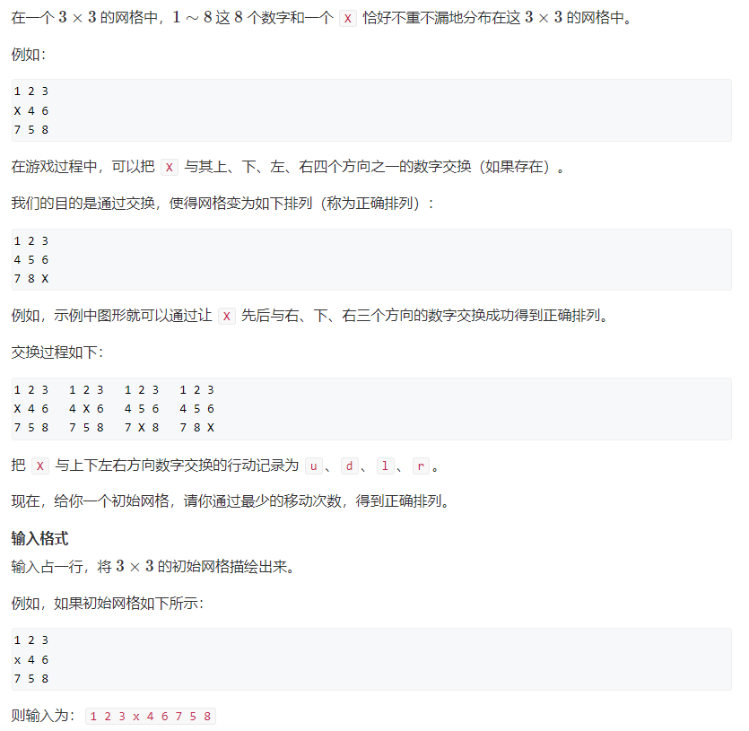
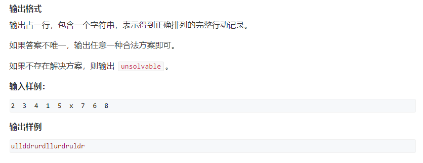
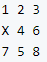
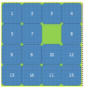
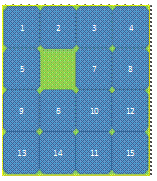
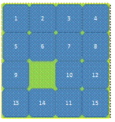
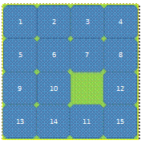
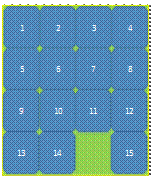
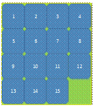

# 启发式搜索A-star

### 1.相关证明和概念

#### 1.1常规模板

处理图问题，边权是非负或者无负权回路即可。

```C++
while(heap.size())   //小根堆
{
    t <- 优先队列的对头;
   	当终点第一次出队  break;
    for t 的所有领边:
        将领边入队
}

// 其中堆里面存的是：  从起点到当前点的真实距离 + 从当前点到终点的估计距离（估价函数）
// dijkstra可以看成从当前点到终点的估计距离都是0的A-star算法。
```

`A*`算法一定要保证有解才能做，否则效率不如普通的`bfs`。但是大多数实际情况，很难提前知道是否有解，只能硬着头皮写。即有解才适用，不然整个空间

#### 1.2正确的条件

当前这个点的状态为`state`。

`d(state)`：表示起点`start`到`state`的一个**真实距离**。

`g(state)`：表示`state`到终点`end`的一个**真实距离**。

`f(state)`：表示`state`到终点`end`的一个**估计距离**。

`heap`建堆的依据是`d(state) + f(state)`。

必须满足：`0<=f(state)<=g(state)`，->  可以保证当终点第一次出队时，一定是最小值（正确的）。

`A-star`算法只能保证当终点第一次出队时，终点的距离是最小的，不能保证中间的每个点第一次出队时都是最小的。但可以保证起点->终点路径上的所有点都是最优的（距离最小）。

### 2.相关题目

#### 2.1  179.八数码





##### **2.1.1解题思路**

​		八数码问题可以提前知道是否有解，首先我们将这个八数码棋盘按行展开，得到一个序列`y`为 1 2 3 4 6 7 5 8，看这个序列`y`的逆序对是否为偶数，如果为**偶数**则改问题有解，否则无解。

​		证明上述结论（必要性， 有解 ===> 逆序对数量一定是偶数）：我们可以很明显的发现，数字在行内移动的话，并没有改变上述序列`y`本身，逆序对的数量并没有发生改变；如果某个数字`k`在上下移动的话，那么将会改变原始序列`y`的逆序对数量，改变的逆序对只有2对，要么增加2个，要么减少2个，要么增加1个减少1个抵消。综上所述：每移动一次数字，逆序对的奇偶性不变，由于最终目标形成的序列是1 2 3 4 5 6 7 8，逆序对为0是偶数，因此如果要有解，棋盘的初始序列状态的逆序对的数量应该也是**偶数**。

**然后来确定估价函数：**

每次移动只会把一个数字向它的目标位置移动一格。**估价函数**就是当前状态的每一个数和它目标位置之间的一个曼哈顿`manhattan`距离距离之和。这样取估价函数一定是<=真实值。

##### 2.1.2代码实现

```c++
#include <iostream>
#include <cstdio>
#include <cstring>
#include <algorithm>
#include <unordered_map>
#include <queue>

using namespace std;
typedef pair<int, string> PIS;

int f(string state)   //估价函数：每个数字当前到目标位置的曼哈顿距离之和
{
    int res = 0;
    for(int i = 0; i < 9; i ++ )
        if(state[i] != 'x')
        {
            int a = state[i] - '1';
            res += abs(i / 3 - a / 3) + abs(i % 3 - a % 3);
        }
    return res;
}

string bfs(string start)
{
    unordered_map<string, int> d;  //距离起点状态的真实距离
    unordered_map<string, pair<char, string>> prev;  //存当前这个棋盘状态由哪步操作得来，并且存下上一步的棋盘状态
    //小根堆，每个选这个估计距离最小的状态来更新其它可能的状态： 起点到当前点的真实距离d[state] + 当前点到终点的一个估价距离f(state)。
    priority_queue<PIS, vector<PIS>, greater<PIS>> q;
    
    char op[] = "urdl";
    int dx[] = {-1, 0, 1, 0}, dy[] = {0, 1, 0, -1};
    string end = "12345678x";
    
    d[start] = 0;
    q.push({d[start] + f(start), start});
    
    while(q.size())
    {
        auto t = q.top();q.pop();
        
        string state = t.second;
        int dist = d[state];  //存的是到起点的真实距离
        
        if(state == end) break;
        
        //找到'x'的位置
        int x, y;
        int i = state.find('x');
        x = i / 3, y = i % 3;
        
        //看能否和周围4个方向的字母替换
        string source = state;
        for(int i = 0; i < 4; i ++ )
        {
            int r = x + dx[i], c = y + dy[i];
            if(r < 0 || r >= 3 || c < 0 || c >= 3) continue;
            
            // state = source;
            //做交换
            swap(state[x * 3 + y], state[r * 3 + c]);
            if(!d.count(state) || d[state] > dist + 1)
            {
                d[state] = dist + 1;
                prev[state] = {op[i], source};  //答案输出的是x的移动方向
                q.push({d[state] + f(state), state});
            }
            swap(state[x * 3 + y], state[r * 3 + c]);
        }
    }
    
    string ans;
    while(end != start)
    {
        ans += prev[end].first;
        end = prev[end].second;
    }
    reverse(ans.begin(), ans.end());
    
    return ans;
}

int main()
{
    string start, seq;
    char c;
    while(cin >> c)
    {
        start += c;
        if(c != 'x') seq += c;
    }
    
    //先判断是否有解
    int cnt = 0;  //逆序对数量
    for(int i = 0; i < 8; i ++ )
        for(int j = i + 1; j < 8; j ++ )
            if(seq[i] > seq[j]) cnt ++ ;
    if(cnt & 1) puts("unsolvable");
    else cout << bfs(start) << endl;  
    
    return 0;
}
```

#### 2.2 十五数码

**题目描述：**

可能有人玩过这样一个游戏。在一个4*4的方框中，有1~15的数字和一个空格（用X表示），空格旁边的数字可以移动到空格所在的位置，这样不停的移动，最后将数字按1~15从左到右从上到下依次排列，并使右小角的方框为空格。如下图所示。



**输入：**

输入包含4行4列的方格中初始时每个数字和空格所在的位置（空格用X表示）。

**输出：**

如果能够将当前棋盘中的数字按照上述规则以最少的移动次数变成要求的输出结果，则输出对应的移动过程所形成的字符串。字符串中u表示空格上移，l表示空格左移，r表示空格右移，d表示空格下移。如果不能获得对应的输出结果，则输出-1。

**样例输入：**

```
1   2   3   4
5   7   X   8
9   6  10  12
13 14  11  15
```

**样例输出：**

```
ldrdr
```

##### 2.2.1解题思路

​		十五数码问题也可以提前知道是否有解，首先将初始状态的所有数字（除去空格）按顺序排列成一个一维数组。计算这个数组的逆序对的数量`cnt`。然后在初始状态中，找到空格所在的行号，并计算初始状态空格所在的行号与目标状态空格所在行号的距离（称为空格行距离`row_cnt`）。如果初始状态的逆序对数量`cnt`与空格行距离`row_cnt`的**奇偶性相同**，则问题有解；否则，问题无解。

##### 2.2.2代码实现

```c++
#include <iostream>
#include <cstdio>
#include <algorithm>
#include <cstring>
#include <unordered_map>
#include <queue>

using namespace std;
typedef pair<int, string> PIS;


int f(string state)   //估价函数
{
    int res = 0;
    for(int i = 0; i < 16; i ++ )
        if(state[i] != 'X')
        {
            int t = state[i] - 'A';
            res += abs(i / 4 - t / 4) + abs(i % 4 - t % 4);
        }
    return res;
}

string bfs(string start)
{
    unordered_map<string, int> d; //到起点状态的真实距离
    unordered_map<string, pair<char, string>> prev;  //存当前这个状态的前驱操作，以及前驱状态
    priority_queue<PIS, vector<PIS>, greater<PIS>> heap;  //堆顶放起点到当前点的真实距离+当前点到终点的估计距离最小值
    
    int dx[] = {-1, 0, 1, 0}, dy[] = {0, 1, 0, -1};
    char op[] = "urdl";
    string end = "ABCDEFGHIJKLMNOX";  //目标状态
    d[start] = 0;
    heap.push({d[start] + f(start), start});
    
    while(heap.size())
    {
        auto t = heap.top();heap.pop();
        string state = t.second;
        int step = d[state];  //起始状态到当前状态的真实距离
        
        if(state == end) break;
        
        //查找当前空格所在位置
        int idx = state.find('X');
        int x = idx / 4, y = idx % 4;
        
        string source = state;
        for(int i = 0; i < 4; i ++ )
        {
            int r = x + dx[i], c = y + dy[i];
            if(r < 0 || r >= 4 || c < 0 || c >= 4) continue;
            
            swap(state[x * 4 + y], state[r * 4 + c]);
            if(!d.count(state) || d[state] > step + 1)
            {
                d[state] = step + 1;
                prev[state] = {op[i], source};
                heap.push({d[state] + f(state), state});
            }
            swap(state[x * 4 + y], state[r * 4 + c]);
        }
    }
    
    string ans;
    while(end != start)
    {
        ans += prev[end].first;
        end = prev[end].second;
    }
    reverse(ans.begin(), ans.end());
    
    return ans;
}

int main()
{
    // 将这个棋盘状态转化为大写字母，目标状态为string end = "ABCDEFGHIJKLMNOX";
    string start, seq, c;
    while(cin >> c)
    {
        if(c[0] != 'X'){
            int n = c.size();
            int digits = 0;
            for(int i = 0; i < n; i ++ )
                digits = digits * 10 + (c[i] - '0');
            char ch = 'A' + digits - 1;
            start += ch;
            seq += ch;
        }else start += c;
    }
    
    //判断提前判断是否有解
    int cnt = 0, row_cnt = 0;  //逆序对数量，当前状态的空格X距离目标状态X的行间距
    for(int i = 0; i < 15; i ++ )
        for(int j = i + 1; j < 15; j ++ )
            if(seq[i] > seq[j]) cnt ++ ;
    
    int i = start.find('X');
    int row = i / 4;  //空格所在行
    row_cnt = 3 - row;
    
    if((cnt & 1) != (row_cnt & 1)) puts("-1");
    else cout << bfs(start) << endl;
    
    return 0;
}
```

数码是否有解相关证明：`https://blog.csdn.net/TA201314/article/details/45509023`

行内移动：不改变逆序对的奇偶性
竖向移动：逆序对数要么+3，-3，+1，-1，均为奇数，即表明竖向移动，每移动一次就会改变原始状态的奇偶性。
因此可以得出结论：原始状态的逆序对数量为n，原始状态的空格的行号到目标状态的空格的行号之间的差距为为cnt。因为目标状态的逆序对数量为0，为偶数。
n为偶数，cnt也应该为偶数
n为奇数，cnt也应该为奇数（偶数+1）


结论应该是原始状态的逆序对数和目标状态的逆序对数之差的奇偶性与原始状态空格的行号和目标状态空格的行号之差的奇偶性一致，则有解；否则，无解。
