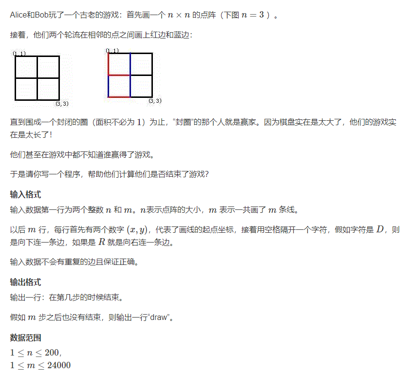
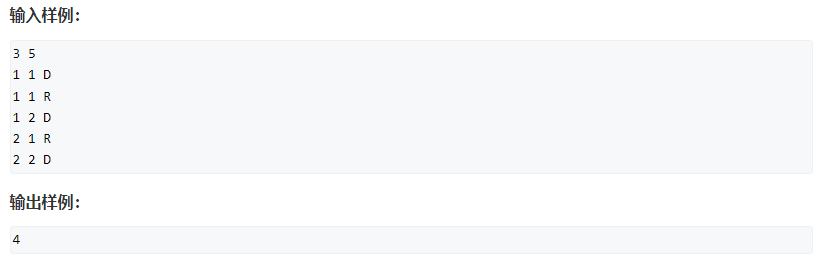
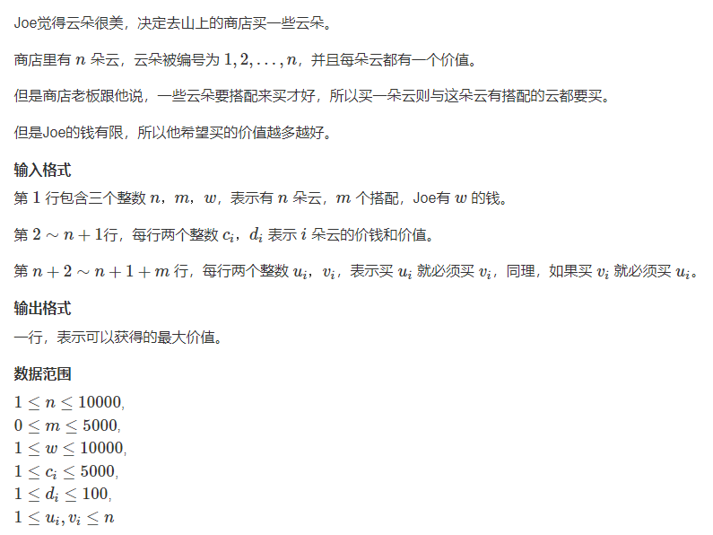
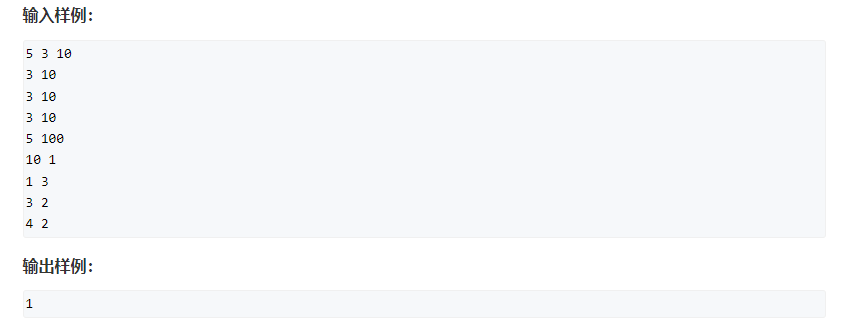
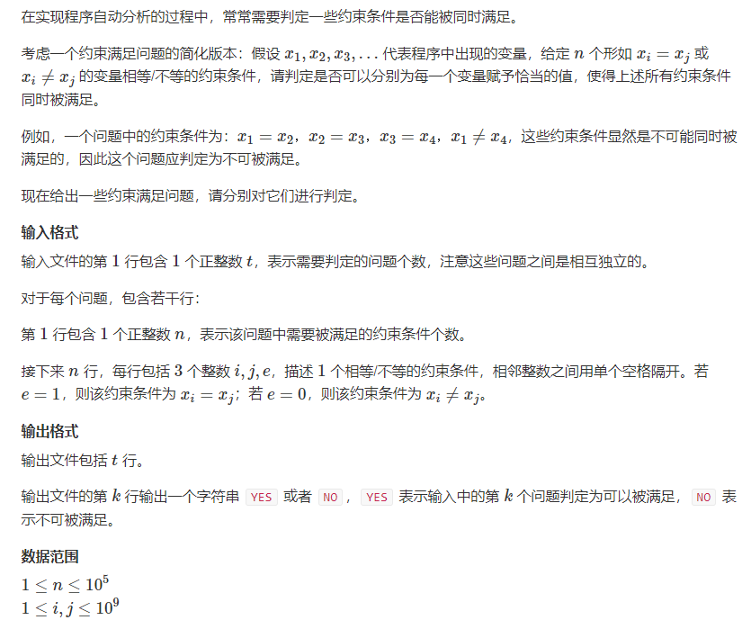
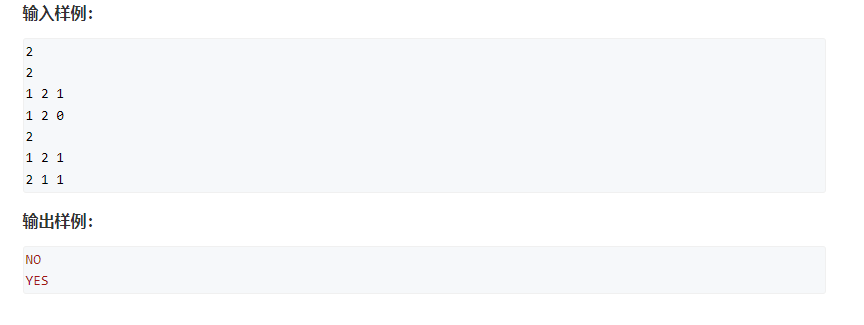
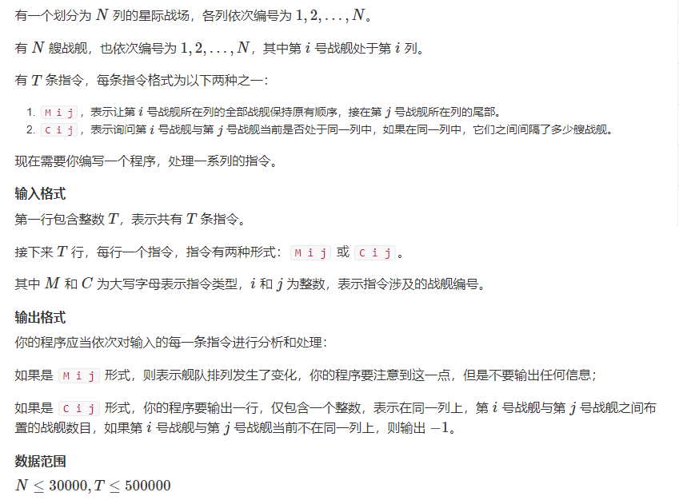
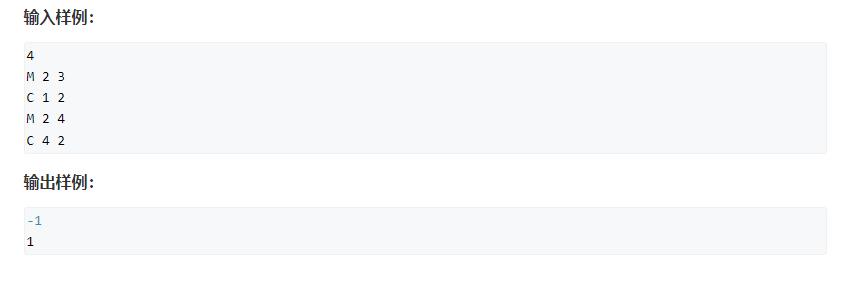
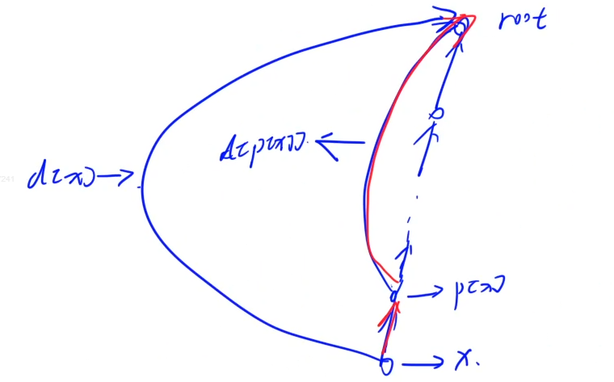

# 并查集

**并查集的初始化：**

```c++
// 最开始，每个节点都单独为一个集合，因此它们的根节点就是自己
for(int i = 1; i <= n; i ++ ) p[i] = i;
```

**一.操作：**

- 操作1：合并两个集合
- 操作2：查询某个元素的祖宗节点（可以快速判断两个元素是否在同一集合中）

**二.优化：**

- 优化1：路径压缩（常用），时间复杂度 `O(log(n))`

- ```c++
  int find(int x)
  {
      if(p[x] != x) p[x] = find(p[x]);
      return p[x];
  }
  ```

- 优化2：按秩合并，思想：合并两个集合的时候，每次把节点个数或者树的深度较小的一个合并到较大的那一个。`O(log(n))`

**三.扩展：**

- 扩展1：维护上述两个操作的同时，去记录一下每个集合的大小，将这个属性绑定到根节点上。
- 扩展2：记录每个点到根节点的距离，将这个属性绑定到每个元素上。

#### 相关题目

1250.格子游戏：





- 时间复杂度：`o(n^2)`
- 空间复杂度：`o(n^2)`

```c++
#include <iostream>
#include <cstdio>
#include <algorithm>

using namespace std;

const int N = 40010;
int p[N];
int n, m;

//把二维的点映射到一维，0序才有这个公式
int get(int x, int y)
{
    return x * n + y;
}

int find(int x)
{
    if(p[x] != x) p[x] = find(p[x]);
    return p[x];
}

int main()
{
    scanf("%d%d", &n, &m);
    
    for(int i = 0; i < n * n; i ++ ) p[i] = i;
    
    int res = 0;
    for(int i = 1; i <= m; i ++ )
    {
        int x, y;  //坐标是1序，切换为0序
        char op[2];
        cin >> x >> y >> op;
        x --, y -- ;
        int a = get(x, y);
        int b = get(x, y + 1);  //另一个点在右边
        if(op[0] == 'D') b = get(x + 1, y);
        
        //合并a，b两个点前先判断是否在一个集合内，如果是，合并就成环了
        int pa = find(a), pb = find(b);  
        if(pa == pb){
            res = i;
            break;
        }else{
            p[pa] = pb;
        }
        
    }
    
    if(!res) puts("draw");
    else printf("%d\n", res);
    
    return 0;
}
```

1252.搭配购买：





- 时间复杂度：`o(n*w)`
- 空间复杂度：`o(w)`

```c++
// 每个集合的根节点存每个集合的价钱（cost）和价值（weight）,然后用0，1背包做即可。
// 考察的就是并查集+优化版本的01背包

#include <iostream>
#include <cstdio>
#include <cstring>

using namespace std;
const int N = 10010;
int v[N], w[N], p[N];
int n, t, m;
int f[N];

int find(int x)
{
    if(p[x] != x) p[x] = find(p[x]);
    return p[x];
}

int main()
{
    scanf("%d%d%d", &n, &t, &m);
    
    
    for(int i = 1; i <= n; i ++ ){
        p[i] = i;
        scanf("%d%d", v + i, w + i);
    }
    
    
    while(t -- )
    {
        int a, b;
        scanf("%d%d", &a, &b);
        int pa = find(a), pb = find(b);
        if(pa != pb) {
            v[pb] += v[pa];  //更新集合的花费
            w[pb] += w[pa];  //更新集合的价值
            p[pa] = pb;
        }
    }
    
    // 01背包 f[i][j]表示从前i个集合中选，总体积不超过j的最大价值
    // f[i][j] = max(f[i - 1][j], f[i - 1][j - v[i]]+w[i]);
    for(int i = 1; i <= n; i ++ )  //枚举集合
    {
        if(p[i] != i) continue;   //当前没有枚举到集合的根节点，就跳过  也可以改成 if(find(i) != i) continue;
        for(int j = m; j >= v[i]; j -- )
            f[j] = max(f[j], f[j - v[i]] + w[i]);
    }
    cout << f[m] << endl;
    
    return 0;
}
```

237. 程序自动分析





**方法一：**

- 时间复杂度：`o(t*nlog(n))`  离散化可以用hash表unordered_map来做，就不需要排序，时间复杂度可以优化到`o(t*n)`
- 空间复杂度：`o(2*n)`

```c++
// 离散化 + 并查集
// 离散化可以用hash表来做

#include <iostream>
#include <cstdio>
#include <cstring>
#include <algorithm>

using namespace std;
const int N = 2e5 + 10;
int p[N];
int n;

vector<int> alls;  //排序，然后去重，再离散化
vector<vector<int>> op;  //存所有操作

inline void init()
{
    alls.clear();
    op.clear();
}

// 离散化，我们用二分实现，将很多离散的值映射到一个区间[1-2e5]之间即可
int get(int x)
{
    int l = 0, r = alls.size() - 1;
    while(l < r)
    {
        int mid = l + r >> 1;
        if(alls[mid] >= x) r = mid;
        else l = mid + 1;
    }
    return l + 1; //映射到一序
}

//并查集
int find(int x)
{
    if(p[x] != x) p[x] = find(p[x]);
    return p[x];
}

int main()
{
    int t;
    scanf("%d", &t);
    while(t -- )
    {
        scanf("%d", &n);
        init();
        for(int i = 1; i <= n; i ++ )
        {
            int a, b, e;
            scanf("%d%d%d", &a, &b, &e);
            op.push_back({a, b, e});  //存下所有操作方案
            
            alls.push_back(a);
            alls.push_back(b);
        }
        
        //离散化
        sort(alls.begin(), alls.end());
        alls.erase(unique(alls.begin(), alls.end()), alls.end());
        
        for(int i = alls.size(); i >= 1; i -- ) p[i] = i;
        
        //应该先把相等的所有点连接起来，后面再看不相等的式子是否产生冲突
        //可以遍历两次，第一次把相等的变量连接起来就可以了，时间复杂度更优
        sort(op.begin(), op.end(), [](vector<int>& p, vector<int>& q){   //排序技巧，这样最快
           return p[2] > q[2]; 
        });
        
        bool is_clash = false;  //是否产生冲突
        
        for(auto t : op)
        {
            int a = get(t[0]), b = get(t[1]), e = t[2];
            int pa = find(a), pb = find(b);
    
            if(e == 1) {  //如果说两个相等，我们假设它们相等，构造它们相等
                if(pa != pb) {
                    p[pa] = pb;
                }
            }else { //如果不相等，看看之前的相等式子是否产生冲突
                if(pa == pb) {
                    is_clash = true;
                    break;
                }
            }
        }
        if(is_clash) puts("NO");
        else puts("YES");
        
    }
    
    return 0;
}
```

**从上述代码中可以总结如下内容：**

- 1.排序技巧：

- ```c++
  sort(op.begin(), op.end(), [](vector<int>& p, vector<int>& q){   //排序技巧，这样最快
     return p[2] > q[2]; 
  });
  
  sort(op.begin(), op.end(), [&](vector<int> p, vector<int> q){   //这样会很慢
     return p[2] > q[2]; 
  });
  ```

- **2.离散化操作总结：**（离散化作用：将少量比较大的数映射到一个值较小的区间内）

- - 2.1保序，离散化之前x < y，离散化之后find(x) < find(y)：**排序 + 去重 + 二分**

- ```c++
  // 首先定义存储待离散化的所有值的数组
  vector<int> alls;
  
  // 将所有待离散化的值存入alls后：
  // 1.先排序
  sort(alls.begin(), alls.end());
  // 2.再去重 
  alls.erase(unique(alls.begin(), alls.end()), alls.end());  //alls中剩下的所有元素的值都是唯一的
  // 3.再将这些值映射到一个较小的区间内：
  // 例如：alls中现在含有  1 27 89 1024
  //      可以映射到区间[1,4]，例如find(1)=1, find(27)=2, find(89)=3, find(1024)=4
  //这个操作可以用二分实现，将其映射为alls中对应的1序下标即可
  int find(int x)
  {
      int l = 0, r = alls.size() - 1;  //在[0, alls.size() - 1]中找到第一个>=x的位置下标
      while(l < r)
      {
          int mid = l + r >> 1;
          if(alls[mid] >= x) r = mid;
          else l = mid + 1;
      }
      return l + 1;  //映射到一序
  }
  
  
  ```

- - 2.2不要求保序：使用map或者hash表

- ```c++
  // 1.首先定义hash表：
  unordered_map<int, int> S;
  int n;  //最终映射的总数
  // 2.离散化操作：
  int find(int x)  //无序离散化
  {
      if(S.count(x) == 0) S[x] = ++ n; //之前没出现过x，就依次映射
      return S[x];  //出现过或映射后 就直接返回映射后的值
  }
  ```

**方法二：**

- 时间复杂度：离散化可以用hash表unordered_map来做，就不需要排序，时间复杂度可以优化到`o(t*n)`
- 空间复杂度：`o(2*n)`  

```c++
#include <iostream>
#include <cstdio>
#include <cstring>
#include <algorithm>
#include <unordered_map>

using namespace std;
const int N = 2e5 + 10;

unordered_map<int, int> S;
int p[N];
int n, m;

struct Query{
    int x, y, e;
}query[N];

int get(int x)  //无序离散化
{
    if(S.count(x) == 0) S[x] = ++ n;  //之前没出现过x，就依次映射
    return S[x];  //出现过或映射后 就直接返回
}

int find(int x)
{
    if(p[x] != x) p[x] = find(p[x]);
    return p[x];
}

int main()
{
    int t;
    cin >> t;
    while(t -- )
    {
        n = 0;
        S.clear();  //hash表记得清空
        scanf("%d", &m);
        for(int i = 0; i < m; i ++ )
        {
            int a, b, e;
            scanf("%d%d%d", &a, &b, &e);
            query[i] = {get(a), get(b), e};
        }
        
        for(int i = 1; i <= n; i ++ ) p[i] = i;
        
        //合并所有相等的约束条件
        for(int i = 0; i < m; i ++ )
            if(query[i].e == 1){
                int pa = find(query[i].x), pb = find(query[i].y);
                if(pa != pb) p[pa] = pb;
            }
        //检测所有的不等条件
        bool is_clash = false;
        
        for(int i = 0; i < m; i ++ )
            if(query[i].e == 0){
                int pa = find(query[i].x), pb = find(query[i].y);
                if(pa == pb) {
                    is_clash = true;
                    break;
                }
            }
        if(is_clash) puts("NO");
        else puts("YES");
    }
    
    return 0;
}
```

**238.银河英雄传说(理解并查集代码的本质)**





- 时间复杂度：`o(T)`
- 空间复杂度：`o(N)`  
- - 理解find函数：
  - 

```c++
//每个点都要维护一个距离根节点的距离
#include <iostream>
#include <cstdio>
#include <cstring>
#include <algorithm>

using namespace std;
const int N = 3e4 + 10;
int p[N], cnt[N], d[N];  //d[x]表示x到p[x]的距离
int n, m;

int find(int x)   //理解这个find代码？
{
    if(p[x] != x) 
    {
        int root = find(p[x]);
        //先累加到根节点的距离，再进行路径压缩。让自己的距离更新为d[x] + d[p[x]],再路径压缩p[x] = find(p[x])
        //x到父节点p[x]的距离 + 父节点p[x]到根节点的距离
        d[x] += d[p[x]];       
        p[x] = root;
    }
    return p[x];
}

int main()
{
    for(int i = 1; i < N; i ++ ) p[i] = i, cnt[i] = 1;
    
    scanf("%d", &m);
    while(m -- )
    {
        char op[2];
        int a, b;
        scanf("%s%d%d", op, &a, &b);
        int pa = find(a), pb = find(b);
        if(op[0] == 'M') {
            if(pa != pb) {
                d[pa] = cnt[pb];   //pa这个根节点到pb根节点的距离更新为pb这个集合的size
                cnt[pb] += cnt[pa];
                p[pa] = pb;
            }
        }else {
            if(pa != pb) puts("-1");
            else printf("%d\n", max(abs(d[a] - d[b]) - 1, 0));
        }
    }
    
    return 0;
}
```

