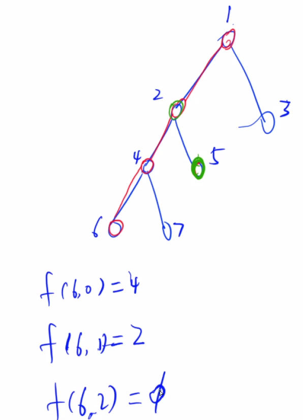
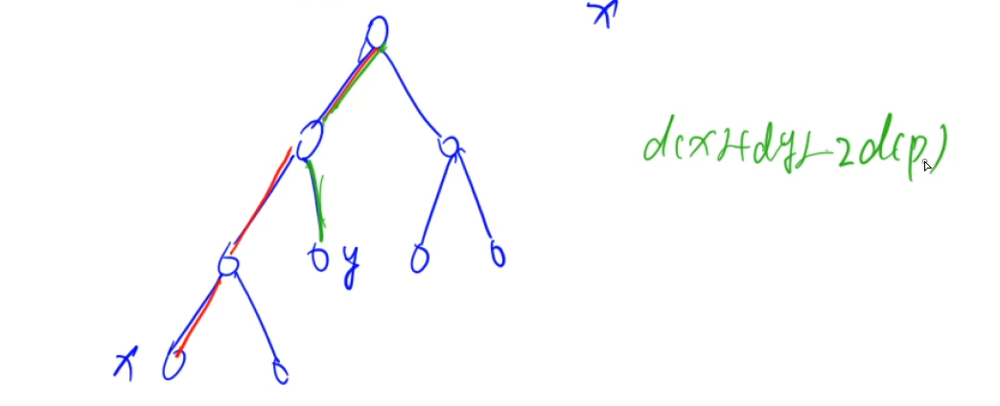

# 图论：最近公共祖先LCA

### 方法一：向上标记法（不常用）

- 思路：从一个点往上（往根节点）走，把经过的所有节点（祖先标记为true），然后再从第二个点开始往上走，第一次遇到被标记的点，即为两者的最近公共祖先。

- 时间复杂度：`o(n)`，最坏情况下树是一个链，走到根节点。（非常暴力）

### 方法二：倍增法（常用）

- 思路：  

​			预处理（递推就可以求出）：

​			预处理1：fa[i, j]表示从i开始，向上走2^j步所能走到的节点。 0<=j<=log(2)n，log(2)n表示以2为底的n，向下取整。求f[i, j]可以通过跳两次2^(j-1)步完成。

```c++
f[i, j] = f[i, j-1] + f[f[i,j-1], j-1]    // j > 0
f[i, j] = i的父节点                        // j=0
```

​			预处理2：depth[i]表示深度，到根节点的距离+1

​			哨兵：如果从i开始跳2^j步会跳过根节点，那么fa[i, j] = 0，并且规定depth[0] = 0。

​			上述两个预处理操作都可以用dfs或bfs做，时间复杂度为`o(nlogn)`。

- 步骤：

​			1.先将两个点跳到同一层，（把较深的那个点跳到和较浅的那个点同一层）      二进制思想（highbit）

​			2.让两个点同时往上跳，一直跳到它们的最近公共祖先的下一层。（因为如果两个点跳到了同一个祖先，不能保证这个祖先就是最近的。）

​			上面两步的时间复杂度为o(logn)，因此询问两个点的公共祖先的时间复杂度为`o(logn)`。

- 时间复杂度：`o((n + m)logn)` ，其中n是节点数，m是询问数量。其中`o(nlogn)`是预处理的时间复杂度。

- 例如：



### 相关题目：

#### 1.[1172.祖孙询问](https://www.acwing.com/problem/content/1174/)

- 倍增法求解：这是一种在线做法，读一次询问，做一次lca，输出一次。

```c++
#include <iostream>
#include <cstdio>
#include <algorithm>
#include <cstring>

using namespace std;

const int N = 4e4 + 10, M = 2 * N;
int h[N], e[M], ne[M], idx;
int depth[N];  //存每个点的深度，根节点深度为1，depth[0] = 0，0这个点不存在，深度为0
int f[N][16];  //f[i][j]表示从点i往上跳2^j步，所到达的点
int q[N];   //队列

void add(int a, int b) {
    e[idx] = b, ne[idx] = h[a], h[a] = idx ++ ;
}

void bfs(int root)  
{
    memset(depth, 0x3f, sizeof depth);  //初始化设点深度无穷大
    int hh = 0, tt = -1;
    depth[0] = 0;
    depth[root] = 1;
    q[ ++ tt] = root;
    while(hh <= tt) {
        int t = q[hh ++ ];
        for(int i = h[t]; ~i; i = ne[i])  
        {
            int j = e[i];
            if(depth[j] > depth[t] + 1)  //说明点j是点t的儿子,点t是点j的父亲
            {
                depth[j] = depth[t] + 1; 
                q[ ++ tt] = j;
                f[j][0] = t;  //递推求f[i][j]
                for(int k = 1; k <= 15; k ++ )  //logN = 15
                    f[j][k] = f[f[j][k - 1]][k - 1];
            }
        }
    }
    
}

int lca(int a, int b)
{
    if(depth[a] < depth[b]) swap(a, b);
    //先让a点跳到和b点同一层
    for(int k = 15; k >= 0; k -- )
        if(depth[f[a][k]] >= depth[b])  //点a往上跳2^k步到达的点的深度如果比b大，说明可以跳；如果跳过根节点，那么depth[0] = 0 < depth[b]，故不会跳
            a = f[a][k];
            
    if(a == b) return b;  //已经到达同一公共祖先，说明点b就是他俩的公共祖先
    // 现在a和b深度一样，同时往上跳
    for(int k = 15; k >= 0; k -- )
        if(f[a][k] != f[b][k])  // 跳不到同一个点，就跳
        {
            a = f[a][k];
            b = f[b][k];
        }
    // 现在a和b都在它们公共祖先的下一层
    return f[a][0];
}

int main()
{
    int n, root;
    scanf("%d", &n);
    memset(h, 0xff, sizeof h);
    for(int i = 0; i < n; i ++ ) {
        int a, b;
        scanf("%d%d", &a, &b);
        if(b == -1) root = a;
        else if(a != b) add(a, b), add(b, a);
    }
    
    // 预处理
    bfs(root);
    
    int m;
    scanf("%d", &m);
    
    while(m -- ){   //m次查询，每次logn
        int a, b;
        scanf("%d%d", &a, &b);
        int p = lca(a, b);  //最近公共祖先   logn
        if(p == a) puts("1");
        else if(p == b) puts("2");
        else puts("0");
    }
}
```

### 方法三：Tarjan---离线求LCA  (本质是对向上表记法的优化)

- 其中离线的意思就是：一次把所有询问统一读完，统一计算之后，然后再一起输出。

- 时间复杂度：`o(n + m)`，n是节点数，m是询问数量。

- 思路：是一个基于深度优先遍历的做法，在做深度优先遍历的过程中，把所有点分为三大类：

​			第一类：已经遍历过，且回溯过的点。

​			第二类：正在搜索的分支，从根节点到当前节点的一个路径。

​			第三类：还未搜到的点。

#### 相关题目：

#### [1171.距离](https://www.acwing.com/problem/content/1173/)

- **在树上如何求两个点之间的距离（也就是最短距离）呢？**先预处理出来，每个点到根节点的距离。树上两点之间只有一条路径，因此它们之间的距离也称为最短距离。**随便确定一个点为根节点即可。**

例如：求树上点x到点y之间的距离，其中预处理出来了x到根节点的距离为d[x]，y到根节点的距离为d[y]，x和y的最近公共祖先为z = lca(x, y)，那么x到y的距离就是d[x] + d[y] - 2 * d[lca(x, y)]。所以核心还是求两个点的最近公共祖先是谁。



```c++
//Tarjan---离线求LCA
include <cstdio>
#include <cstring>
#include <iostream>
#include <algorithm>
#include <vector>

using namespace std;

typedef pair<int, int> PII;

const int N = 10010, M = N * 2;

int n, m;
int h[N], e[M], w[M], ne[M], idx;
int dist[N];
int p[N];
int res[M];
int st[N];
vector<PII> query[N];   // first存查询的另外一个点，second存查询编号

void add(int a, int b, int c)
{
    e[idx] = b, w[idx] = c, ne[idx] = h[a], h[a] = idx ++ ;
}

void dfs(int u, int fa)
{
    for (int i = h[u]; ~i; i = ne[i])
    {
        int j = e[i];
        if (j == fa) continue;
        dist[j] = dist[u] + w[i];
        dfs(j, u);
    }
}

int find(int x)
{
    if (p[x] != x) p[x] = find(p[x]);
    return p[x];
}

void tarjan(int u)
{
    st[u] = 1;
    for (int i = h[u]; ~i; i = ne[i])
    {
        int j = e[i];
        if (!st[j])
        {
            tarjan(j);
            p[j] = u;
        }
    }

    for (auto item : query[u])
    {
        int y = item.first, id = item.second;
        if (st[y] == 2)
        {
            int anc = find(y);
            res[id] = dist[u] + dist[y] - dist[anc] * 2;
        }
    }

    st[u] = 2;
}

int main()
{
    scanf("%d%d", &n, &m);
    memset(h, -1, sizeof h);
    for (int i = 0; i < n - 1; i ++ )
    {
        int a, b, c;
        scanf("%d%d%d", &a, &b, &c);
        add(a, b, c), add(b, a, c);
    }

    for (int i = 0; i < m; i ++ )
    {
        int a, b;
        scanf("%d%d", &a, &b);
        if (a != b)
        {
            query[a].push_back({b, i});
            query[b].push_back({a, i});
        }
    }

    for (int i = 1; i <= n; i ++ ) p[i] = i;

    dfs(1, -1);
    tarjan(1);

    for (int i = 0; i < m; i ++ ) printf("%d\n", res[i]);

    return 0;
}
```

- 方法二：倍增法：

```c++
//直接倍增法求LCA，在线做法

//额外维护一个d数组，d[i]表示点i到根节点的距离        d[x] + d[y] - 2 * d[p], p为x和y的最近公共祖先

#include <iostream>
#include <cstdio>
#include <cstring>
#include <algorithm>

using namespace std;

const int N = 1e4 + 10, M = 2 * N;
int h[N], e[M], w[M], ne[M], idx;
int f[N][14];  // 2^13 = 8192   //f[i][j]表示从点i往上跳2^j步，所能到达的点
int depth[N];    // 表示树中每个节点的深度
int q[N];

int dist[N];     //表示树中每个节点到根节点的距离
int n, m;

void add(int a, int b, int c)
{
    e[idx] = b, w[idx] = c, ne[idx] = h[a], h[a] = idx ++ ;
}

void dfs(int u, int parent)
{
    for(int i = h[u]; ~i; i = ne[i])
    {
        int j = e[i];
        if(j == parent) continue;
        dist[j] = dist[u] + w[i];
        dfs(j, u);
    }
}

void bfs(int root)
{
    memset(depth, 0x3f, sizeof depth);
    depth[root] = 1, depth[0] = 0;
    int hh = 0, tt = -1;
    q[ ++ tt] = root;
    while(hh <= tt) 
    {
        int t = q[hh ++ ];
        for(int i = h[t]; ~i; i = ne[i])
        {
            int j = e[i];
            if(depth[j] > depth[t] + 1)
            {
                depth[j] = depth[t] + 1;
                q[++ tt ] = j;
                f[j][0] = t;
                for(int k = 1; k <= 13; k ++ )
                    f[j][k] = f[f[j][k - 1]][k - 1];
            }
        }
    }
}

int lca(int a, int b)
{
    //单独让深度高的点跳到矮点的同一层
    if(depth[a] < depth[b]) swap(a, b);
    for(int i = 13; i >= 0; i -- )  //跳多少步2^i
        if(depth[f[a][i]] >= depth[b])
            a = f[a][i];
    if(a == b) return b;
    //a,b同时往上跳到最近公共祖先的下一层
    for(int i = 13; i >= 0; i -- )
        if(f[a][i] != f[b][i])
        {
            a = f[a][i];
            b = f[b][i];
        }
    return f[a][0];
}

int main()
{
    scanf("%d%d", &n, &m);
    memset(h, 0xff, sizeof h);
    for(int i = 1; i < n; i ++ )
    {
        int a, b, c;
        scanf("%d%d%d", &a, &b, &c);
        if(a != b) add(a, b, c), add(b, a, c);
    }
    
    dfs(1, -1);  //求每个点到根节点的距离，现在1是根节点
    
    //预处理出depth和f[i][j]
    bfs(1);
    
    while(m -- )
    {
        int a, b;
        scanf("%d%d", &a, &b);
        int p = lca(a, b);
        printf("%d\n", dist[a] + dist[b] - 2 * dist[p]);
    }
    
    return 0;
}
```


### 题单推荐：

- 树上倍增：

[1483. 树节点的第 K 个祖先](https://leetcode.cn/problems/kth-ancestor-of-a-tree-node/)

leetcode360场周赛：[2836. 在传球游戏中最大化函数值](https://leetcode.cn/problems/maximize-value-of-function-in-a-ball-passing-game/)

- 最近公共祖先lca：

leetcode361场周赛：[2846. 边权重均等查询](https://leetcode.cn/problems/minimum-edge-weight-equilibrium-queries-in-a-tree/)

题解：[我的题解](https://leetcode.cn/problems/minimum-edge-weight-equilibrium-queries-in-a-tree/)

```c++
const int N = 1e4 + 10, M = N * 2;
class Solution {
public:
    int h[N], e[M], w[M], ne[M], idx;
    int count[N][27];
    int f[N][14]; // 2^13=8192   f[i][j]表示从节点i往上跳2^j步所能到达的点
    int depth[N];   // 点i的深度
    int q[N];

    void add(int a, int b, int c)
    {
        e[idx] = b, w[idx] = c, ne[idx] = h[a], h[a] = idx ++ ;
    }

    void dfs(int u, int parent)
    {
        for(int i = h[u]; ~i; i = ne[i])
        {
            int j = e[i];
            if(j == parent) continue;
            for(int k = 1; k <= 26; k ++ )
                count[j][k] = count[u][k];
            count[j][w[i]] ++ ;
            dfs(j, u);
        }
    }
    
    void bfs(int root)
    {
        memset(depth, 0x3f, sizeof depth);
        depth[root] = 1, depth[0] = 0;
        int hh = 0, tt = -1;
        q[ ++ tt] = root;
        while(hh <= tt)
        {
            int t = q[hh ++ ];
            for(int i = h[t]; ~i; i = ne[i])
            {
                int j = e[i];
                if(depth[j] > depth[t] + 1)
                {
                    depth[j] = depth[t] + 1;
                    q[ ++ tt] = j;
                    f[j][0] = t;
                    for(int k = 1; k <= 13; k ++ )
                        f[j][k] = f[f[j][k - 1]][k - 1];
                }
            }
        }
    }

    int lca(int a, int b)
    {
        if(depth[a] < depth[b]) swap(a, b);
        for(int k = 13; k >= 0; k -- )
            if(depth[f[a][k]] >= depth[b])
                a = f[a][k];
        if(a == b) return b;
        for(int k = 13; k >= 0; k -- )
            if(f[a][k] != f[b][k])
            {
                a = f[a][k];
                b = f[b][k];
            }
        return f[a][0];
    }

    vector<int> minOperationsQueries(int n, vector<vector<int>>& edges, vector<vector<int>>& queries) {
        // count[i][j]表示从节点i到根节点的路径上，权重为j的边数量

        //先建图
        memset(h, 0xff, sizeof h);
        for(int i = 0; i < n - 1; i ++ )
        {
            int a = edges[i][0] + 1, b = edges[i][1] + 1, c = edges[i][2];
            add(a, b, c), add(b, a, c);
        }

        //先维护出count[i][j]
        dfs(1, -1);  //1为根节点

        //做预处理
        bfs(1);

        int m = queries.size();
        vector<int> ans(m, 0);
        for(int i = 0; i < m; i ++ )
        {
            int a = queries[i][0] + 1, b = queries[i][1] + 1;
            int p = lca(a, b);
            
            //两个点都要剪切公共路径上的count记录
            int maxv = 0;  //最多相同的边数量有多少
            for(int w = 1; w <= 26; w ++ )
                maxv = max(count[a][w] + count[b][w] - 2 * count[p][w], maxv);
            ans[i] = depth[a] + depth[b] - 2 * depth[p] - maxv;
        }

        return ans;
    }
};
```

