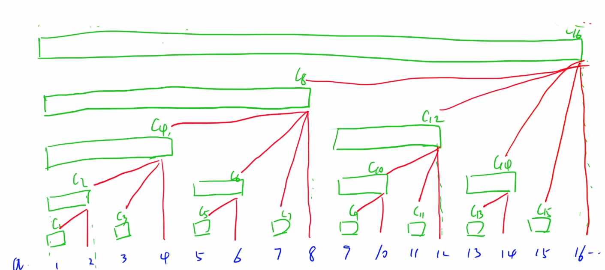
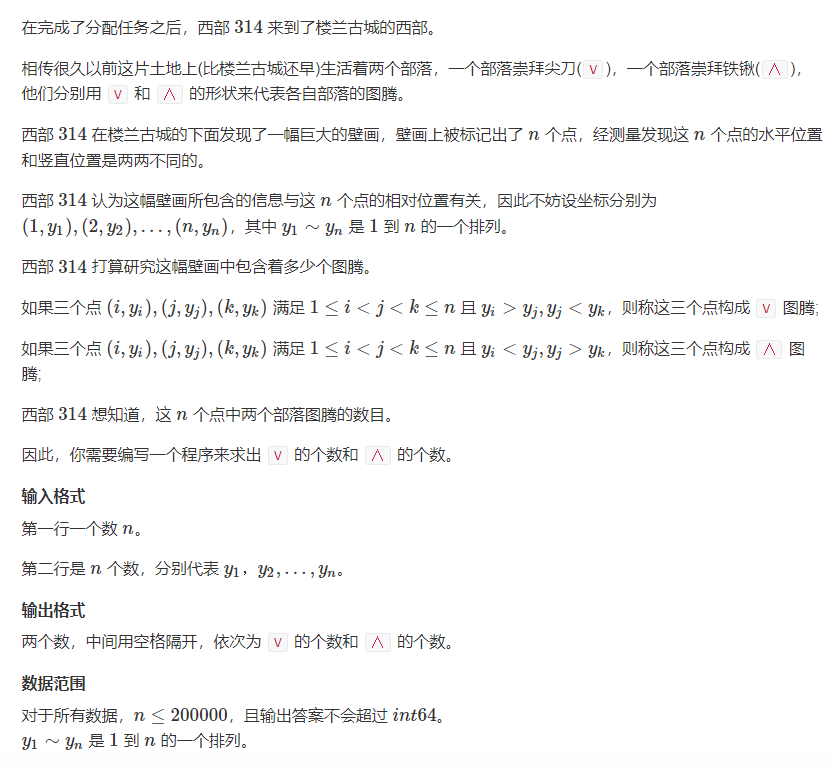
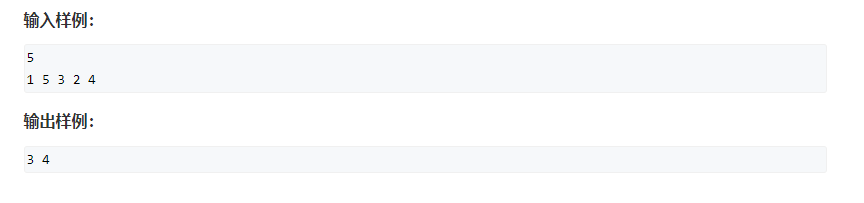
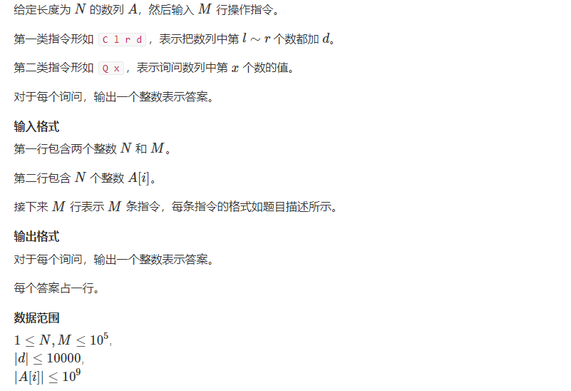
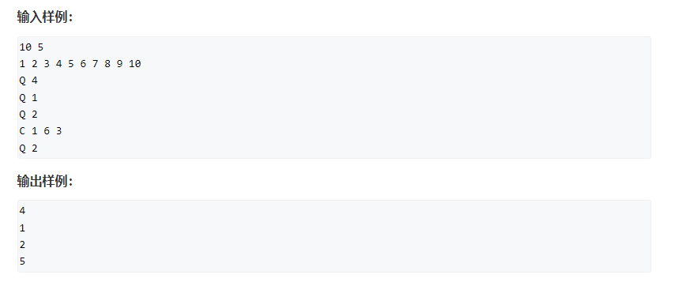
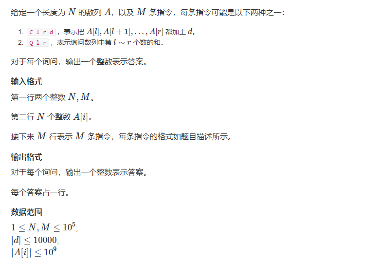
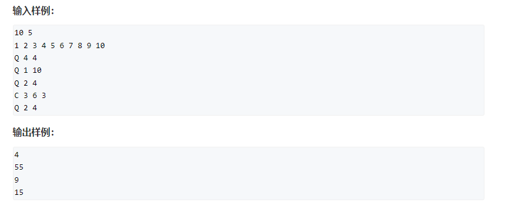
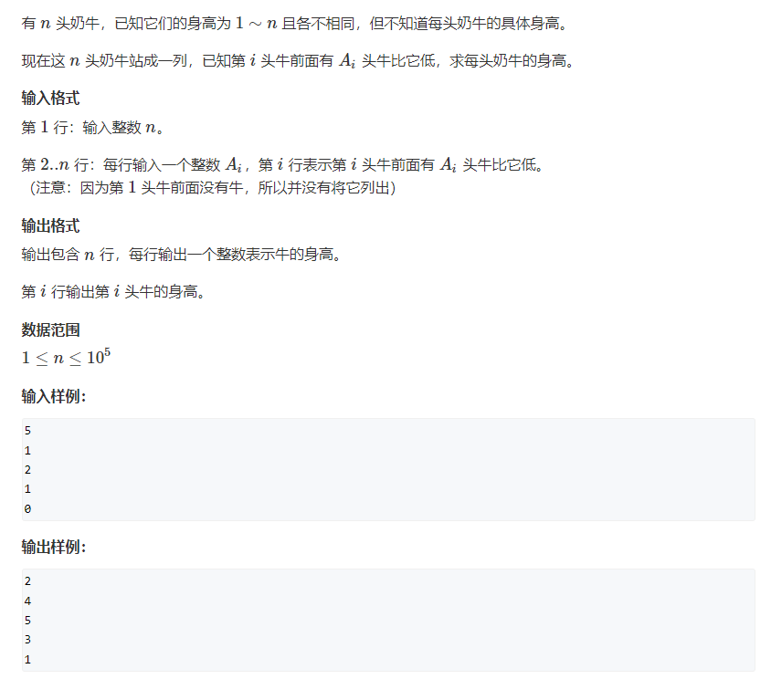

# 树状数组

**前缀和与差分**

```c++
前提：(数组默认1序)
    原数组为a[N]
    前缀和数组为s[N]：s[i]表示原数组a前i项的和。
    差分数组为b[N]：b[i] = a[i] - a[i - 1]
```

1.如何根据原数组a[N]求前缀和数组s[N]，时间复杂度为`o(n)`：

```c++
for(int i = 1; i <= n; i ++ )
    s[i] = s[i - 1] + a[i]
```

2.如何根据原数组a[N]求差分数组s[N]，时间复杂度为`o(n)`：

- 方法1：

```c++
for(int i = 1; i <= n; i ++ )
    b[i] = a[i] - a[i - 1];
```

- 方法2：

```c++
void insert(int l, int r, int c)
{
    b[l] += c, b[r + 1] -= c;
}

for(int i = 1; i <= n; i ++ ) insert(i, i, a[i]);    //在原数组区间[i,i]加一个a[i]
```


3.相关结论：

```c++
	b1 = a1
    b2 = a2 - a1
    b3 = a3 - a2
    ...
    bn = an - a(n-1)
  	=> b1 + b2 + b3 + ... + bi = ai
       原数组是差分数组的前缀和
```

4.如何快速地在原数组a的一个区间[l, r]内增加或减少一个值c（**转化为对差分数组的操作**）：

```c++
因为b1 + b2 + b3 + ... + bl + ... + bn = an
    如果我们对new_bl = bl+c:
	b1 + b2 + ... + b(l-1) = a(l-1)
    b1 + b2 + ... + b(l-1)+ new_bl = al + c
    b1 + b2 + ... + new_bl + b(l+1) = a(l+1) + c
    ...
    b1 + b2 + ... + new_bl + ... + bn = an + c
    => 会发现对差分数组求前缀和后得到的原数组，前l-1个元素的值并未增加，从a[l]到a[n]的元素都比原来多加了个值c
    => 即对bl+=c的作用就是对原数组[l,n]区间内都加一个c
    ? 那么如何只让[l,r]区间内的元素增加值c呢 ?
    很显然是b[l]+=c, b[r+1]-=c; 那么等价于[l,n]都+=c,然后[r+1,n]都-=c;  等价于对原数组的区间[l,r]+=c

// 因此要对原数组一个区间[l,r]内增加某个值c，可以转化为对其差分数组进行操作：

// 首先求其差分数组：
for(int i = 1; i <= n; i ++ )
    b[i] = a[i] - a[i - 1];
        
// 然后进行区间修改操作：
void insert(int l, int r, int c)
{
	b[l] += c;
    b[r + 1] -= c;
}
// 最后再求一次前缀和即可：
for(int i = 1; i <= n; i ++ ) b[i] += b[i - 1];
```

**差分相关题目**

797. 差分


- 时间复杂度：`o(max(n, m))`
- 空间复杂度：`o(n)`

```c++
#include <iostream>
#include <cstdio>
#include <cstring>
#include <algorithm>

using namespace std;

const int N = 1e5 + 10;
int a[N], b[N];
int n, m;

void insert(int l, int r, int c)
{
    b[l] += c;
    b[r + 1] -= c;
}

int main()
{
    scanf("%d%d", &n, &m);
    for(int i = 1; i <= n; i ++ ) scanf("%d", a + i), insert(i, i, a[i]); // b[i] = a[i] - a[i - 1]
    while(m -- )  //把o(nm)时间复杂度降低到了o(m)
    {
        int l, r, c;
        scanf("%d%d%d", &l, &r, &c);
        insert(l, r, c);
    }
    for(int i = 1; i <= n; i ++ ) b[i] += b[i - 1], printf("%d ", b[i]);
    return 0;
}
```


**树状数组基本原理**

基于二进制的原理：

```c++
// c[x]表示原数组a的[x - lowbit(x) + 1, x]这个区间所有数的和，即以x结尾的，长度为2^k的区间和
// 以x结尾的C数组区间长度为 lowbit(x)

```



**一.操作：**时间复杂度都是`o(logn)`

- 1.快速求前缀和   （**区间查询 or 区间求和**）=> 求和a[l,r]

- ```c++
  // 求a[1]-a[x]的区间和
  int ask(int x)
  {
      int res = 0;
      for(int i = x; i; i -= lowbit(i))
          res += c[i];
      return res;
  }
  ```

- 2.修改原数组的某个数，同时正确维护前缀和  （**单点修改**） => a[x]+=c

- ```c++
  // 如果让a[x] += k，需要维护其对应的所有父亲节点;
  void add(int x, int y)
  {
      for(int i = x; i <= n; i += lowbit(i) ) c[i] += y;
  }
  ```

- 如何初始化树状数组：

- - 1.单点插入法，时间复杂度`o(nlogn)`（够用）

  - ```c++
    for(int i = 1; i <= n; i ++ ) add(i, a[i]);
    ```

  - 2.其它方法，从定义出发`o(n)`

  - ```c++
    // C[x] = a[x - lowbit(x) + 1, x]
    // 因此可以先求a的前缀和s：
    for(int i = 1; i <= n; i ++ ) s[i] = s[i - 1] + a[i];
    
    //然后再初始化树状数组c：
    for(int i = 1; i <= n; i ++ ) c[i] = s[i] - s[i - lowbit(i)];
    ```

**题目**

241. 楼兰图腾





- 时间复杂度：`o(nlogn)`
- 空间复杂度：`o(n)`

```c++
// 枚举每个点，以它这个点为中心的图腾数为left[i] * right[i]

#include <iostream>
#include <cstdio>
#include <algorithm>
#include <cstring>

using namespace std;
typedef long long ll;

const int N = 200010;
int higher[N], lower[N];
int a[N], c[N];
int n;

inline int lowbit(int x)
{
    return x & -x;
}

int ask(int x)
{
    int res = 0;
    for(int i = x; i; i -= lowbit(i))
        res += c[i];
    return res;
}

void add(int x, int y)
{
    for(int i = x; i <= n; i += lowbit(i)) c[i] += y;
}

int main()
{
    scanf("%d", &n);
    for(int i = 1; i <= n; i ++ ) scanf("%d", a + i);
    
    //求左边比a[i]大，小的数有多少个   (求逆序对也可以这样做)
    for(int i = 1; i <= n; i ++ )
    {
        higher[i] = ask(n) - ask(a[i]);
        lower[i] = ask(a[i] - 1);
        add(a[i], 1);
    }
    
    
    memset(c, 0, sizeof c);
    ll V = 0, A = 0;
    //再求右边比a[i]大，小的数有多少
    for(int i = n; i; i -- )
    {
        V += (ll)higher[i] * (ask(n) - ask(a[i]));
        A += (ll)lower[i] * ask(a[i] - 1);
        add(a[i], 1);
    }
    
    printf("%lld %lld\n", V, A);
    
    return 0;
}
```

**二.扩展**

- 扩展1：

```c++
1.单点求和 or 单点查询：求a[x] 
2.区间增加：数组中第 l∼r个数都加 c，a[l~r] += c       // 区间[l, r]+=c，可以转化为对差分数组操作。
```

- 题目：242.一个简单的整数问题（用传统的差分和前缀和会超时）





- 时间复杂度：`o(mlogn)`
- 空间复杂度：`o(n)`

```c++
// 用树状数组维护差分数组即可
#include <iostream>
#include <cstdio>
#include <algorithm>
#include <cstring>

using namespace std;
typedef long long ll;

const int N = 1e5 + 10;
int a[N];
ll c[N];
int n, m;

inline int lowbit(int x)
{
    return x & -x;
}

void add(int x, int y)
{
    for(int i = x; i <= n; i += lowbit(i)) c[i] += y;
}

ll ask(int x)
{
    ll res = 0;
    for(int i = x; i; i -= lowbit(i) ) res += c[i];
    return res;
}

int main()
{
    scanf("%d%d", &n, &m);
    for(int i = 1; i <= n; i ++ ) scanf("%d", a + i), add(i, a[i] - a[i - 1]);  //c数组维护的是差分数组
    
    while(m -- )
    {
        char op[2];
        int l, r, d;
        scanf("%s%d", op, &l);
        if(*op == 'C') {
            scanf("%d%d", &r, &d);
            add(l, d), add(r + 1, -d);
        }else {
            printf("%lld\n", ask(l));
        }
    }
    
    return 0;
}
```

- **扩展2：**

```c++
1.区间求和 or 区间查询：求a[l~r] 
2.区间增加：数组中第 l∼r个数都加 c，a[l~r] += c       // 区间[l, r]+=c，可以转化为对差分数组操作。
```

- 题目：一个简单的整数问题2





- 解题思路：

```c++
1.区间增加：  转换为差分数组    b[l] += c, b[r + 1] -= c
2.区间求和：
    现在考虑如何求a1 + a2 + ... + ax
    a1 = b1
    a2 = b1 + b2
    ...
    ax = b1 + b2 + ... + bx
    => a1 + a2 + ... + ax = (x)b1 + (x - 1)b2 + ... + bx = (b1 + b2 + bx) * (x + 1) - (b1 + 2*b2 + ... + x*bx) //补集的思想
    // 因此同时用两个树状数组维护两个前缀和即可，一个是bi，一个是i*bi, c1维护bi的前缀和，c2维护i*bi的前缀和
    => ask(c1, x) * (x + 1) - ask(c2, x);
```

- 时间复杂度：`o(mlogn)`
- 空间复杂度：`o(n)`

```c++
#include <iostream>
#include <cstdio>
#include <cstring>
#include <algorithm>

using namespace std;

typedef long long ll;
const int N = 1e5 + 10;
int a[N];
ll c1[N], c2[N];  //维护b[i]的前缀和  维护i*b[i]的前缀和
int n, m;

inline int lowbit(int x)
{
    return x & -x;
}

void add(ll c[], int x, ll y)
{
    for(int i = x; i <= n; i += lowbit(i)) c[i] += y;
}

ll ask(ll c[], int x)
{
    ll res = 0;
    for(int i = x; i; i -= lowbit(i))
        res += c[i];
    return res;
}

ll pre_sum(int x)
{
    return ask(c1, x) * (x + 1) - ask(c2, x);
}

int main()
{
    scanf("%d%d", &n, &m);
    for(int i = 1; i <= n; i ++ ) scanf("%d", a + i), add(c1, i, a[i] - a[i - 1]), add(c2, i, (ll)i * (a[i] - a[i - 1]));
    
    while(m -- )
    {
        char op[2];
        int l, r, d;
        scanf("%s%d%d", op, &l, &r);
        if(*op == 'C'){
            scanf("%d", &d);
            add(c1, l, d), add(c1, r + 1, -d);
            add(c2, l, l * d), add(c2, r + 1, (r + 1) * (-d));
        }else{
            printf("%lld\n", pre_sum(r) - pre_sum(l - 1));
        }
    }
    
    return 0;
}
```

- **应用题：**

244. 谜一样的牛



- 解题思路：

```c++
0 1 2 1 0   //从后往前看
最后一头牛前面有0个比它矮的，那么h[5] = 1，现在确定了最后一头牛的身高为1，还剩[2,3,4,5]的身高待匹配
倒数第二头牛前面有1个比它矮的，说明它是现在剩余身高[2,3,4,5]中倒数第二矮的，因此h[4]=3，身高还剩[2,4,5]
倒数第三头牛前面有2个比它矮的，说明它是现在剩余身高[2,4,5]中倒数第三矮的，因此h[3]=5，身高还剩下[2,4]
倒数第四头牛前面有1个比它矮的，说明它是现在剩余身高[2,4]中倒数第二矮的，因此h[2]=4，身高还剩下[2]
倒数第吴头牛前面有0个比它矮的，说明它是现在剩余身高[2]中倒数第一矮的，因此h[1]=2

    
=>  1.从剩余数中，找出第k小的数  （平衡树的两个基本操作）
    2.删除某一个数  <==> 找到一个最小的x，使得 ask(x) = pre[i]+1，二分
    
//思路：
    从后往前遍历pre数组，pre[i]表示牛i前面有多少头比它矮的，因此牛i是现在剩余牛中第pre[i]+1矮的，因此需要在剩余身高中找第pre[i]+1大的数。
    => ask(x) = pre[i]+1，求满足这个式子的最小的x（二分）, 其中ask(x)表示身高在[1-x]范围内的还有多少个身高没确认。
```

- 时间复杂度：`o(n(logn)^2)`
- 空间复杂度：`o(n)`

```c++
#include <iostream>
#include <cstring>
#include <cstdio>
#include <algorithm>

using namespace std;

const int N = 1e5 + 10;
int pre[N], h[N], c[N]; //c[i]表示身高还剩1-i的总和
int n;

inline int lowbit(int x)
{
    return x & -x;
}

void add(int x, int y)
{
    for(int i = x; i <= n; i += lowbit(i)) c[i] += y;
}

int ask(int x)
{
    int res = 0;
    for(int i = x; i; i -= lowbit(i)) res += c[i];
    return res;
}

int main()
{
    scanf("%d", &n);
    for(int i = 2; i <= n; i ++ ) scanf("%d", pre + i);
    
    //初始化身高
    // for(int i = 1; i <= n; i ++ ) c[i] = lowbit(i);  //c[i]的实际含义 + c[i]的值为a[i - lowbit(i) + 1, i]
    for(int i = 1; i <= n; i ++ ) add(i, 1);
    
    for(int i = n; i; i -- )
    {
        int k = pre[i] + 1;  //当前牛是剩余身高中第k矮的
        int l = 1, r = n;
        while(l < r)
        {
            int mid = l + r >> 1;
            if(ask(mid) >= k) r = mid;
            else l = mid + 1;
        }
        h[i] = l;
        add(l, -1);
    }
    
    for(int i = 1; i <= n; i ++ ) printf("%d\n", h[i]);
    
    return 0;
}
```


