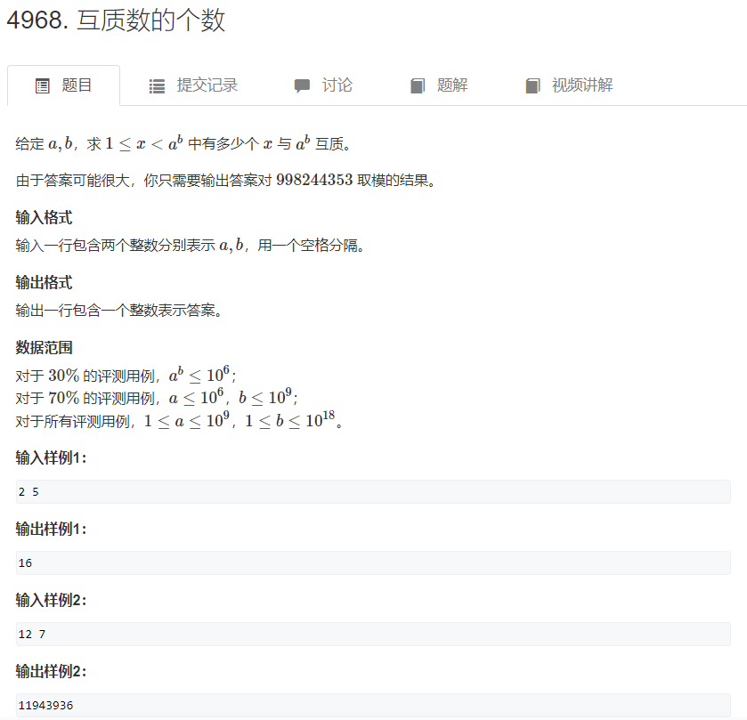

# 欧拉函数

### 一.定义&证明

#### 1.1**定义：**

> 1~N中与N互质的数的个数被称为欧拉函数，记为f(n)。（公约数只有1的两个数互质）

#### **1.2求法：**

> 首先将N分解质因数：

$$
N = p1 ^ {a1} \cdot p2 ^ {a2} \cdot ... \cdot pk ^ {ak}
$$

> 然后f(N)表示如下：

$$
f(N) = N \cdot (1 - \frac{1}{p1}) \cdot (1 - \frac{1}{p2}) \cdot ... \cdot (1 - \frac{1}{pk})
$$

#### **1.3证明：**(待补)


### 二.代码实现

#### **2.1模板：**

**时间复杂度：** 

> o(sqrt(n))

```c++
int get_euler(int n)
{
    int res = n;
    for(int i = 2; i <= n / i; i ++ )
    {
        if(n % i == 0) {     //每个满足这个表达式的i一定是它的质因数
            while(n % i == 0) n /= i;
            res = res / i * (i - 1); 
        }
    }
    if(n > 1) res = res / n * (n - 1);
    return res;
}
```

#### **2.2相关题目：**



**思路：**

> 1.题目就是求：

$$
f(a^b) \,\, mod \,\, 998244353 
$$

> 2.然而a^b非常大，直接求a^b的欧拉函数会超时，因此我们可以进行简单的推到：

$$
1.对a分解质因数: \\
a = p1 ^ {a1} \cdot p2 ^ {a2} \cdot ... \cdot pk ^ {ak}  \\
$$

$$
2.那么显然有： \\
a^b = (p1 ^ {a1} \cdot p2 ^ {a2} \cdot ... \cdot pk ^ {ak})^b = p1 ^ {b \cdot a1} \cdot p2 ^ {b \cdot a2} \cdot ... \cdot pk ^ {b \cdot ak} \\
$$

$$
3.所以f(a^b)的值如下：\\
f(a^b) = a^b \cdot (1 - \frac{1}{p1}) \cdot (1 - \frac{1}{p2}) \cdot ... \cdot (1 - \frac{1}{pk}) = a^{b-1} \cdot a \cdot (1 - \frac{1}{p1}) \cdot (1 - \frac{1}{p2}) \cdot ... \cdot (1 - \frac{1}{pk})
$$

> 3.所以直接对a分解质因数，时间复杂度为 o(sqrt(a))；然后再用快速幂求a^b，时间复杂度为o(logb), 总的时间复杂度就为o(sqrt(a)) + o(logb)。其中，快速幂是快速得出 a ^ b mod p的结果。

**代码如下：**

```c++
#include <iostream>
#include <cstdio>
#include <algorithm>

typedef long long ll;
using namespace std;
const int MOD = 998244353;

int qmi(int a, ll b, int p)  //快速幂
{
    int res = 1;
    while(b)
    {
        if(b & 1) res = (ll)res * a % p;
        a = (ll)a * a % p;
        b >>= 1;
    }
    return res;
}

int main()
{
    int a;
    ll b;
    scanf("%d%lld", &a, &b);
    
    if(a == 1) {    //这个题求eular不包括a^b本身
        cout << 0 << endl;
        return 0;
    }
    
    int res = a, x = a;
    for(int i = 2; i <= x / i; i ++ )  //欧拉函数
    {
        if(x % i == 0) {
            res = res / i * (i - 1);
            while(x % i == 0) x /= i;
        }
    }
    if(x > 1) res = res / x * (x - 1);
    
    printf("%d\n", (ll)res * qmi(a, b - 1, MOD) % MOD);  ////如果直接求a^b%MOD之后，不一定能整除a的所有质因子，因此保留一个a出来
    
    return 0;
}
```

