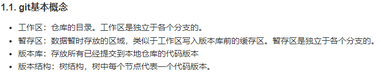
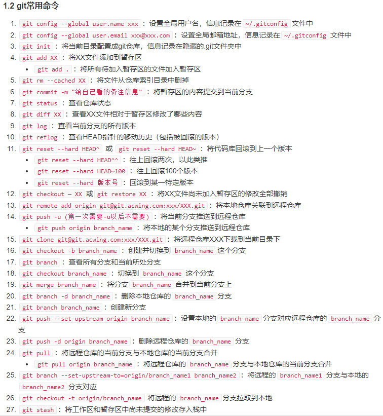
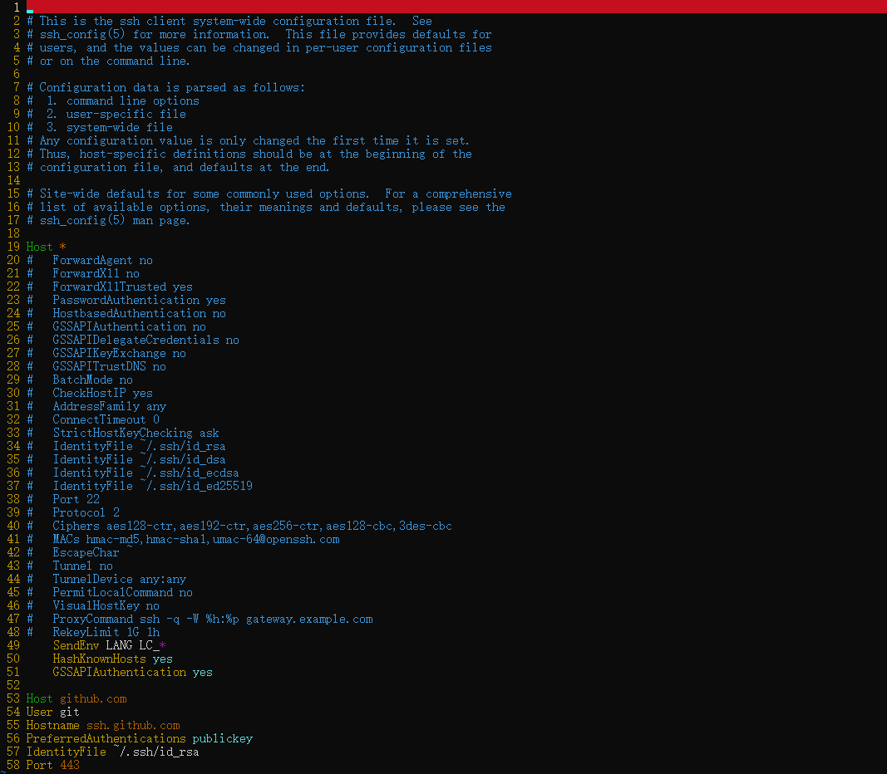
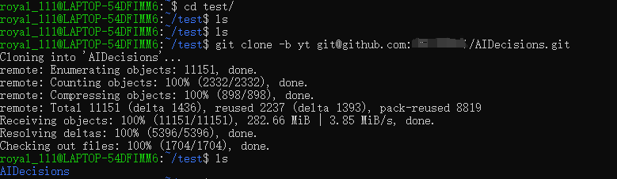

# git相关命令

### 一.常见命令






### 二.git 相关问题

本地git push前面可以一直用，后面突然不能用了，报错如下：

```
ssh: connect to host github.com port 22: Resource temporarily unavailable fatal: Could not read from remote repository. Please make sure you have the correct access rights and the repository exists.
```

**解决办法：**

1.首先找到git 的config文件（/etc/ssh/ssh_config），打开/etc/ssh/ssh_config文件进行编辑

```bash
cd /etc/ssh
sudo vim ssh_config
```

2.在文件末尾添加如下配置

```bash
Host github.com
User git
Hostname ssh.github.com
PreferredAuthentications publickey
IdentityFile ~/.ssh/id_rsa
Port 443
```



3.验证成功


### 三.克隆别人远程仓库的代码

1.首先在本地创建一个文件夹，例如`mkdir test`

2.进入test文件夹`cd test/`

3.克隆需要的分支代码 `git clone -b 分支名 git@github.com:xxx/xxx.git`


