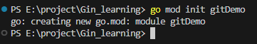
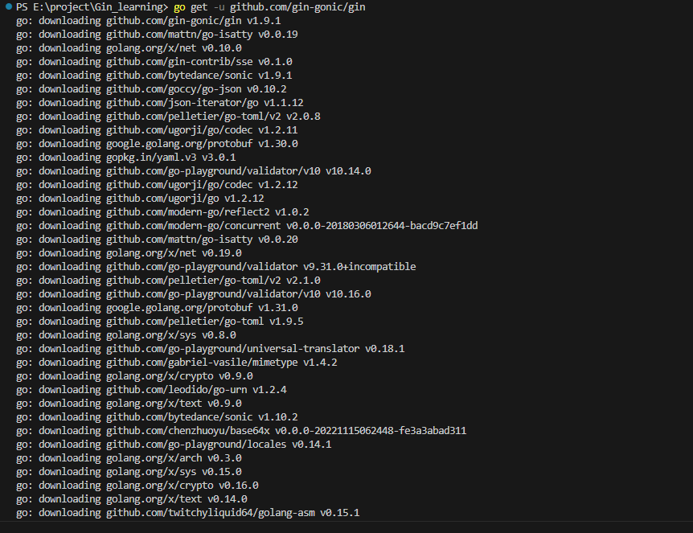
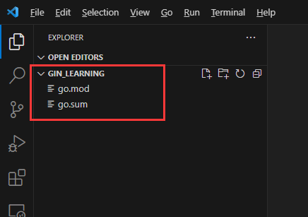
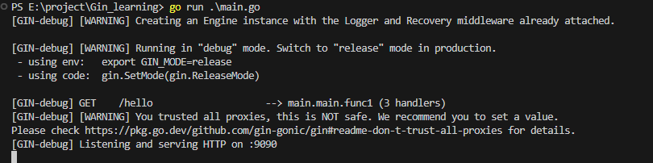
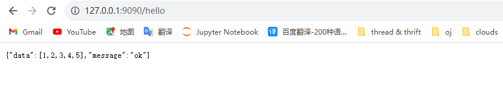
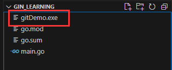
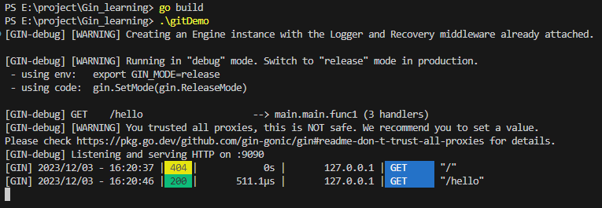
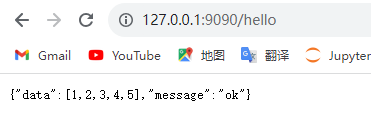

# VSCode创建Gin项目(前提是已经安装好go，在tutorial.md里面有讲)

### 1.创建一个文件夹

- 我在本地的创建的文件夹路径为：`E:\project\Gin_learning`

- 用vscode打开`Gin_learning`文件夹。

### 2.使用go mod管理项目，并生成go.mod文件

- 在该文件夹下的终端中键入`go mod init gitDemo`，如下图所示，同时会在`Gin_learning`文件夹下生成一个`go.mod`文件夹：




### 3.下载并安装Gin

1.键入`go env`查看相关配置

2.键入如下命令修改配置（默认的是：`set GO111MODULE=     set GOPROXY=https://proxy.golang.org,direct`）  //将代理改为国内的，下载更快

```go
set GO111MODULE=on
set GOPROXY=https://goproxy.cn,direct
```

3.然后键入命令`go get -u github.com/gin-gonic/gin`，成功后如下图所示，并生成一个`go.sum`文件。





### 4.测试是否安装成功，写一个GET请求验证

- 1.在该文件夹`E:\project\Gin_learning`下创建一个`main.go`文件，在里面引入`gin`，代码为`import "github.com/gin-gonic/gin"`，如下图所示：

```go
package main

import ( // 引入gin
	"net/http"

	"github.com/gin-gonic/gin"
)

func main() {
	// 创建一个默认的路由引擎
	router := gin.Default() //返回值类型为*gin.Engine
	/*
		创建一个匿名函数，当用户以GET方法访问/hello这个路由时，向浏览器返回一段JSON字符串。

		// H is a shortcut for map[string]any
		type H map[string]any
	*/

	var data []int
	for i := 0; i < 5; i++ {
		data = append(data, i+1)
	}

	router.GET("/hello", func(c *gin.Context) {
		// c.JSON：返回 JSON 格式的数据
		c.JSON(http.StatusOK, gin.H{
			"message": "ok",
			"data":    data,
		})
	})
	// 启动 HTTP 服务，默认在 0.0.0.0:8080 启动服务
	router.Run(":9090")
}

```

- 2.写好程序后，终端/命令行键入`go run main.go`运行项目，最后去浏览器打开网站`http://127.0.0.1:9090/`，即可得到下图所示：





- 3.也可以如下启动项目：
- - 3.1在命令行键入`go build`，会在文件夹下生成一个`.exe`的可执行程序，如图：
  - 3.2然后再键入`.\gitDemo`即可启动项目，如下图所示：



