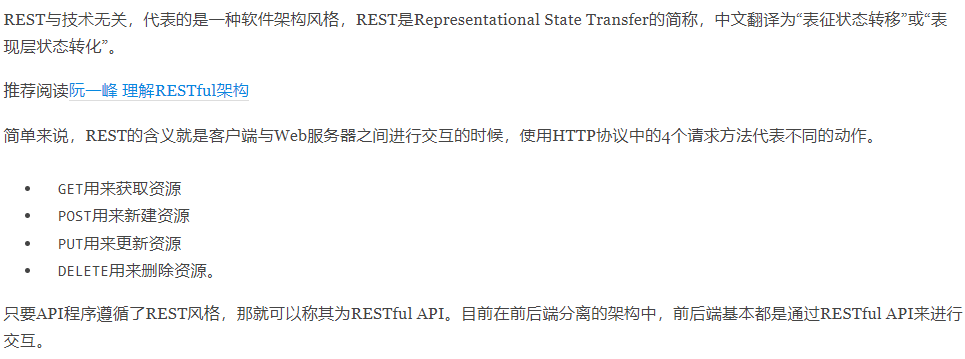
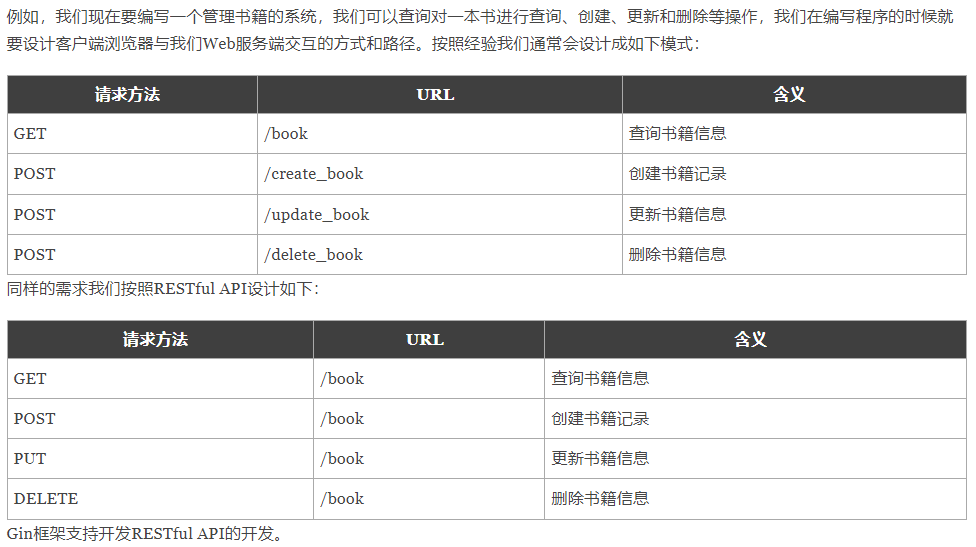
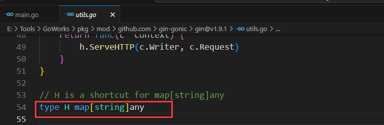
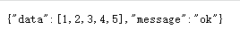
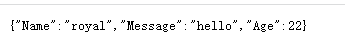
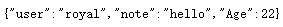

# Gin框架

**相关教程：**[Gin框架教程](https://www.liwenzhou.com/posts/Go/Gin_framework/)

### 1.关于Web

- Web是基于HTTP协议进行交互的应用网络。
- Web是通过使用Browser/APP访问的各种资源。

### 2.RESTful API

- 下载并安装Gin框架：

```bash
go get -u github.com/gin-gonic/gin
```

- 示例：

```go
package main

import (  //引入刚才下好的gin框架
	"github.com/gin-gonic/gin"
)

func main() {
	// 创建一个默认的路由引擎
	r := gin.Default()
	// GET：请求方式；/hello：请求的路径
	// 当客户端以GET方法请求/hello路径时，会执行后面的匿名函数
	r.GET("/hello", func(c *gin.Context) {
		// c.JSON：返回JSON格式的数据
		c.JSON(200, gin.H{
			"message": "Hello world!",
		})
	})
	// 启动HTTP服务，默认在0.0.0.0:8080启动服务
	r.Run()
}
```





```go
func main() {
	r := gin.Default()
	r.GET("/book", func(c *gin.Context) {
		c.JSON(200, gin.H{
			"message": "GET",
		})
	})

	r.POST("/book", func(c *gin.Context) {
		c.JSON(200, gin.H{
			"message": "POST",
		})
	})

	r.PUT("/book", func(c *gin.Context) {
		c.JSON(200, gin.H{
			"message": "PUT",
		})
	})

	r.DELETE("/book", func(c *gin.Context) {
		c.JSON(200, gin.H{
			"message": "DELETE",
		})
	})
    //启动服务，不加端口有默认端口
    r.Run(":9090")
}
```

**注意：做的网站要防止用户xss攻击，例如用户提交一个<script>alert(111);</script> ，如何将其转为一个一个字符串，而不是解析为一个js脚本，还有数据库方面的安全。**

### 3.Gin框架返回JSON

- 最常见的方式，利用封装好的`gin.H{}`，本质就是一个字典：



```go
package main
import ( 
	"net/http"

	"github.com/gin-gonic/gin"  // 引入gin
)
func main() {
	// 创建一个默认的路由引擎
	router := gin.Default() //返回值类型为*gin.Engine
	/*
		创建一个匿名函数，当用户以GET方法访问/hello这个路由时，向浏览器返回一段JSON字符串。

		// H is a shortcut for map[string]any
		type H map[string]any
	*/
	var data []int
	for i := 0; i < 5; i++ {
		data = append(data, i+1)
	}
	router.GET("/hello", func(c *gin.Context) {
		// c.JSON：返回 JSON 格式的数据
		c.JSON(http.StatusOK, gin.H{
			"message": "ok",
			"data":    data,
		})
	})
	// 启动 HTTP 服务，默认在 0.0.0.0:8080 启动服务
	router.Run(":9090")
}
```

浏览器返回的结果为：



- 第二种方法，项目级别的go语言开发中用的比较多的是结构体，结构体成员变量必须首字母大写，否则不能返回该数据，返回的成员变量字段也是大写：

```go
package main
import ( // 引入gin
	"net/http"

	"github.com/gin-gonic/gin"
)
func main() {
	r := gin.Default()
	// gin.H 是map[string]any{}的缩写
	r.GET("/someJSON", func(c *gin.Context) {
		// 方式一：自己拼接JSON
		c.JSON(http.StatusOK, gin.H{"message": "Hello world!"})
	})
	r.GET("/moreJSON", func(c *gin.Context) {
		// 方法二：使用结构体
		type msg struct {  //首字母必须大写
            Name    string
			Message string  
			Age     int
		}
		m := msg{
			Name:    "royal",
			Message: "hello",
			Age:     22,
		}
		c.JSON(http.StatusOK, m)  
	})
	r.Run(":9090")
}
```

上述程序返回结果为：



- 使用结构体返回json数据时，想要返回小写成员变量，可以灵活使用tag来对结构体字段做定制化操作，见代码：

```go
package main

import ( // 引入gin
	"net/http"

	"github.com/gin-gonic/gin"
)

func main() {
	r := gin.Default()
	// gin.H 是map[string]any{}的缩写
	r.GET("/someJSON", func(c *gin.Context) {
		// 方式一：自己拼接JSON
		c.JSON(http.StatusOK, gin.H{"message": "Hello world!"})
	})
	r.GET("/moreJSON", func(c *gin.Context) {
		// 方法二：使用结构体, 灵活使用tag来对结构体字段做定制化操作
		type msg struct { //首字母必须大写
			Name    string `json:"user"`   //json数据时，把Name替换为user
			Message string `json:"note"` //json数据时，把Message替换为note
			Age     int
		}
		m := msg{
			Name:    "royal",
			Message: "hello",
			Age:     22,
		}
		c.JSON(http.StatusOK, m)
	})
	r.Run(":9090")
}
//返回：
// {"user":"royal","note":"hello","Age":22}
```

浏览器返回结果：



### 4.获取querystring参数

- 前端发请求的时候，给后端额外附加一些信息，例如：`/user/search?username=小王子&address=沙河`，给后端发送了`username`和`address`信息，后端如何获取这两个信息呢？通过`Query`或者`DefaultQuery`获得请求中携带的`querystring`参数。

```go
func main() {
	//Default返回一个默认的路由引擎
	r := gin.Default()
	r.GET("/user/search", func(c *gin.Context) {
		username := c.DefaultQuery("username", "小王子")  //查询到username就用查询到的，查询不到就用默认的"小王子"
		//username := c.Query("username")
		address := c.Query("address")
		//输出json结果给调用方，将前端用户通过url发送过来信息再以json形式返回。
		c.JSON(http.StatusOK, gin.H{
			"message":  "ok",
			"username": username,
			"address":  address,
		})
	})
	r.Run()
}

//例如：查询的是/user/search?user=小虎&address=流沙河
//那么返回的json应该是{“message”:"ok", "usernamme":"小王子", "address":"流沙河"}
```

