# Gin框架

**相关教程：**[Gin框架教程](https://www.liwenzhou.com/posts/Go/Gin_framework/)

**官方中文文档：**[中文文档](https://gin-gonic.com/zh-cn/docs/)

### 0.Vscode 创建新项目

创建项目教程：[vscode创建项目](https://www.liwenzhou.com/posts/Go/install/)

- go mod init

使用`go module`模式新建项目时，我们**需要**通过`go mod init 项目名`命令对项目进行初始化，该命令会在项目根目录下生成`go.mod`文件。例如，我们使用`Gin_study`作为我们第一个Go项目的名称，执行如下命令。

```bash
go mod init Gin_study
```

- 编写代码

接下来在该目录中创建一个`main.go`文件：

```go
package main  // 声明 main 包，表明当前是一个可执行程序

import "fmt"  // 导入内置 fmt 包

func main(){  // main函数，是程序执行的入口
	fmt.Println("Hello World!")  // 在终端打印 Hello World!
}
```

**非常重要！！！** 如果此时VS Code右下角弹出提示让你安装插件，务必点 **install all** 进行安装。

这一步需要先执行完上面提到的`go env -w GOPROXY=https://goproxy.cn,direct`命令配置好`GOPROXY`。

- **编译**

`go build`命令表示将源代码编译成可执行文件。

在`Gin_study`目录下执行：

```bash
go build
```

编译得到的可执行文件会保存在执行编译命令的当前目录下，如果是`Windows`平台会在当前目录下找到`Gin_study.exe`可执行文件。

可在终端直接执行该`Gin_study.exe`文件：

```bash
E:xxx\Gin_study>Gin_study.exe
```

我们还可以使用`-o`参数来指定编译后得到的可执行文件的名字。

```bash
go build -o hello.exe
```

- go run

`go run main.go`也可以执行程序，该命令本质上是先在临时目录编译程序然后再执行。

- **每次新建Gin项目，都需要安装Gin框架**

> 执行安装之前，需要先go mod init初始化一下项目

```bash
go get -u github.com/gin-gonic/gin
```

> 然后就可以在文件夹下导入gin框架，并写项目了

```go
import (
	"net/http"

	"github.com/gin-gonic/gin"
)

```


- **其它相关命令**

```bash
go mod tidy   //帮组引入代码提示等，补全代码确实的东西，查漏补缺
```


### 1.关于Web

- Web是基于HTTP协议进行交互的应用网络。
- Web是通过使用Browser/APP访问的各种资源。

### 2.RESTful API

- 下载并安装Gin框架：

```bash
go get -u github.com/gin-gonic/gin
```

- 示例：

```go
package main

import (  //引入刚才下好的gin框架
	"github.com/gin-gonic/gin"
)

func main() {
	// 创建一个默认的路由引擎
	r := gin.Default()
	// GET：请求方式；/hello：请求的路径
	// 当客户端以GET方法请求/hello路径时，会执行后面的匿名函数
	r.GET("/hello", func(c *gin.Context) {
		// c.JSON：返回JSON格式的数据
		c.JSON(200, gin.H{
			"message": "Hello world!",
		})
	})
	// 启动HTTP服务，默认在0.0.0.0:8080启动服务
	r.Run()
}
```


```go
func main() {
	r := gin.Default()
	r.GET("/book", func(c *gin.Context) {
		c.JSON(200, gin.H{
			"message": "GET",
		})
	})

	r.POST("/book", func(c *gin.Context) {
		c.JSON(200, gin.H{
			"message": "POST",
		})
	})

	r.PUT("/book", func(c *gin.Context) {
		c.JSON(200, gin.H{
			"message": "PUT",
		})
	})

	r.DELETE("/book", func(c *gin.Context) {
		c.JSON(200, gin.H{
			"message": "DELETE",
		})
	})
    //启动服务，不加端口有默认端口
    r.Run(":9090")
}
```

**注意：做的网站要防止用户xss攻击，例如用户提交一个<script>alert(111);</script> ，如何将其转为一个一个字符串，而不是解析为一个js脚本，还有数据库方面的安全。**

### 3.Gin框架返回JSON

- 最常见的方式，利用封装好的`gin.H{}`，本质就是一个字典：


```go
package main
import ( 
	"net/http"

	"github.com/gin-gonic/gin"  // 引入gin
)
func main() {
	// 创建一个默认的路由引擎
	router := gin.Default() //返回值类型为*gin.Engine
	/*
		创建一个匿名函数，当用户以GET方法访问/hello这个路由时，向浏览器返回一段JSON字符串。

		// H is a shortcut for map[string]any
		type H map[string]any
	*/
	var data []int
	for i := 0; i < 5; i++ {
		data = append(data, i+1)
	}
	router.GET("/hello", func(c *gin.Context) {
		// c.JSON：返回 JSON 格式的数据
		c.JSON(http.StatusOK, gin.H{
			"message": "ok",
			"data":    data,
		})
	})
	// 启动 HTTP 服务，默认在 0.0.0.0:8080 启动服务
	router.Run(":9090")
}
```

浏览器返回的结果为：


- 第二种方法，项目级别的go语言开发中用的比较多的是**结构体**，结构体成员变量必须首字母大写，否则不能返回该数据，返回的成员变量字段也是大写：

```go
package main
import ( // 引入gin
	"net/http"

	"github.com/gin-gonic/gin"
)
func main() {
	r := gin.Default()
	// gin.H 是map[string]any{}的缩写
	r.GET("/someJSON", func(c *gin.Context) {
		// 方式一：自己拼接JSON
		c.JSON(http.StatusOK, gin.H{"message": "Hello world!"})
	})
	r.GET("/moreJSON", func(c *gin.Context) {
		// 方法二：使用结构体
		type msg struct {  //首字母必须大写
            Name    string
			Message string  
			Age     int
		}
		m := msg{
			Name:    "royal",
			Message: "hello",
			Age:     22,
		}
		c.JSON(http.StatusOK, m)
	})
	r.Run(":9090")
}
```

上述程序返回结果为：


- 使用结构体返回json数据时，想要返回小写成员变量，可以灵活使用tag来对结构体字段做定制化操作，见代码：

```go
package main

import ( // 引入gin
	"net/http"

	"github.com/gin-gonic/gin"
)

func main() {
	r := gin.Default()
	// gin.H 是map[string]any{}的缩写
	r.GET("/someJSON", func(c *gin.Context) {
		// 方式一：自己拼接JSON
		c.JSON(http.StatusOK, gin.H{"message": "Hello world!"})
	})
	r.GET("/moreJSON", func(c *gin.Context) {
		// 方法二：使用结构体, 灵活使用tag来对结构体字段做定制化操作
		type msg struct { //首字母必须大写
			Name    string `json:"user"`   //json数据时，把Name替换为user
			Message string `json:"note"` //json数据时，把Message替换为note
			Age     int
		}
		m := msg{
			Name:    "royal",
			Message: "hello",
			Age:     22,
		}
		c.JSON(http.StatusOK, m)
	})
	r.Run(":9090")
}
//返回：
// {"user":"royal","note":"hello","Age":22}
```

浏览器返回结果：


### 4.获取querystring参数(不能传太多，这种属于明文传输)

> GET请求 URL ? 后面跟的是querystring参数，key=value格式，多个key=value可以用&连接，
>
> 例如：127.0.0.1:9090/search?username=royal&address=sichuan

- 前端发请求的时候，给后端额外附加一些信息，例如：`/user/search?username=小王子&address=沙河`，给后端发送了`username`和`address`信息，后端如何获取这两个信息呢？通过`Query`或者`DefaultQuery` 或者`GetQuery`获得请求中携带的`querystring`参数。

```go
func main() {
	//Default返回一个默认的路由引擎
	r := gin.Default()
	r.GET("/user/search", func(c *gin.Context) {
		username := c.DefaultQuery("username", "小王子")  //查询到username就用查询到的，查询不到就用默认的"小王子"
		//username := c.Query("username")
		address := c.Query("address")
		//输出json结果给调用方，将前端用户通过url发送过来信息再以json形式返回。
		c.JSON(http.StatusOK, gin.H{
			"message":  "ok",
			"username": username,
			"address":  address,
		})
        
        name, ok := c.GetQuery("username")  //返回值是(string, bool)  //ctrl+点击可以查看函数定义
        if !ok {
            name = "xxx"
        }
        
	})
	r.Run()
}

//例如：查询的是/user/search?user=小虎&address=流沙河
//那么返回的json应该是{“message”:"ok", "usernamme":"小王子", "address":"流沙河"}
```

### 5.获取form参数

> 常见的登录或者注册界面是前端通过form表单，通过post方式提交的。

- 当用户点击登录按钮的时候，会触发form表单，像`/login`路由发送post请求，那么后端怎么接受该表单的内容呢？（跟Querystring一样，也有很多类似的方法）

  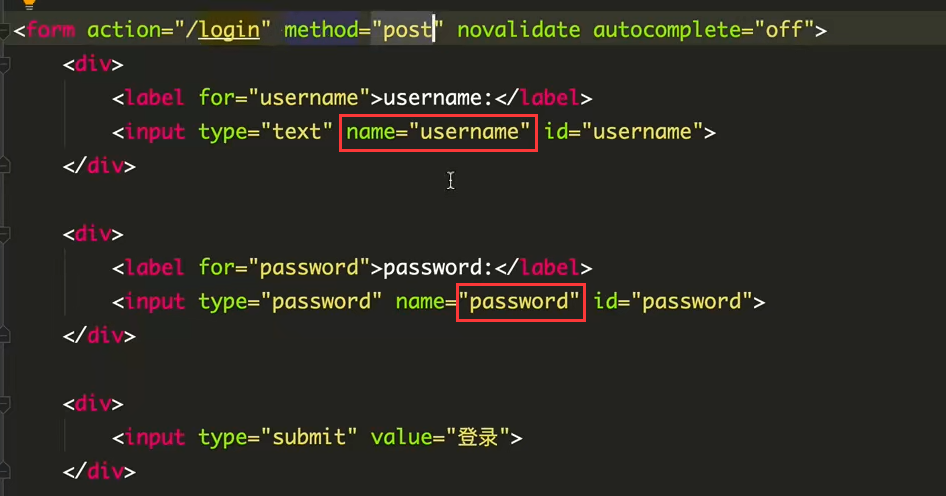

```go
func main() {
	//Default返回一个默认的路由引擎
	r := gin.Default()
	r.POST("/login", func(c *gin.Context) {
		// DefaultPostForm取不到值时会返回指定的默认值
		//username := c.DefaultPostForm("username", "小王子")
		username := c.PostForm("username")  //username和password这些名称都是前端input框中的name属性定义好了的。
		password := c.PostForm("password")  
		//输出json结果给调用方
		c.JSON(http.StatusOK, gin.H{
			"message":  "ok",
			"username": username,
			"password":  password,
		})
	})
	r.Run(":8080")
}
```

### 6.获取path参数

> 请求的参数通过URL路径传递，例如：`/profile/user/121`。 这个路由一般是用户的个人中心，121一般为用户的uid，获取请求URL路径中的参数的方式如下。

```go
package main

import (
	"net/http"

	"github.com/gin-gonic/gin"
)

func main() {
	//Default返回一个默认的路由引擎
	r := gin.Default()

	r.GET("/profile/user/:uid", func(ctx *gin.Context) {
		uid := ctx.Param("uid")
		ctx.JSON(http.StatusOK, gin.H{  //把得到的uid传给前端
			"id": uid,
		})
	})

	r.Run(":8080")
}

```

> 用户121点击个人中心时，发出GET请求

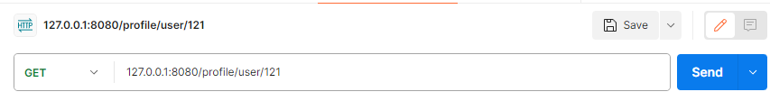

> 把得到的uid传给前端

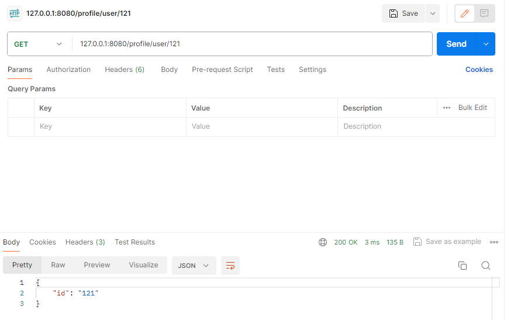

### 7.参数绑定

为了能够更方便的获取请求相关参数，提高开发效率，我们可以基于请求的`Content-Type`识别请求数据类型并利用反射机制自动提取请求中`QueryString`、`form表单`、`JSON`、`XML`等参数到结构体中。 下面的示例代码演示了`.ShouldBind()`强大的功能，它能够基于请求自动提取`JSON`、`form表单`和`QueryString`类型的数据，并把值绑定到指定的结构体对象。

```go
// Binding from JSON
type Login struct {
	User     string `form:"user" json:"user" binding:"required"`
	Password string `form:"password" json:"password" binding:"required"`
}

func main() {
	router := gin.Default()

	// 绑定JSON的示例 ({"user": "q1mi", "password": "123456"})
	router.POST("/loginJSON", func(c *gin.Context) {
		var login Login

		if err := c.ShouldBind(&login); err == nil {
			fmt.Printf("login info:%#v\n", login)
			c.JSON(http.StatusOK, gin.H{
				"user":     login.User,
				"password": login.Password,
			})
		} else {
			c.JSON(http.StatusBadRequest, gin.H{"error": err.Error()})
		}
	})

	// 绑定form表单示例 (user=q1mi&password=123456)
	router.POST("/loginForm", func(c *gin.Context) {
		var login Login
		// ShouldBind()会根据请求的Content-Type自行选择绑定器，非常的智能哇，三个板块的东西一模一样。
		if err := c.ShouldBind(&login); err == nil {
			c.JSON(http.StatusOK, gin.H{
				"user":     login.User,
				"password": login.Password,
			})
		} else {
			c.JSON(http.StatusBadRequest, gin.H{"error": err.Error()})
		}
	})

	// 绑定QueryString示例 (/loginQuery?user=royal_111&password=123456)
	router.GET("/loginForm", func(c *gin.Context) {
		var login Login
		// ShouldBind()会根据请求的Content-Type自行选择绑定器
		if err := c.ShouldBind(&login); err == nil {
			c.JSON(http.StatusOK, gin.H{
				"user":     login.User,
				"password": login.Password,
			})
		} else {
			c.JSON(http.StatusBadRequest, gin.H{"error": err.Error()})
		}
	})

	// Listen and serve on 0.0.0.0:8080
	router.Run(":8080")
}
```

`ShouldBind`会按照下面的顺序解析请求中的数据完成绑定：

1. 如果是 `GET` 请求，只使用 `Form` 绑定引擎（`query`）。
2. 如果是 `POST` 请求，首先检查 `content-type` 是否为 `JSON` 或 `XML`，然后再使用 `Form`（`form-data`）。

### 8.文件上传

#### 8.1单个文件上传

文件上传前端页面代码： <--*> 上传文件需要写上这个, enctype="multipart/form-data" </--*>

```html
<!DOCTYPE html>
<html lang="zh-CN">
<head>
    <title>上传文件示例</title>
</head>
<body>
<form action="/upload" method="post" enctype="multipart/form-data">   
    <input type="file" name="f1">
    <input type="submit" value="上传">
</form>
</body>
</html>
```

后端gin框架部分代码：

```go
// 从请求中读取文件
// 将读取到的文件保存在本地，（服务端本地）
func main() {
	router := gin.Default()
	// 处理multipart forms提交文件时默认的内存限制是32 MiB
	// 可以通过下面的方式修改
	// router.MaxMultipartMemory = 8 << 20  // 8 MiB
	router.POST("/upload", func(c *gin.Context) {
		// 单个文件
		file, err := c.FormFile("f1")
		if err != nil {
			c.JSON(http.StatusInternalServerError, gin.H{
				"message": err.Error(),
			})
			return
		}

		log.Println(file.Filename)
		dst := fmt.Sprintf("./%s", file.Filename)  //连接字符串，保存到当前目录下
        // dst := path.Join("./", f.Filename)
		// 上传文件到指定的目录
		c.SaveUploadedFile(file, dst)  //这里也应该处理一下错误
		c.JSON(http.StatusOK, gin.H{
			"message": fmt.Sprintf("'%s' uploaded!", file.Filename),
		})
	})
	router.Run()
}
```

#### 8.2多个文件上传

```go
func main() {
	router := gin.Default()
	// 处理multipart forms提交文件时默认的内存限制是32 MiB
	// 可以通过下面的方式修改
	// router.MaxMultipartMemory = 8 << 20  // 8 MiB
	router.POST("/upload", func(c *gin.Context) {
		// Multipart form
		form, _ := c.MultipartForm()
		files := form.File["file"]

		for index, file := range files {
			log.Println(file.Filename)
			dst := fmt.Sprintf("C:/tmp/%s_%d", file.Filename, index)
			// 上传文件到指定的目录
			c.SaveUploadedFile(file, dst)
		}
		c.JSON(http.StatusOK, gin.H{
			"message": fmt.Sprintf("%d files uploaded!", len(files)),
		})
	})
	router.Run()
}
```

### 9.重定向

#### 9.1HTTP重定向

HTTP 重定向很容易。 内部、外部重定向均支持。

> 路由会直接跳转到百度的url

```go
r.GET("/test", func(c *gin.Context) {
	c.Redirect(http.StatusMovedPermanently, "https://www.baidu.com/")
})
```

#### 9.2路由重定向

路由重定向，使用`HandleContext`：

> 访问/test路由时，会执行/test2这个里面的函数，但是浏览器中的路由不会发生改变。

```go
r.GET("/test", func(c *gin.Context) {
    // 指定重定向的URL
    c.Request.URL.Path = "/test2"
    r.HandleContext(c)
})
r.GET("/test2", func(c *gin.Context) {
    c.JSON(http.StatusOK, gin.H{"hello": "world"})
})
```

### 10.路由（重点）

#### 10.1普通路由

```go
r.GET("/index", func(c *gin.Context) {...})
r.GET("/login", func(c *gin.Context) {...})
r.POST("/login", func(c *gin.Context) {...})
```

此外，还有一个可以匹配所有请求方法的`Any`方法如下：

```go
r.Any("/test", func(c *gin.Context) {
    switch c.Request.Method {
        case "GET":  //匹配到GET请求做什么事
        	//...
        case http.MethodPost:  //http.MethodPost就是一个字符串常量，等价于"POST"
        	//...
        //...
    }
})
```

为没有配置处理函数的路由添加处理程序，默认情况下它返回404代码，下面的代码为没有匹配到路由的请求都返回`views/404.html`页面。

```go
r.NoRoute(func(c *gin.Context) {
	c.HTML(http.StatusNotFound, "views/404.html", nil)
    //或者返回一个Json，然后前端收到这个状态码的时候，由前端来处理，并返回404 page not found页面
    // c.JSON(http.StatusNotFound, gin.H{
    //     "message":"404",
    // })
})
```

#### 10.2路由组

我们可以将**拥有共同URL前缀**的路由划分为一个路由组。习惯性一对`{}`包裹同组的路由，这只是为了看着清晰，你用不用`{}`包裹功能上没什么区别。

```go
func main() {
	r := gin.Default()
	userGroup := r.Group("/user")  //公用的前缀
	{
		userGroup.GET("/index", func(c *gin.Context) {...})
		userGroup.GET("/login", func(c *gin.Context) {...})
		userGroup.POST("/login", func(c *gin.Context) {...})

	}
	shopGroup := r.Group("/shop")
	{
		shopGroup.GET("/index", func(c *gin.Context) {...})
		shopGroup.GET("/cart", func(c *gin.Context) {...})
		shopGroup.POST("/checkout", func(c *gin.Context) {...})
	}
	r.Run()
}
```

路由组也是支持嵌套的，例如：

```go
shopGroup := r.Group("/shop")
	{
		shopGroup.GET("/index", func(c *gin.Context) {...})
		shopGroup.GET("/cart", func(c *gin.Context) {...})
		shopGroup.POST("/checkout", func(c *gin.Context) {...})
		// 嵌套路由组
		xx := shopGroup.Group("xx")
		xx.GET("/oo", func(c *gin.Context) {...})
	}
```

通常我们将路由分组用在划分业务逻辑或划分API版本时。

### 11.中间件

Gin框架允许开发者在处理请求的过程中，加入用户自己的钩子（Hook）函数。这个钩子函数就叫中间件，中间件适合处理一些公共的业务逻辑，比如登录认证(判断是否登录)、权限校验(用户是否为VIP)、数据分页、记录日志、耗时统计等。

#### 11.1定义&注册中间件

- **定义中间件：**Gin中的中间件必须是一个`gin.HandlerFunc`类型。例如我们像下面的代码一样定义一个统计请求耗时的中间件。

```go
// StatCost 是一个统计耗时请求耗时的中间件
func StatCost() gin.HandlerFunc {
	return func(c *gin.Context) {
		start := time.Now()
		c.Set("name", "royal_111") // 可以通过c.Set在请求上下文中设置值，后续的处理函数能够取到该值
		// 调用该请求的剩余处理程序
		c.Next()
		// 不调用该请求的剩余处理程序
		// c.Abort()
		// 计算耗时
		cost := time.Since(start)
		log.Println(cost)
	}
}
```

- **注册中间件：**在gin框架中，我们可以为每个路由添加任意数量的中间件。

> 为全局路由注册（就是为所有url注册中间件，这些中间件为所有的url适用）

```go
func main() {
	// 新建一个没有任何默认中间件的路由
	r := gin.New()
	// 注册一个全局中间件
	r.Use(StatCost())
	
	r.GET("/test", func(c *gin.Context) {
		name := c.MustGet("name").(string) // 从上下文取值        //跨中间件存取值。
		log.Println(name)
		c.JSON(http.StatusOK, gin.H{
			"message": "Hello world!",
		})
	})
	r.Run()
}
```

> 为某个路由单独注册

```go
// 给/test2路由单独注册中间件（可注册多个）
	r.GET("/test2", StatCost(), func(c *gin.Context) {
		name := c.MustGet("name").(string) // 从上下文取值
		log.Println(name)
		c.JSON(http.StatusOK, gin.H{
			"message": "Hello world!",
		})
	})
```

> **为路由组注册中间件**

为路由组注册中间件有以下两种写法。

写法1：

```go
shopGroup := r.Group("/shop", StatCost())

{
    shopGroup.GET("/index", func(c *gin.Context) {...})
    ...
}
```

写法2：

```go
shopGroup := r.Group("/shop")
shopGroup.Use(StatCost())

{
    shopGroup.GET("/index", func(c *gin.Context) {...})
    ...
}
```

> 中间件注意事项

gin默认中间件：

`gin.Default()`默认使用了`Logger`和`Recovery`中间件，其中：

- `Logger`中间件将日志写入`gin.DefaultWriter`，即使配置了`GIN_MODE=release`。
- `Recovery`中间件会recover任何`panic`。如果有panic的话，会写入500响应码。

```go
//源代码
// Default returns an Engine instance with the Logger and Recovery middleware already attached.
func Default() *Engine {
	debugPrintWARNINGDefault()
	engine := New()
	engine.Use(Logger(), Recovery())
	return engine
}
```

如果不想使用上面两个默认的中间件，可以使用`gin.New()`新建一个没有任何默认中间件的路由。

**gin中间件中使用goroutine**：(不太清楚什么是goroutine)

当在中间件或`handler`中启动新的`goroutine`时，**不能使用**原始的上下文（c *gin.Context），必须使用其只读副本（`c.Copy()`）。

```go
func middle1(c *gin.Context) {
	fmt.Println("middle1 start.......")
	start := time.Now()
	
    // go funcXX(c.Copy())   //在funcXX中只能使用c的拷贝
	c.Next() //调用后面的middle2

	cost := time.Since(start)
	fmt.Printf("cost:%v\n", cost) //cost:0s
	fmt.Println("middle1 end.......")
}
```


#### 11.2定义&注册中间件，具体举例

Gin中的中间件必须是一个`gin.HandlerFunc`类型。在gin框架中，我们可以为每个路由添加任意数量的中间件。

```go
package main

import (
	"fmt"
	"net/http"
	"time"

	"github.com/gin-gonic/gin"
)

func index(c *gin.Context) {
	is_login, exists := c.Get("is_login")  //获取前面hander函数用Set创建的键值对
	if exists {
		c.JSON(http.StatusOK, gin.H{
			"message":  "index",
			"is_login": is_login,
		})
	}

}

// 中间件
func is_login(c *gin.Context) { //这个中间件用来判断当前用户是否登录状态，并且统计耗时
	c.JSON(http.StatusOK, gin.H{
		"is_login": "true",
	})

	// 设置一些键值对信息，供后面的hander函数访问获取
	c.Set("is_login", "true")

	start := time.Now()
	c.Next()

	cost := time.Since(start)
	fmt.Printf("cost:%v\n", cost) //cost:121.3us
}

// 中间件
func is_login2(c *gin.Context) { //这个中间件用来判断当前用户是否登录状态
	c.JSON(http.StatusOK, gin.H{
		"is_login": "true",
	})
    
    c.Next()  //调用后续的处理函数，这里就是调用后面的index函数
    
    // c.Abort()  //阻止调用后续的handler函数。   //比如未登录，我们就不调用后续的index函数
}

func main() {
	//Default返回一个默认的路由引擎
	r := gin.Default()

	// GET is a shortcut for router.Handle("GET", path, handlers).
	// func (group *RouterGroup) GET(relativePath string, handlers ...HandlerFunc) IRoutes {
	// 	return group.handle(http.MethodGet, relativePath, handlers)
	// }
	
    //调用中间件
	r.GET("./index", is_login, index)
    r.GET("./hello", is_login, xxx)  //假设xxx已经写好
    
    //方法二：提前注册好中间件，就不需要每个请求中写入中间件了
    r.Use(is_login)  //全局注册中间件函数m1
    r.GET("./index", index)
    r.GET("./hello", xxx)  //假设xxx已经写好
    
    

	r.Run(":8080")
}
```

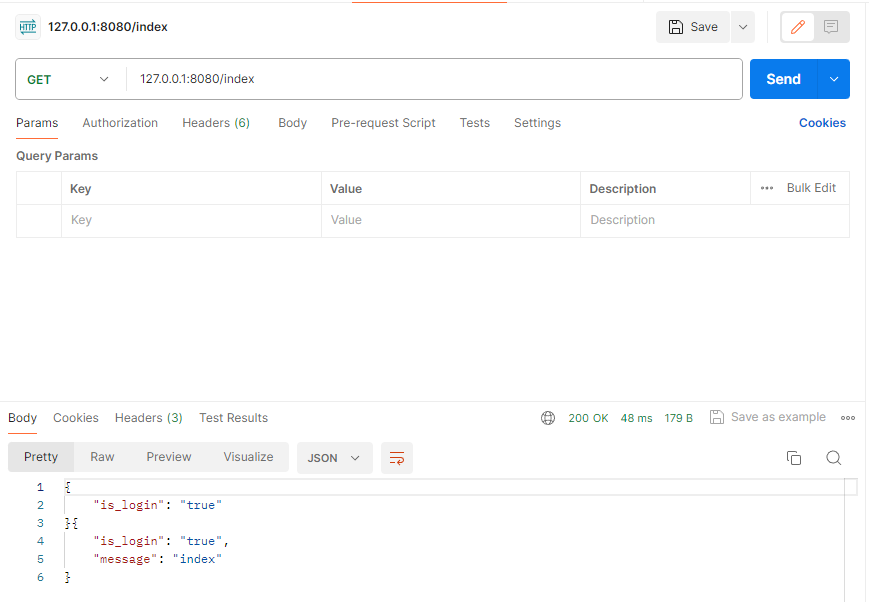

例如我们像下面的代码一样定义一个统计请求耗时的中间件。

```go
// StatCost 是一个统计耗时请求耗时的中间件
func StatCost() gin.HandlerFunc {
	return func(c *gin.Context) {
		start := time.Now()
		c.Set("name", "小王子") // 可以通过c.Set在请求上下文中设置值，后续的处理函数能够取到该值
		// 调用该请求的剩余处理程序
		c.Next()
		// 不调用该请求的剩余处理程序
		// c.Abort()
		// 计算耗时
        // 后面两行代码是等后面剩余的处理函数执行完后再执行。
		cost := time.Since(start)
		log.Println(cost)
	}
}
```

- 注册多个中间件时，hander函数的执行流程：

```go
package main

import (
	"fmt"
	"net/http"
	"time"

	"github.com/gin-gonic/gin"
)

func index(c *gin.Context) {
	fmt.Println("index")
	c.JSON(http.StatusOK, gin.H{
		"message": "index",
	})

}

// 中间件1
func middle1(c *gin.Context) {
	fmt.Println("middle1 start.......")
	start := time.Now()

	c.Next() //调用后面的middle2

	cost := time.Since(start)
	fmt.Printf("cost:%v\n", cost)
	fmt.Println("middle1 end.......")
}

// 中间件2
func middle2(c *gin.Context) {
	fmt.Println("middle2 start.......")

	c.Next() //调用后面的index

	fmt.Println("middle2 end.......")
}

func main() {
	//Default返回一个默认的路由引擎
	r := gin.Default()
	// 注册多个中间件
	r.Use(middle1, middle2)

	r.GET("./index", index) //访问当前路由时，先执行上面注册的两个中间件，最后再执行index处理函数

	r.Run(":8080")
}
```

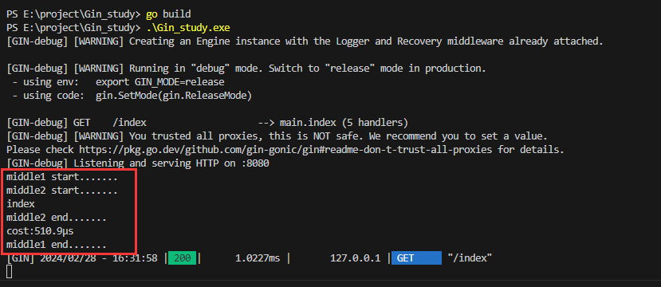

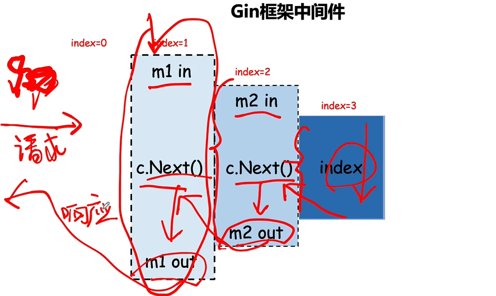

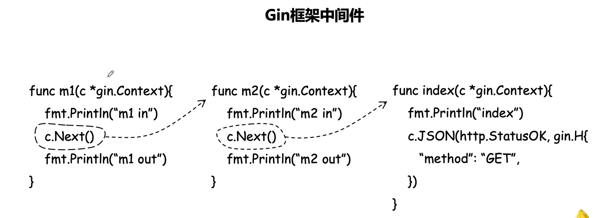

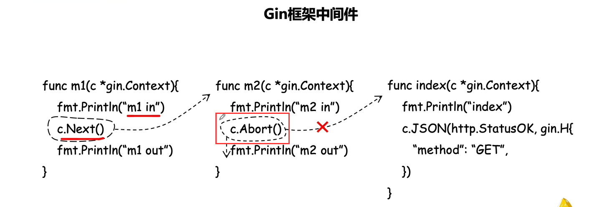

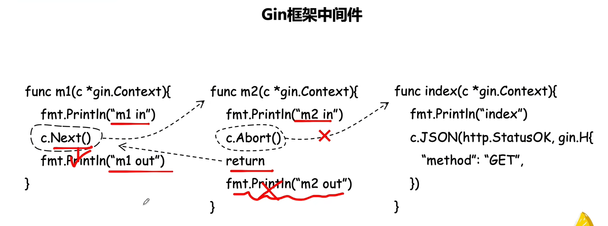

- 中间件不加`c.Next()`的话，该请求的中间件和处理函数就按顺序执行即可。


- 写一个规范的判断是否登录的中间件

```go
func authMiddleware(doCheck bool) gin.HandlerFunc{
    // 连接数据库
    // 或者一些其它准备工作
    return func(c *gin.Context) {
        if doCheck {
            // 放具体的逻辑 
        	//是否登录的判断
        	// if 是登录用户
        	// c.Next()
        	// else
        	// c.Abort()
        }else {
            c.Next()
        }
        
    }
}

//注册中间件时更灵活  为全局路由注册
r.Use(m1, m2, authMiddleware(true))
```

### 12.GORM

[GORM入门教程](https://www.liwenzhou.com/posts/Go/gorm/)

[推荐官方文档](https://gorm.io/zh_CN/docs/)

#### 12.1GORM连接MySQL基本示例

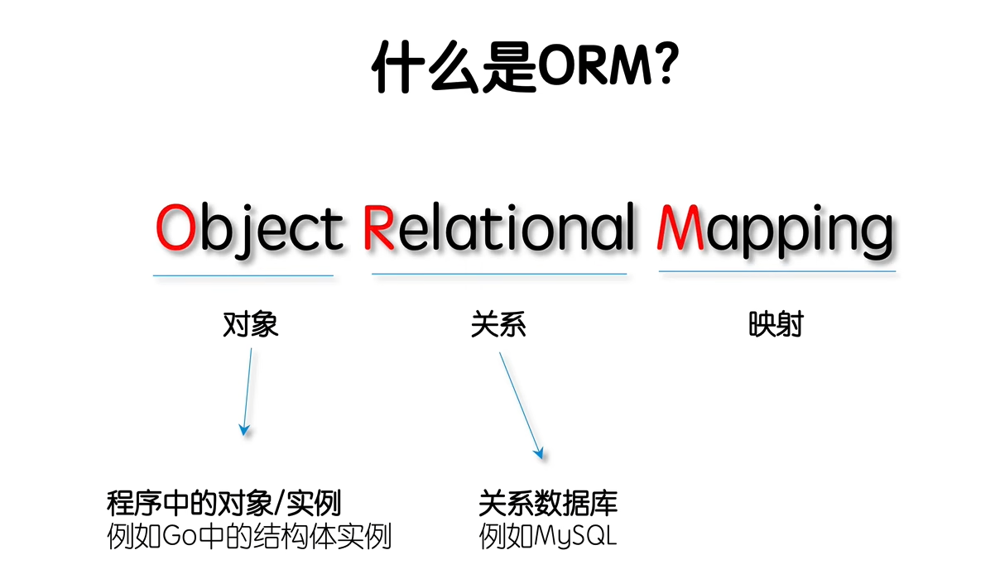

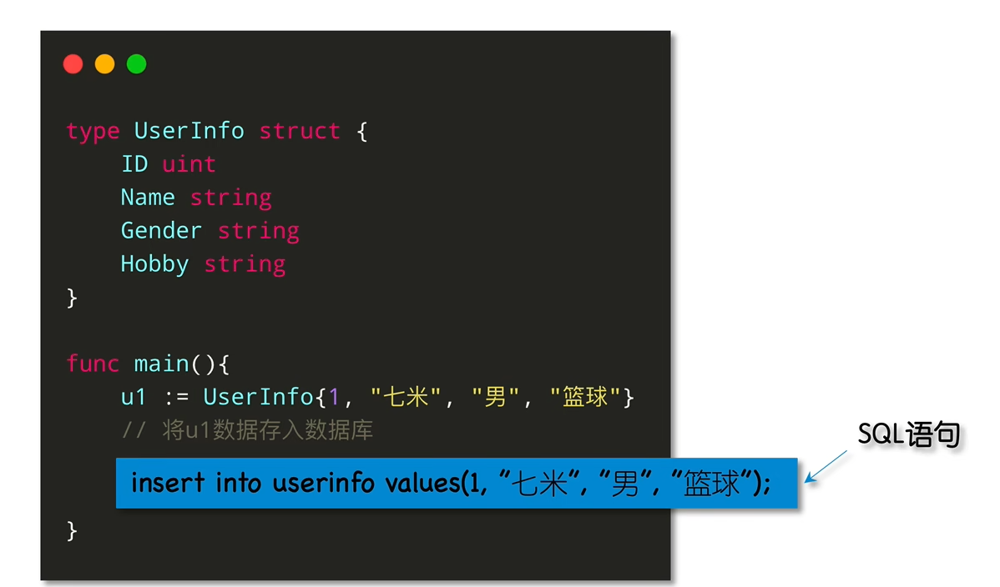

> orm帮助我们去写sql

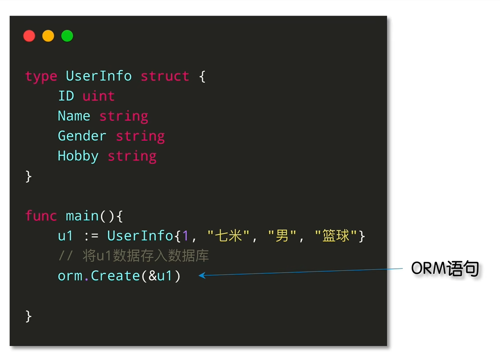

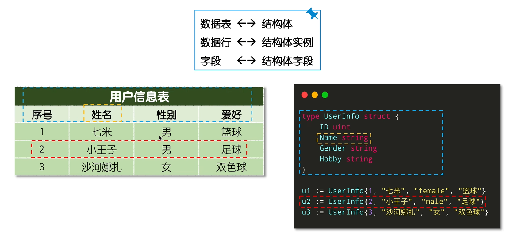

- ORM的优缺点：（大型项目，对性能要求较高的，建议手写sql）

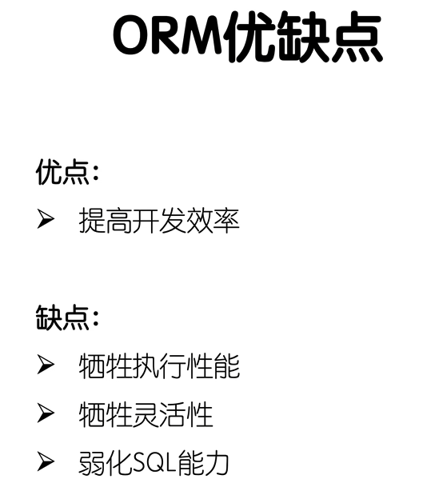

- **安装gorm包**

```bash
go get -u gorm.io/gorm
go get -u gorm.io/driver/mysql   (下载对应的驱动)
// go get -u gorm.io/driver/sqlite
```

- **连接到MySQL**

```go
import (
  "gorm.io/driver/mysql"  //导入mysql的驱动
  "gorm.io/gorm"   //导入gorm工具
)

func main() {
  // 参考 https://github.com/go-sql-driver/mysql#dsn-data-source-name 获取详情
  dsn := "user:pass@tcp(127.0.0.1:3306)/dbname?charset=utf8mb4&parseTime=True&loc=Local"
  db, err := gorm.Open(mysql.Open(dsn), &gorm.Config{})
}
```

- **在本地创建一个MySQL数据库**

```mysql
create database gin_db;
```

- **使用GORM连接数据库gin_db，并进行简单的创建、查询、更新、删除操作（更多细节操作建议看官网即可）**

```go
package main

import (
	"gorm.io/driver/mysql"
	"gorm.io/gorm"
)

// 结构体对应的数据库的表
type UserInfo struct {
	ID     uint
	Name   string
	Gender string
	Hobby  string
}

func main() {

	// 连接MySQL数据库
	dsn := "root:123456@tcp(127.0.0.1:3306)/gin_db?charset=utf8mb4&parseTime=True&loc=Local"
	db, err := gorm.Open(mysql.Open(dsn), &gorm.Config{})
	if err != nil {
		panic("failed to connect database")
	}

	//执行数据库操作
	// 创建表  自动迁移（把结构体和数据库表进行对应，就是帮你自动创建，修改数据库表（根据你对结构体的改变））
	_ = db.AutoMigrate(&UserInfo{})

	//创建数据行
	u1 := UserInfo{1, "royal_111", "男", "basketball"}
	// db.Create(u1)   //结构体直接按值传速度比较慢，建议直接传入指针
	db.Create(&u1)
    
	
    // 查询
	var u UserInfo  //声明模型结构体类型变量u
    //u := new(UserInfo)
    // db.First(u)   //new返回的是指针
    
	// 获取第一条记录（主键升序）
	db.First(&u)
	// SELECT * FROM users ORDER BY id LIMIT 1;
	fmt.Printf("%#v\n%v\n", u, u)
	// main.UserInfo{ID:0x1, Name:"royal_111", Gender:"男", Hobby:"basketball"}
	// {1 royal_111 男 basketball}
    
    // 更新
	db.Model(&u).Where("id = ?", 1).Update("hobby", "football")
	// UPDATE users SET hobby='football', updated_at='2013-11-17 21:34:10' WHERE id=1;
    
    //删除
	db.Delete(&u)
	// DELETE from users where id = 1;
    
	// 关闭数据集
	sqlDB, err := db.DB() //通过db.DB()获取底层的*sql.DB对象，然后调用其Close方法来关闭数据库连接
	if err != nil {
		panic("failed to close database")
	}
	sqlDB.Close()

}

```

> 执行完go run main.go后的效果如下：(这是创建后的效果图)

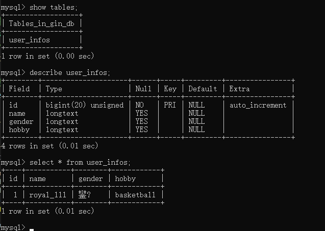

#### 12.2GORM模型定义（[模型定义官方文档](https://gorm.io/zh_CN/docs/models.html)）

- 官方提供了一个预先定义好的结构体，包含常用的几个字段：

- **`gorm.Model`**

GORM provides a predefined struct named `gorm.Model`, which includes commonly used fields:

```go
// gorm.Model 的定义
type Model struct {
  ID        uint           `gorm:"primaryKey"`
  CreatedAt time.Time
  UpdatedAt time.Time
  DeletedAt gorm.DeletedAt `gorm:"index"`
}
```

- **Embedding in Your Struct**: You can embed `gorm.Model` directly in your structs to include these fields automatically. This is useful for maintaining consistency across different models and leveraging GORM’s built-in conventions, refer [Embedded Struct](https://gorm.io/zh_CN/docs/models.html#embedded_struct)
- **Fields Included**:
  - `ID`: A unique identifier for each record (primary key).
  - `CreatedAt`: **Automatically set** to the current time when a record is created.
  - `UpdatedAt`: **Automatically updated** to the current time whenever a record is updated.
  - `DeletedAt`: Used for soft deletes (marking records as deleted without actually removing them from the database).


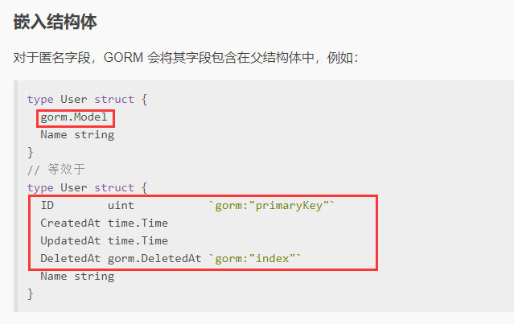

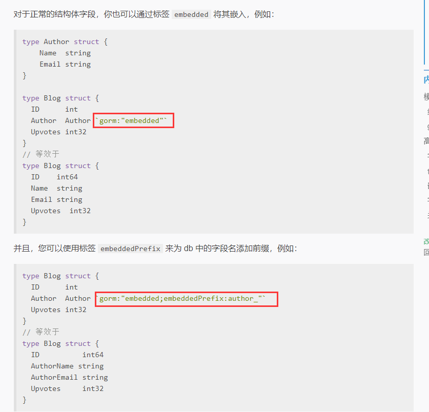

- 当然也可以自己定义模型，不使用gorm.Model

```go
type User struct {
	ID int
    Name string
}
```

- 模型定义示例：

```go
type User struct {
  gorm.Model             //内嵌gorm.Model
  Name         string
  Age          sql.NullInt64         //零值类型
  Birthday     *time.Time
  Email        string  `gorm:"type:varchar(100);unique_index"`        //``结构体的tag    unique_index唯一索引，在数据库中不能重复
  Role         string  `gorm:"size:255"` // 设置字段大小为255
  MemberNumber *string `gorm:"unique;not null"` // 设置会员号（member number）唯一并且不为空
  Num          int     `gorm:"AUTO_INCREMENT"` // 设置 num 为自增类型
  Address      string  `gorm:"index:addr"` // 给address字段创建名为addr的索引
  IgnoreMe     int     `gorm:"-"` // 通过 struct 读写会忽略该字段  (不会创建在我们的数据库里面)
}
```

- 结构体的字段标签（tag）:

声明 model 时，tag 是可选的，GORM 支持以下 tag： tag 名大小写不敏感，但建议使用 `camelCase` 风格。

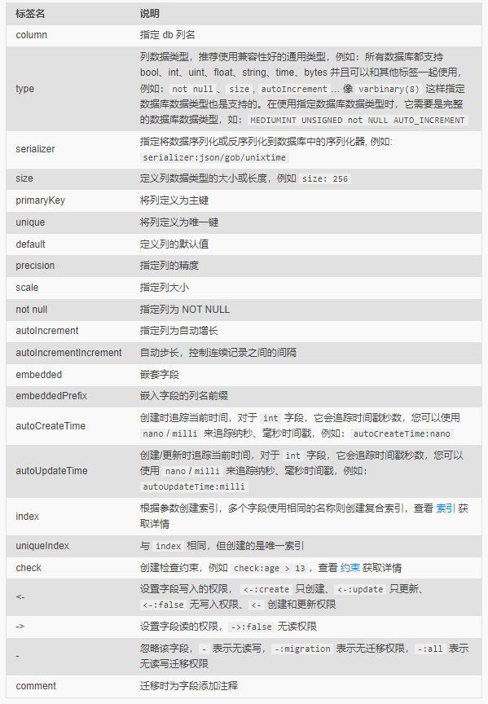

- 利用`_ = db.AutoMigrate(&User{})`创建表：

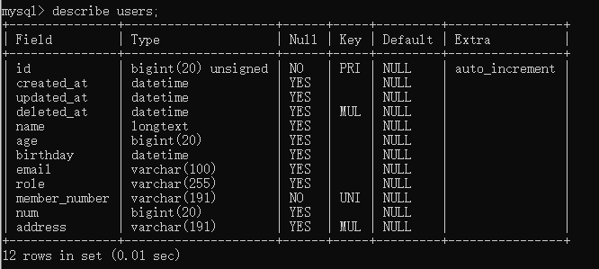

- 关联标签：

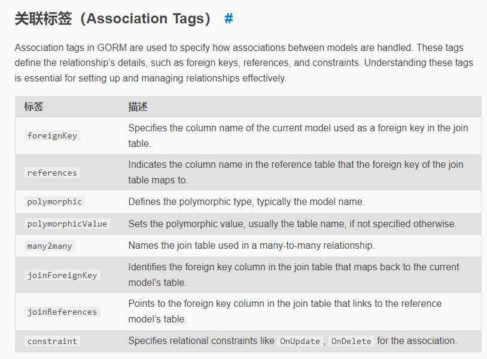

#### tips:上述很多细节官方文档都有，我就不再记录，建议写的时候直接查官方文档，写一两次就熟悉了[官方文档](https://gorm.io/zh_CN/docs/associations.html#tags)以及[非官方文档](https://www.liwenzhou.com/posts/Go/gorm/)

- **主键、表名、列名的约定**

- **主键（Primary Key）**

GORM 默认会使用名为ID的字段作为表的主键。

```go
type User struct {
  ID   string // 名为`ID`的字段会默认作为表的主键
  Name string
}

// 使用`AnimalID`作为主键
type Animal struct {
  AnimalID int64 `gorm:"primary_key"`
  Name     string
  Age      int64
}
```

- **表名（Table Name）**

表名默认就是结构体名称的复数，例如：

```go
type User struct {} // 默认表名是 `users`

// 将 User 的表名设置为 `profiles`  唯一指定表名
func (User) TableName() string {
  return "profiles"
}

func (u User) TableName() string {
  if u.Role == "admin" {
    return "admin_users"
  } else {
    return "users"
  }
}

// 禁用默认表名的复数形式，如果置为 true，则 `User` 的默认表名是 `user`
db.SingularTable(true)
```

例子：

```go
package main

import (
	"database/sql"
	"time"

	"gorm.io/driver/mysql"
	"gorm.io/gorm"
)

// 结构体对应的数据库的表
type UserInfo struct {
	ID     uint
	Name   string
	Gender string
	Hobby  string
}

type User struct {
	gorm.Model   //内嵌gorm.Model
	Name         string
    Age          sql.NullInt64 //零值类型：有默认值，想插入0时，u := User{Age:sql.NullInt64{0, true}, ...}
	Birthday     *time.Time
	Email        string  `gorm:"type:varchar(100);unique_index"` //``结构体的tag    unique_index唯一索引，在数据库中不能重复
	Role         string  `gorm:"size:255"`                       // 设置字段大小为255
	MemberNumber *string `gorm:"unique;not null"`                // 设置会员号（member number）唯一并且不为空
	Num          int     `gorm:"AUTO_INCREMENT"`                 // 设置 num 为自增类型
	Address      string  `gorm:"index:addr"`                     // 给address字段创建名为addr的索引
	IgnoreMe     int     `gorm:"-"`                              // 通过 struct 读写会忽略该字段  (不会创建在我们的数据库里面)
}

type Good struct {
	ID    uint
	Price float32
}

func (Good) TableName() string {  //改别名
	return "good_bd"
}

func main() {

	// 连接MySQL数据库
	dsn := "root:123456@tcp(127.0.0.1:3306)/gin_db?charset=utf8mb4&parseTime=True&loc=Local"
	db, err := gorm.Open(mysql.Open(dsn), &gorm.Config{})
	if err != nil {
		panic("failed to connect database")
	}

	//执行数据库操作
	// 创建表  自动迁移（把结构体和数据库表进行对应，就是帮你自动创建，修改数据库表（根据你对结构体的改变））
	_ = db.AutoMigrate(&UserInfo{})
	_ = db.AutoMigrate(&User{})
	_ = db.AutoMigrate(&Good{})

	//创建数据行
	// u1 := UserInfo{1, "royal_111", "男", "basketball"}
	// // db.Create(u1)   //结构体直接按值传速度比较慢，建议直接传入指针
	// db.Create(&u1)

	// 关闭数据集
	sqlDB, err := db.DB() //通过db.DB()获取底层的*sql.DB对象，然后调用其Close方法来关闭数据库连接
	if err != nil {
		panic("failed to close database")
	}
	sqlDB.Close()

}

```

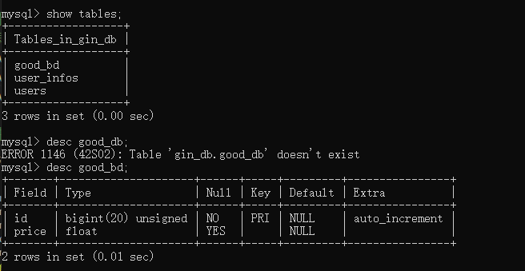


也可以通过`Table()`指定表名：

```go
// 使用User结构体创建名为`deleted_users`的表
db.Table("deleted_users").CreateTable(&User{})

var deleted_users []User
db.Table("deleted_users").Find(&deleted_users)
//// SELECT * FROM deleted_users;

db.Table("deleted_users").Where("name = ?", "royal_111").Delete()
//// DELETE FROM deleted_users WHERE name = 'royal_111';
```

GORM还支持更改默认表名称规则：

```go
gorm.DefaultTableNameHandler = func (db *gorm.DB, defaultTableName string) string  {
  return "sms_" + defaultTableName;  //默认所有表名前缀加上"sms_"
}   //只影响默认的表名规则
```

- **列名（Column Name）**

列名由字段名称进行下划线分割来生成

```go
type User struct {
  ID        uint      // column name is `id`
  Name      string    // column name is `name`
  Birthday  time.Time // column name is `birthday`
  CreatedAt time.Time // column name is `created_at`
}
```

可以使用结构体tag指定列名：

```go
type Animal struct {
  AnimalId    int64     `gorm:"column:beast_id"`         // set column name to `beast_id`
  Birthday    time.Time `gorm:"column:day_of_the_beast"` // set column name to `day_of_the_beast`
  Age         int64     `gorm:"column:age_of_the_beast"` // set column name to `age_of_the_beast`
}
```

- **CreatedAt**

如果模型有 `CreatedAt`字段，该字段的值将会是初次创建记录的时间。

```go
db.Create(&user) // `CreatedAt`将会是当前时间

// 可以使用`Update`方法来改变`CreateAt`的值
db.Model(&user).Update("CreatedAt", time.Now())
```

- **UpdatedAt**

如果模型有`UpdatedAt`字段，该字段的值将会是每次更新记录的时间。

```go
db.Save(&user) // `UpdatedAt`将会是当前时间

db.Model(&user).Update("name", "jinzhu") // `UpdatedAt`将会是当前时间
```

- **DeletedAt**

如果模型有`DeletedAt`字段，调用`Delete`删除该记录时，将会设置`DeletedAt`字段为当前时间，而不是直接将记录从数据库中删除。


### 13.CRUD

**[参考文档](https://www.liwenzhou.com/posts/Go/gorm-crud/)**不会更新

**[官方文档](https://gorm.io/zh_CN/docs/query.html)**

```go
var users []UserInfo
db.Debug().Find(&users)   //Debug()会在控制台打印对应的sql语句
fmt.Printf("%#v\n", users)
```

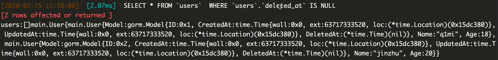

- Struct & Map查询

```go
// Struct
db.Where(&User{Name: "jinzhu", Age: 20}).First(&user)
//// SELECT * FROM users WHERE name = "jinzhu" AND age = 20 LIMIT 1;

// Map
db.Where(map[string]interface{}{"name": "jinzhu", "age": 20}).Find(&users)
//// SELECT * FROM users WHERE name = "jinzhu" AND age = 20;

// 主键的切片
db.Where([]int64{20, 21, 22}).Find(&users)
//// SELECT * FROM users WHERE id IN (20, 21, 22);
```

**提示：**当通过结构体进行查询时，GORM将会只通过非零值字段查询，这意味着如果你的字段值为`0`，`''`，`false`或者其他`零值`时，将不会被用于构建查询条件，例如：

```go
db.Where(&User{Name: "jinzhu", Age: 0}).Find(&users)
//// SELECT * FROM users WHERE name = "jinzhu";
```

你可以使用指针或实现 `Scanner/Valuer `接口来避免这个问题.

```go
// 使用指针
type User struct {
  gorm.Model
  Name string
  Age  *int
}

// 使用 Scanner/Valuer
type User struct {
  gorm.Model
  Name string
  Age  sql.NullInt64  // sql.NullInt64 实现了 Scanner/Valuer 接口
}
```

查询时的语句如下：

```go
// 使用 Scanner/Valuer
db.Where(&User{Name: "royal_111", Age: sql.NullInt64{0, true}}).Find(&users)

//使用指针   new(int)返回的是一个值为0的指针
db.Where(&User{Name: "royal_111", Age: new(int)}).Find(&users)
```

### 14.项目分级

> 所有变量，函数首字母大写才能导出（对外面的文件才可访问），即被别的go文件访问。

- controller：url进来之后执行的处理函数（hander函数），单独定义在controller文件夹里面，在controller里面又可以细分。
- dao：存放数据库的创建，关闭等操作
- models：存放所有的结构体模型，以及跟模型相关的增删改查操作。
- logic：写逻辑供controller层调用，logic又调用models里面的增删改查。（复杂业务逻辑才创建这一层）
- router：把路由，以及路由组放在这里面

```go
url      -> controller  -> logic  ->  model
请求来了   ->  控制器      ->业务逻辑 ->  模型层的增删改查
```

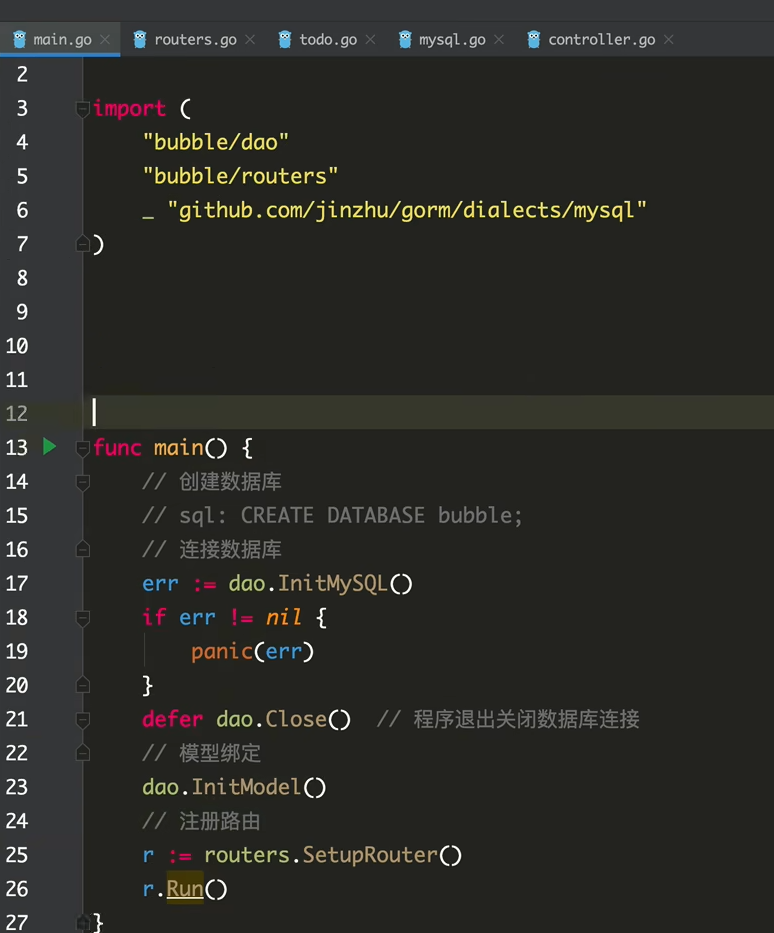
