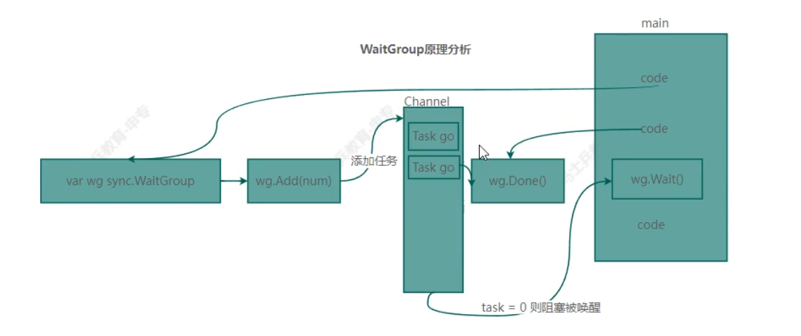
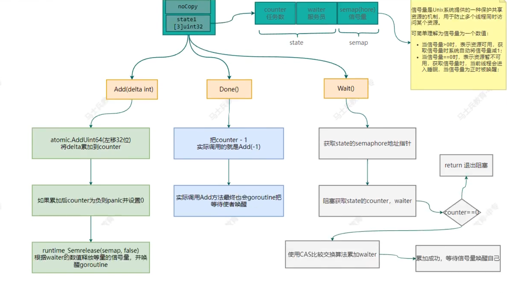

# Go并发编程

### 基本概念：

#### 进程Process与线程Thread

进程定义：进程是并发执行的程序中分配和管理资源的基本单位。

线程定义：线程是进程的执行单元，是进行调度的实体，是比进程更小的独立运行单位。

#### 并行Concurrent与并发Paralled

并发定义：多线程**交替**操作**同一**资源类

并行定义：多个线程**同时**操作**多个**资源类

### 协程goroutine的引入：

#### 协程的基本概念:

协程:

​		协程是单线程下的并发，又称微线程，纤程。它是实现多任务的另一种方式，只不过是比线程更小的执行单元。因为**它自带CPU的上下文**，这样只要在合适的时机，我们可以把一个协程切换到另一个协程。英文名Coroutine。

​		一句话说明什么是协程:轻量级的线程独立的栈空间，共享程序堆空间调度由用户控制是逻辑态，对资源消耗小

#### 线程和协程的区别:

​		线程的切换是一个Cpu在不同线程中来回切换，是从系统层面来，不止保存和恢复CPU上下文这么简单，会非常耗费性能。但是协程只是在同一个线程内来回切换不同的函数，只是简单的操作CPU的上下文，所以耗费的性能会大大减少。

​		golang的协程机制，可轻松开启上万个协程。其他语言并发机制一般基于线程（几千就封顶），开启过多资源耗费大。

#### 需求：(求素数)

统计1~1000000000的数字中 素数有多少个（哪些是素数）？

1.传统的做法：时间复杂度：`o(nlogn)`

```go
package main

import (
	"fmt"
	"time"
)

var (
	n     int = 100000000
	count int = 0
)

func is_prime(x int) bool {
	for i := 2; i <= x/i; i++ {
		if x%i == 0 {
			return false
		}
	}
	return true
}

func main() {
	start := time.Now()
	for i := 2; i <= n; i++ {
		if is_prime(i) {
			count++
		}
	}
	fmt.Printf("1~%d之间的素数有：%d个\n", n, count)
	fmt.Println("运行时间：", time.Since(start))
}
/*
1~100000000之间的素数有：5761455个
运行时间： 1m19.1418272s
*/
```

2.优化方式：1-100000000中的每个数都可以同时进行判断，互不影响，故可使用并发来做（但是不可能开这么多的协程，需要控制开的协程数量）：

```go
package main

import (
	"fmt"
	"sync"
	"time"
)

var (
	n               int = 100000000
	count           int = 0               //素数的总数量是多少
	workedCount     int = 0               //当前被计算了的数一共有多少个
	maxWorkerCount      = 200             //最大协程数量
	workCount           = 0               //当前协程数量
	workDone            = make(chan bool) //当前的goroutine协程是否工作结束
	workRequest         = make(chan int)  //当前有工作请求
	isAPrime            = make(chan bool) //当时这个数是素数，就往信道喊话
	workedCountChan     = make(chan bool)
	lock            sync.Mutex
)

func is_prime(x int, isAGoroutine bool) bool {
	for i := 2; i <= x/i; i++ {
		if x%i == 0 {
			if isAGoroutine {
				workDone <- true
			}
			workedCountChan <- true
			return false
		}
	}
	isAPrime <- true
	if isAGoroutine {
		workDone <- true
	}
	workedCountChan <- true
	return true
}

func waitForWorkers() {
	for {
		select {
		case number := <-workRequest:
			lock.Lock()
			workCount++
			lock.Unlock()
			go is_prime(number, true)

		case <-workDone:
			lock.Lock()
			workCount--
			lock.Unlock()
		case <-isAPrime:
			count++
		case <-workedCountChan:
			workedCount++
			if workedCount >= n-1 {
				return
			}
		}
	}
}

func do_task() {
	for i := 2; i <= n; i++ {
		lock.Lock()
		if workCount < maxWorkerCount {
			lock.Unlock()
			workRequest <- i
		} else {
			is_prime(i, false) //协程拉满了，就主线程自己做这个事情
		}
	}
}

func main() {
	start := time.Now()
	go do_task()
	waitForWorkers()
	fmt.Printf("1~%d之间的素数一共有%d个\n", n, count)
	fmt.Println("总共耗时：", time.Since(start))
}


// 效果反而变差了
/*
1~100000000之间的素数一共有5761455个
总共耗时： 2m23.4417799s
*/
/*
在你的修改后的代码中，使用了多个协程来执行判断素数的任务。然而，由于你的代码中使用了无缓冲通道，导致协程之间的通信会发生阻塞，从而降低了并发执行的效率。

在你的 is_prime 函数中，当一个数被判断为非素数时，你向 workDone 和 workedCountChan 通道发送了值。在 waitForWorkers 函数中，当接收到这些通道的值时，分别减少了 workCount 和增加了 workedCount 的计数。这种方式会导致在每个协程判断非素数时，都需要进行通信，而通信过程中会发生阻塞。

由于无缓冲通道的特性，发送和接收操作将会相互等待，直到有接收方准备好接收数据。这会导致协程之间的并发性降低，而且频繁地进行通信操作也会带来一定的开销。

为了改进代码的性能，你可以考虑使用带缓冲的通道来替代无缓冲通道，从而减少通信时的阻塞。另外，你还可以尝试调整协程的数量，以找到一个合适的平衡点，避免过多的协程切换和通信开销。
*/

```

正确的思路：

```go
package main

import (
	"fmt"
	// "sync"
	"time"
)

var (
	n              int = 100000000 //求1-n之间的素数数量
	maxWorkerCount int = 64        //最大允许这么多个协程
	count          int = 0
	// lock           sync.Mutex
)

func is_prime(x int) bool {
	for i := 2; i <= x/i; i++ {
		if x%i == 0 {
			return false
		}
	}
	return true
}

func producer(productNumber chan int, start time.Time) {
	for i := 2; i <= n; i++ {
		productNumber <- i
	}
    fmt.Println("producers结束：", time.Since(start))   
    //经过测试发现：如果productNumber的信道的缓冲大小为n，那么producer这个协程将不会被调度出来（不会被阻塞），会一直往信道里面把数据传完，然后直接退出：producers结束： 7.6641209s
    // 如果将其信道大小设为100000<n，那么当这个chan信道缓冲区被放满了后，就会被阻塞，切换到do_task协程来进行读，所以producer是走走停停，producers结束： 15.4005434s
    
	close(productNumber) //关闭信道
}

func do_task(productNumber chan int, workDone chan bool, isAPrime chan bool, start time.Time) {
	for number := range productNumber {
		if is_prime(number) {
			isAPrime <- true
		}
	}
    fmt.Println("协程结束：", time.Since(start))  //每个协程都会等待通道关闭，并且读完信道所有的数据后才会结束
	workDone <- true
}

func main() {
	//开启64个协程同时去做这件事
	start := time.Now()
	//先拿一个协程往信道里面放数
	var productNumber = make(chan int, 100000)
	var workDone = make(chan bool, maxWorkerCount)
	var isAPrime = make(chan bool, 100)
	go producer(productNumber, start)

	for i := 0; i < maxWorkerCount; i++ {
		go do_task(productNumber, workDone, isAPrime, start)
	}

	var workerDone = 0
	for {
		select {
		case <-workDone:
			workerDone++
			if workerDone >= maxWorkerCount {
				fmt.Printf("1~%d之间一共有%d个素数\n", n, count)
				fmt.Println("一共耗时：", time.Since(start))
				return
			}
		case <-isAPrime:
			count++
		}

	}
}
//chan信道开了缓存，会快，也免得多个协程频繁的来回切换，同时互相通信的协程阻塞率会降低，节省了时间开销
/*
producers结束： 15.4005434s
协程结束： 15.4282352s
协程结束： 15.4282352s
协程结束： 15.4282352s
协程结束： 15.4282352s
协程结束： 15.4282352s
协程结束： 15.4282352s
协程结束： 15.4282352s
协程结束： 15.4282352s
协程结束： 15.4282352s
协程结束： 15.4282352s
协程结束： 15.4282352s
协程结束： 15.4282352s
协程结束： 15.4282352s
协程结束： 15.4282352s
协程结束： 15.4282352s
协程结束： 15.4282352s
协程结束： 15.4282352s
协程结束： 15.4282352s
协程结束： 15.4282352s
协程结束： 15.4282352s
协程结束： 15.4282352s
协程结束： 15.4282352s
协程结束： 15.4282352s
协程结束： 15.4282352s
协程结束： 15.4282352s
协程结束： 15.4282352s
协程结束： 15.4282352s
协程结束： 15.4282352s
协程结束： 15.4282352s
协程结束： 15.4282352s
协程结束： 15.4282352s
协程结束： 15.4282352s
协程结束： 15.4282352s
协程结束： 15.4282352s
协程结束： 15.4282352s
协程结束： 15.4282352s
协程结束： 15.4282352s
协程结束： 15.4282352s
协程结束： 15.4282352s
协程结束： 15.4282352s
协程结束： 15.4282352s
协程结束： 15.4282352s
协程结束： 15.4282352s
协程结束： 15.4282352s
协程结束： 15.4282352s
协程结束： 15.4282352s
协程结束： 15.4282352s
协程结束： 15.4282352s
协程结束： 15.4282352s
协程结束： 15.4282352s
协程结束： 15.4282352s
协程结束： 15.4282352s
协程结束： 15.4282352s
协程结束： 15.4282352s
协程结束： 15.4282352s
协程结束： 15.4282352s
协程结束： 15.4282352s
协程结束： 15.4282352s
协程结束： 15.4282352s
协程结束： 15.4282352s
协程结束： 15.4282352s
协程结束： 15.4282352s
协程结束： 15.4282352s
协程结束： 15.4282352s
1~100000000之间一共有5761455个素数
一共耗时： 15.4282352s
*/

//chan无缓存，确实慢了，因为使用了无缓冲通道，导致协程之间的通信会发生阻塞
/*
1~100000000之间一共有5761455个素数
一共耗时： 29.8615647s
*/
```


#### 并发的安全问题：

多协程并发资源竞争的问题（同时读写一个资源）

​	案例：20个协程都要对计数器进行读写操作

```go
package main

// 20个协程都需要对计数器进行读写操作，会出现问题

// 第一种解决方案：对临界资源加锁
import (
	"fmt"
	"time"
)

var (
	counter int = 0
)

func work(x int) {
	counter++ //临界资源，不加互斥锁，很有可能多个goroutinea同时进行counter++，就不对
	fmt.Printf("i=%d开的协程：，此时计数器为%d\n", x, counter)
}

func main() {
	for i := 1; i <= 20; i++ {
		go work(i)
	}
	time.Sleep(time.Second * 2)
	fmt.Println("总共加了：", counter)
}

```


#### 问题的解决方案：

##### 		1.互斥锁

​				**全局变量（临界资源）** 通过加锁lock unlock的方法  达到线程安全

​				lock sync.Mutex

​				lock.Lock()  登使用完了临界资源就lock.Unlock()释放锁

```go
import "sync"
var lock sync.Mutex

func function () {
    //...
    lock.Lock()  //每个时刻只允许一个线程（协程）访问的资源，就需要先加锁
    //临界区
    lock.Unlock() //访问完后，就释放锁，供其它线程访问该临界区
    //...
}
```

​				加互斥锁：(缺点：无法知道临界区到底要执行多少时间才结束，可能主线程已经结束了，某些子线程还未结束)

```go
package main

// 20个协程都需要对计数器进行读写操作，会出现问题

// 第一种解决方案：对临界资源加锁
import (
	"fmt"
	"sync"
	"time"
)

var (
	counter int = 0
	lock    sync.Mutex
)

func work(x int) {
	lock.Lock()
	counter++ //临界资源，不加互斥锁，很有可能多个goroutinea同时进行counter++，就不对
	lock.Unlock()
	fmt.Printf("i=%d开的协程：，此时计数器为%d\n", x, counter)
}

func main() {
	for i := 1; i <= 20; i++ {
		go work(i)
	}
	time.Sleep(time.Second * 2)
    lock.Lock()
	fmt.Println("总共加了：", counter)  //这个也访问了临界资源，也可以加上锁
    lock.Unlock()
}

```

##### 		2.channel通道

chan本质就是一个数据结构-队列先进先出FIFO的规则﹐线程安全，多Goroutine访问不需要加锁，因为通道本身线程安全。

注意: channel是有类型的，定义存放的类型不能放不同类型。当然如果传空接口`interface{}`就能往里面放所有类型的数据

chan类型本身就是指针，用`fmt.Println(chan)`会直接得到该chan的地址

每往chan中写入一条数据，chan的长度len就会+1，每从chan中读出一条数据，chan的长度就会-1


###### 基本用法：

```go
package main

import (
	"fmt"
)

var (
	channel1 = make(chan int, 3)
)

func main() {
	//channel的基本用法
	for i := 1; i <= 3; i++ {
		channel1 <- i
		fmt.Println("channel1的当前长度：", len(channel1), "当前容量为：", cap(channel1))
	}
}
/*
channel1的当前长度： 1 当前容量为： 3
channel1的当前长度： 2 当前容量为： 3
channel1的当前长度： 3 当前容量为： 3
*/

package main

import (
	"fmt"
)

var (
	channel1 = make(chan int, 3)
)

func main() {
	//channel的基本用法
	for i := 1; i <= 3; i++ {
		channel1 <- i
	}
	for i := 1; i <= 3; i++ {
		fmt.Println(<-channel1)
	}
}
/*
1
2
3
*/
```

如果当前chan信道里面存的数据的数量已经超过其缓存cap大小，则会报错

```go
package main

import (
	"fmt"
)

var (
	channel1 = make(chan int, 3)
)

func main() {
	//channel的基本用法
	for i := 1; i <= 4; i++ {
		channel1 <- i
		fmt.Println("channel1的当前长度：", len(channel1), "当前容量为：", cap(channel1)) 
	}
}

/*
channel1的当前长度： 1 当前容量为： 3
channel1的当前长度： 2 当前容量为： 3
channel1的当前长度： 3 当前容量为： 3
fatal error: all goroutines are asleep - deadlock!

goroutine 1 [chan send]:   //goroutine 1 往信道传数据死锁
main.main()
        E:/Tools/GoWorks/src/workfile/channel/main.go:14 +0xed
exit status 2
*/
```

如果当前有线程还在监听信道，但是已经不会有任何goroutine往该信道传数据了，则该线程会被一直阻塞，即为死锁

```go
package main

var (
	channel1 = make(chan int, 3)
)

func main() {
	//channel的基本用法
	for i := 1; i <= 3; i++ {
		channel1 <- i
	}
	for i := 1; i <= 4; i++ {
		<-channel1
	}
}
/*
fatal error: all goroutines are asleep - deadlock!

goroutine 1 [chan receive]:  // goroutine 1 接收数据死锁，因为没有goroutine往信道喊话,传数据了
main.main()
        E:/Tools/GoWorks/src/workfile/channel/main.go:13 +0x51
exit status 2
*/
```

同一个信道chan想传输不同类型的数据，就把chan定义为空接口`interface{}`

```go
package main

import "fmt"

var (
	multiClassChan = make(chan interface{}, 3)
)

type dog struct { //结构体
	Name, Gender string
}

type mp map[string]int //字典

func main() {
	//channel的基本用法
	multiClassChan <- dog{Name: "xiaoxiao", Gender: "♂"}

	multiClassChan <- mp{"abc": 1}

	multiClassChan <- 5

	for i := 0; i < 3; i++ {
		if i == 0 {
			dogs := <-multiClassChan
			fmt.Println(dogs)
			// 报错，拿不到dogs的任何属性和方法
			// fmt.Println(dogs.Name, dogs.Gender)  //dogs.Name undefined (type interface{} has no field or method Name)

			//现在就可以了
			d := dogs.(dog)   //需要类型断言
			fmt.Println(d.Name, d.Gender)
		} else {
			fmt.Println(<-multiClassChan)
		}

	}
}


/*
{xiaoxiao ♂}
xiaoxiao ♂
map[abc:1]
5
*/
```

chan的循环遍历与关闭：

​	chan信道关闭之后是不能再写入的，否则：panic：send on closed channel

循环取chan里面的值：

```go
// 方法1：用for range循环取值前，需要发送方将此chan关闭：close(chanName)
close(chanName)
for message := range chanName{  //将已关闭chan中剩余的数据读完就结束循环
	//...
}
否则fatal error: all goroutines are asleep - deadlock

// 方法2：用for
close(chanName)
for {
    message, ok := <- chanName  //ok代表这个chan是否还可以正常通讯
    if !ok {  //如果ok为false，表明chan被关闭，此时你接收到的这条消息就会是这个chan的数据类型的初始值，如果这个chan传输的是string类型，则此时的message的只为""
        break
    }
    //...
}

// 方法2：用for
package main
import "fmt"
var (
	chan1 = make(chan string, 3)
)
func main() {
	for i := 0; i < 3; i++ {
		chan1 <- "hello"
	}
	close(chan1)
	for {
		message, ok := <-chan1
		if !ok {
			fmt.Println(message, len(message))
			break
		}
		fmt.Println(message, len(message))
	}
}
/*
hello 5
hello 5
hello 5
 0
*/

var (
	chan1 = make(chan int, 3)
)

func main() {
	for i := 0; i < 3; i++ {
		chan1 <- i + 1
	}
	close(chan1)
	for {
		message, ok := <-chan1
		if !ok {
			fmt.Println("not ok:", message)
			break
		}
		fmt.Println(message)
	}
}
/*
1
2
3
not ok: 0
*/

```

​	

###### Goroutine和Channel的结合应用：

​		实例：

​			1.开启一个writeData协程，向信道intChan中写入50个整数

​			2.开启一个readData协程，向信道intChan中读取writeData写入的数据

​			注意：读写操作的是同一个管道的数据。主线程需要等待两个协程完成了才能退出。

​			

​			代码实现：

```go
package main

import (
	"fmt"
)

var (
	maxCapture int = 50
	workDone       = make(chan bool) //所有协程工作完毕
)

func writeData(c chan int) { //信道本身就是地址，传的地址
	for i := 1; i <= maxCapture; i++ {
		c <- i
	}
	close(c)
}

func readData(c chan int) {
	for data := range c {
		fmt.Println(data)
	}
	//读完之后，通知一下main这个主线程
	workDone <- true
}

func main() {
	var intChan = make(chan int, maxCapture)
	go writeData(intChan)
	go readData(intChan)

    for { //main主线程持续监听workDone信道   //warning: should use for range instead of for { select {} }
		select {
		case <-workDone:
			return
		}
	}

}


//推荐做法
package main

import (
	"fmt"
)

var (
	maxCapture int = 50
	workDone       = make(chan bool) //所有协程工作完毕
)

func writeData(c chan int) { //信道本身就是地址，传的地址
	for i := 1; i <= maxCapture; i++ {
		c <- i
	}
	close(c)
}

func readData(c chan int) {
	for data := range c {
		fmt.Println(data)
	}
	//读完之后，通知一下main这个主线程
	workDone <- true
	close(workDone)
}

func main() {
	var intChan = make(chan int, maxCapture)
	go writeData(intChan)
	go readData(intChan)

	//for message := range workDone {  //和下面的代码等价
	//	fmt.Println(message)
	//}
    fmt.Println("主线程开始等待子协程的完成，主线程进入阻塞状态--------------")
    if <- workDone {  //如果信道另一端没有协程写入数据，则main这个主线程就会阻塞在这里，直到信道另一端有数据传入，就被激活
        fmt.Println("所有子协程均已完成，主线程结束--------------")
        return 
    }
}

/*
主线程开始等待子协程的完成，主线程进入阻塞状态--------------
...
所有子协程均已完成，主线程结束--------------
*/
```

###### chan相关测试：（缓冲区大小的不同）

- production信道没有缓冲区

```go
var (
	n          int = 10
	production     = make(chan int)
	Done           = make(chan bool)
)

func producer() {
	for i := 0; i < n; i++ {
		fmt.Println("生产了---------： ", i+1)
		production <- i + 1

	}

	close(production)
}

func consumer() {
	for data := range production {
		fmt.Println("消费了：", data)
	}
	Done <- true
}

func main() {
	go producer()
	go consumer()

	if <-Done {
		return
	}
}
/*
生产了---------：  1
生产了---------：  2
消费了： 1
消费了： 2
生产了---------：  3
生产了---------：  4
消费了： 3
消费了： 4
生产了---------：  5
生产了---------：  6
消费了： 5
消费了： 6
生产了---------：  7
生产了---------：  8
消费了： 7
消费了： 8
生产了---------：  9
生产了---------：  10
消费了： 9
消费了： 10
*/
```

- production信道的缓冲区大小为5：传输方会尽可能的把数据传输完（把信道的缓冲区占满），消费者才从信道中去取

```go
var (
	n          int = 10
	production     = make(chan int, 5)  //缓冲区大小为5
	Done           = make(chan bool)
)

func producer() {
	for i := 0; i < n; i++ {
		fmt.Println("生产了---------： ", i+1)
		production <- i + 1

	}

	close(production)
}

func consumer() {
	for data := range production {
		fmt.Println("消费了：", data)
	}
	Done <- true
}

func main() {
	go producer()
	go consumer()

	if <-Done {
		return
	}
}
/*
生产了---------：  1
生产了---------：  2
生产了---------：  3
生产了---------：  4
生产了---------：  5
生产了---------：  6
生产了---------：  7
消费了： 1
消费了： 2
消费了： 3
消费了： 4
消费了： 5
消费了： 6
消费了： 7
生产了---------：  8
生产了---------：  9
生产了---------：  10
消费了： 8
消费了： 9
消费了： 10
*/
```

- production信道缓冲区为10

```go
var (
	n          int = 10
	production     = make(chan int, n)
	Done           = make(chan bool)
)

func producer() {
	for i := 0; i < n; i++ {
		fmt.Println("生产了---------： ", i+1)
		production <- i + 1

	}

	close(production)
}

func consumer() {
	for data := range production {
		fmt.Println("消费了：", data)
	}
	Done <- true
}

func main() {
	go producer()
	go consumer()

	if <-Done {
		return
	}
}
/*
生产了---------：  1
生产了---------：  2
生产了---------：  3
生产了---------：  4
生产了---------：  5
生产了---------：  6
生产了---------：  7
生产了---------：  8
生产了---------：  9
生产了---------：  10
消费了： 1
消费了： 2
消费了： 3
消费了： 4
消费了： 5
消费了： 6
消费了： 7
消费了： 8
消费了： 9
消费了： 10
*/
```

#### defer匿名函数的捕获panic应用：

​		多个协程工作，如果有某个协程出问题，可能会有panic导致整个程序崩溃，为了防止整个程序因某个协程报错而崩溃，我们使用： defer匿名函数 + err:recover() 捕获panic

举例：

```go
package main

import (
	"fmt"
	"time"
)

func routine1() {
	for i := 0; i < 10; i++ {
		fmt.Println("输出：", i)
	}
}

func routine2(idx int) { 
	defer func() {
		if err := recover(); err != nil {  //捕获panic，不捕获就报错：panic: assignment to entry in nil map
			fmt.Println("routine2异常：", err)
		}
	}()

	var mp map[int]string
	// var mp map[int]string = make(map[int]string)

	mp[idx] = "hello"  // nil dereference in map update
	mp[idx+1] = "hello world"
	fmt.Println(mp[idx], mp[idx+1])
}

func main() {
	go routine1()
	go routine2(22)
	time.Sleep(time.Second)
}
/*
输出： 0
输出： 1
输出： 2
输出： 3
输出： 4
输出： 5
输出： 6
输出： 7
输出： 8
输出： 9
routine2异常： assignment to entry in nil map
*/

```

### golang并发编程综合应用：

#### 需求分析1:

​	生产者每秒生产一个商品，并通知物流公司取货

​	物流公司将商品运输到商铺

​	消费者阻塞等待商铺到货 需要消费10次商品

#### 代码实现1：


#### 定时任务+循环时钟：

```go
// 定时功能
func main() {
	fmt.Println("开始的时间：", time.Now().Format("2006-01-02 03:04:05PM"))
	timer := time.NewTimer(time.Second * 3)
	receive_time := <-timer.C
	fmt.Println("接收的时间点：", receive_time.Format("2006-01-02 03:04:05PM"))
	timer.Reset(time.Second) //可以重新记时1秒钟
	receive_time = <-timer.C
	fmt.Println("接收的时间点：", receive_time.Format("2006-01-02 03:04:05PM"))
}
/*
开始的时间： 2024-03-30 02:38:33PM
接收的时间点： 2024-03-30 02:38:36PM
接收的时间点： 2024-03-30 02:38:37PM
*/


// 循环时钟功能
func main() {
	ticker := time.NewTicker(time.Second * 2)
	var timeCnt int
	var stopChan = make(chan bool)
	go func() {
		for {
			time := <-ticker.C
			fmt.Println("当前时间：", time.Format("2006-01-02 03:04:05PM"))
			timeCnt++
			if timeCnt >= 3 {
				ticker.Stop()
				stopChan <- true
			}
		}
	}()

	if <-stopChan {
		fmt.Println("main end")
	}
}

/*
当前时间： 2024-03-30 02:18:42PM
当前时间： 2024-03-30 02:18:44PM
当前时间： 2024-03-30 02:18:46PM
main end
*/
```

#### 任务队列

sync包的WaitGroup实现了一个类似任务队列的结构。

可以向队列中加入任务，任务完成会移出，`Add()、Done()、Wait()`。

如果全部完成，队列会触发阻塞以阻止程序继续运行。

```go
func main() {
	ticker := time.NewTicker(time.Second * 2)
	var timeCnt int
	var waitGroup sync.WaitGroup
	waitGroup.Add(1)  //添加一个任务

	go func() {
        defer waitGroup.Done()  // 等价于waitGroup.Add(-1)  任务执行结束，让任务减一
		defer ticker.Stop()
		for {
			time := <-ticker.C
			fmt.Println("当前时间：", time.Format("2006-01-02 03:04:05PM"))
			timeCnt++
			if timeCnt >= 3 {
				return
			}
		}
	}()
	waitGroup.Wait()
	fmt.Println("main end")
}
/*
当前时间： 2024-03-30 02:27:09PM
当前时间： 2024-03-30 02:27:11PM
当前时间： 2024-03-30 02:27:13PM
main end
*/
```

### WaitGroup并发控制原理以及底层源码解读

WaitGroup是GoLang应用开发过程中经常使用的并发控制技术。

WaitGroup，可以理解为Wait Goroutine Group，即等待一组goroutine结束。比如某个goroutine需要等待其它几个goroutine全部完成，那么使用WaitGroup可以轻松实现。

#### 实现原理：



#### 底层源码：

​	信号量：是系统提供的一种**保护共享资源的机制**，用于**防止多个线程同时访问某个资源**。


