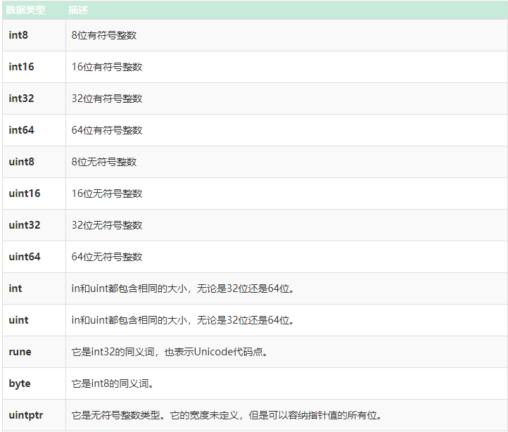
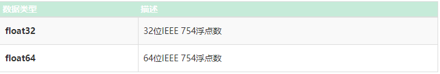
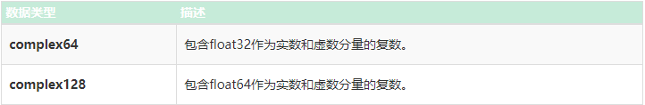

# Golang Tutorial

### 1.go安装

**优势：**快速开发和高性能。

**go编译器安装教程：（同时包含go入门教程，自行查看）**

```
https://www.cainiaoplus.com/golang/go-environment-install.html

https://www.liwenzhou.com/posts/Go/install/   (含有go mod init + 项目名)
```

安装完成打开cmd键入`go version`，返回如下信息：`go version go1.21.4 windows/amd64`

在cmd做一下相关配置：

1.键入`go env`查看相关配置

2.键入如下命令修改配置（默认的是：`set GO111MODULE=     set GOPROXY=https://proxy.golang.org,direct`）

```go
set GO111MODULE=on
set GOPROXY=https://goproxy.cn,direct
```

**后续我只更新与其它语言不一样的知识点**

### 2.基本知识点

#### 2.1标识符命名规则：

- 与`c/c++`一样，标识符由字母、数字和下划线组成，且只能以字母和下划线开头，不能以数字开头，关键字也不能做标识符。

- 在Go语言中，有一些预定义的标识符可用于常量，类型和函数。以下是预定义标识符列表：

```go
常量:
true, false, iota, nil

类型:
int, int8, int16, int32, int64, uint,
uint8, uint16, uint32, uint64, uintptr,
float32, float64, complex128, complex64,
bool, byte, rune, string, error

函数:
make, len, cap, new, append, copy, close, 
delete, complex, real, imag, panic, recover
```

#### 2.2关键字：

没啥讲的...

#### 2.3数据类型：

1. **基本类型：**数字，字符串和布尔值属于此类别。
2. **聚合类型：**数组和结构属于此类别。
3. **引用类型：**指针，切片，map集合，函数和Channel属于此类别。
4. **接口类型**

- **整数**



```go
// 整数举例
package main
import "fmt"

func main()
{
    var x uint8 = 225
    fmt.Printf("%d", x)
}
// 打印225
```

- **浮点数**



```go
// 浮点数举例
package main  
import "fmt"
         
func main() { 
    a := 20.45 
    b := 34.89 
      
    //两个浮点数相减
    c := b-a 
      
    //显示结果 
    fmt.Printf("结果: %f", c) 
      
    //显示c变量的类型
    fmt.Printf("\nc的类型是 : %T", c)   
}

// 输出：
// 结果: 14.440000
// c的类型是: float64
```

- **复数：**将复数分为两部分，如下表所示。`float32`和`float64`也是这些复数的一部分。



```go
//复数的使用 
package main 
import "fmt"
  
func main() { 
      
   var a complex128 = complex(6, 2) 
   var b complex64 = complex(9, 2) 
   fmt.Println(a) 
   fmt.Println(b) 
     
   //显示类型 
  fmt.Printf("a的类型是 %T 以及"+ "b的类型是 %T", a, b) 
}

// (6+2i)
// (9+2i)
// a的类型是 complex128 以及b的类型是 complex64
```

- **布尔类型：**布尔数据类型仅表示true或false。布尔类型的值不会隐式或显式转换为任何其他类型。

```go
//布尔值的使用
package main

import "fmt"

func main() {

    //变量
    str1 := "nhooo"
    str2 := "nhooo"
    str3 := "nhooo"
    result1 := str1 == str2
    result2 := str1 == str3

    //打印结果
    fmt.Println(result1)
    fmt.Println(result2)

    //显示result1和result2的类型
    fmt.Printf("result1 的类型是 %T ， "+"result2的类型是 %T", result1, result2)

}

// true
// true
// result1 的类型是 bool ， result2的类型是 bool
```

- **字符串：**字符串数据类型表示Unicode代码点的序列。换句话说，我们可以说一个字符串是不可变字节的序列，这意味着一旦创建了一个字符串，您就无法更改该字符串。

```go
//使用字符串
package main 
import "fmt"
  
func main() { 
      
    //用于存储字符串的str变量
   str := "nhooo"
     
   //显示字符串的长度
   fmt.Printf("字符串的长度:%d", len(str)) 
     
   //显示字符串 
   fmt.Printf("\n字符串是: %s", str) 
     
   // 显示str变量的类型
   fmt.Printf("\nstr的类型是: %T", str) 
}

// 字符串的长度:5
// 字符串是: nhooo
// str的类型是: string
```

#### 2.4变量

变量是通过两种方式创建的：

- 使用`var`关键字：语法为`var variable_name type = expression`，在上述语法中，变量类型`type`和`= expression`可以二删一，如果删除了类型`type`，则变量类型由表达式中的初值确定。

- 使用**短变量**声明：语法为`variable_name:= expression`，注意`:=`是声明，而`=`是赋值。在上面的表达式中，变量的类型由表达式的类型确定。

- **需要注意的是：**借助短变量声明操作符（：=），**您只能声明**仅具有块级作用域**的局部变量**。如果尝试使用short声明运算符声明全局变量，则会抛出错误消息。syntax error: non-declaration statement outside function body

```go
//方式一：
var name string = "hello"

//方式二：Go是一种静态类型的语言，但是它仍然提供了一种在声明变量的同时省略数据类型声明的功能，如以下语法所示。这通常称为类型推断。类似于c++的auto关键字
var name = "hello"    // fmt.Printf("%T", name)   打印string

//方式三：
var name string
name = "hello"

//方式四：在单个声明中声明相同类型的多个变量。在声明期间使用类型时，只允许声明多个相同类型的变量。
var myvariable1, myvariable2, myvariable3 int = 2, 454, 67

//方式五：在单个声明中声明不同类型的多个变量。变量的类型由初始化值确定。  在声明期间删除类型，您可以声明多个不同类型的变量。
var myvariable1, myvariable2, myvariable3 = 2, "GFG", 67.56

//方式六：使用多行使用var关键字声明和初始化不同类型的值
var(
     nhooo1 = 100
     nhooo2 = 200.57
     nhooo3 bool
     nhooo4 string = "hello"
)

//方式七：使用短变量声明，可以在单个声明中声明不同类型的多个变量。这些变量的类型由表达式确定。
myvariable1, myvariable2, myvariable3 := 800, 34.7, 56.9
myvariable1, myvariable2, myvariable3 := 800, "NHOOO", 47.56

// 打印格式控制符%t输出bool类型的变量，%T打印变量的数据类型
package main
import "fmt"
func main() {
	var (
		a int  = 1
		b      = "hello"
		c bool = false
		d bool = false
	)
	c = true
	fmt.Printf("%d\t%s\t%t\t%T\n", a, b, c, d) // 1	hello	true	bool
}

```

#### 2.5常量

- 使用关键字`const`声明：

```go
const PI = 3.14
const STR = "hello World"
```

#### 2.6运算符

- 按位运算符多一种：`&^`，按位清除运算符

```go
package main

import "fmt"

func main() {

	a := 3
	b, c, d, e := 0, 1, 2, 3
	res1, res2, res3, res4 := a&^b, a&^c, a&^d, a&^e     //把a中与bcde共有的bit 1减掉
	fmt.Printf("%d %d %d %d", res1, res2, res3, res4) // 3 2 1 0
    // res1, res2, res3, res4 := b&^a, c&^a, d&^a, e&^a
	// fmt.Printf("%d %d %d %d", res1, res2, res3, res4) // 0 0 0 0
}
```

- 杂项运算符：`&`：取地址运算符，`*`：指针运算符，和`c/c++`里面的作用一致。`<-`：该运算符的名称为接收。它用于从通道接收值。

#### 2.7类型转换

- c/c++,java之类的静态类型语言提供了对隐式类型转换的支持，但是**Golang不支持自动类型转换或隐式类型转换**。对于类型转换，必须执行**显式转换**。

显示转换的语法和c/c++也有一定区别，语法为：`type(val)`，其中`(val)`括号不可去掉，`type`可加上括号，如`(int32)(val)`，其中`val`为变量。

```go
var nhooo1 int = 845

// 显式类型转换举例
var nhooo2 float64 = float64(nhooo1)
var nhooo3 int64 = int64(nhooo1)
var nhooo4 uint = uint(nhooo1)

package main
import "fmt"
func main() {
	var a, b int = 1, 2
	c := float32(a)
	fmt.Printf("%f %T %d", c, a, b) //1.000000 int 2
}
```

### 3.控制语句

**代码块即使只有一行语句，也需要加花括号{}将代码块括起来**，c/c++的代码块只有一行语句，可以不用花括号{}括起来。

**注意事项：**

- 在if和for循环的表达式 不使用括号()。

- 花括号在if和for循环中是必需的。
- 左括号应与if和for语句所在的行相同。
- 如果数组，字符串，切片或map集合为空，则for循环不会抛出错误并继续其流程。换句话说，如果数组，字符串，切片或map为nil，则for循环的迭代次数为零。

#### 3.1条件语句（分支语句）

- if中的运算表达式**不加括号()**，c/c++需要加括号，其它的和c/c++一模一样。

```go
if a < b {  //花括号必须要, 并且左花括号{应与if或者for语句所在的行相同。
	c = b
} else { 
	c = a
}
```

#### 3.2循环语句

- for循环也**不加括号()**。

```go
for i:=0; i < 4; i ++ {
    fmt.Printf("%d ", i)
}
```

- 死循环写法，类似于`c/c++`的`while(1){...}`。

```go
for{
    ...
}
```

- for循环用作while循环。

```go
for i < 3 {
	...
}
// 等价
while i < 3 {
    
}
```

- 类似于python的zip循环，循环键值对：

```go
package main
import "fmt"
func main() {
	a := []string{"hello", "world", "baby"}
	for k, v := range a {
		fmt.Printf("%d %s\n", k, v)
	}
}
// 打印
/*
0 hello
1 world
2 baby
*/
```

- 对字符串使用for循环：

```go
package main
import "fmt"
func main() {
	var str string = "my wife is you?"
	for idx, ch := range str {
		fmt.Printf("%d %c\n", idx, ch)
	}
    // 等价写法
    var str string = "my wife is you?"
	var n int = len(str)
	for i := 0; i < n; i++ {
		fmt.Printf("%d %c\n", i, str[i])
	}
}
/*
0 m
1 y
2  
3 w
4 i
5 f
6 e
7  
8 i
9 s
10  
11 y
12 o
13 u
14 ?
*/
```

- 对于map使用for循环：for循环遍历map的键值对。

```go
package main

import "fmt"

func main() {
	mp := map[int]string{
		24:  "you",
		89:  "are",
		71:  "my",
		100: "wife",
	}
	for key, value := range mp {
		fmt.Printf("%d %s\n", key, value)
	}
}
/*
24 you
89 are
71 my
100 wife
*/
```

- **（待学习，现在看不懂2023.12.1）For通道： for循环可以遍历通道上发送的顺序值，直到关闭为止。 **

```go
package main

import "fmt"

func main() {

    // 使用 channel
    chnl := make(chan int)
    go func() {
        chnl <- 100
        chnl <- 1000
        chnl <- 10000
        chnl <- 100000
        close(chnl)
    }()
    for i := range chnl {
        fmt.Println(i)
    }

}
/*
100
1000
10000
100000
*/
```

#### 3.3循环控制语句

- goto用不上

```go
package main
import "fmt"
func main() {
	var i int = 0
index:
	for i < 5 {
		if i == 3 {
			i++
			goto index
		}
		fmt.Printf("%d\n", i)
		i++
	}
}
/*
0
1
2
4
*/
```

#### 3.4switch语句

三种常用方式：

```go
package main
import "fmt"
func main() {
	switch n := 2; n {
	case 1:
		fmt.Printf("111")
	case 2:
		fmt.Printf("222")
	case 3:
		fmt.Printf("333")
	default:
		fmt.Printf("444")
	}
}
/*
222
*/

package main
import "fmt"
func main() {
	var n int = 3
	switch n {
	case 1:
		fmt.Printf("111")
	case 2:
		fmt.Printf("222")
	case 3:
		fmt.Printf("333")
	default:
		fmt.Printf("444")
	}
}
/*
333
*/

package main
import "fmt"
func main() {
	var n int = 3
	switch {
	case n == 1:
		fmt.Printf("111")
	case n == 2:
		fmt.Printf("222")
	case n == 3:
		fmt.Printf("333")
	default:
		fmt.Printf("444")
	}
}
/*
333
*/
```

### 4.函数&方法

#### 4.1函数声明

语法：

```go
func function_name(parameter_list) (return_type) {
    ...
}
```

- **func：**它是Go语言的关键字，用于创建函数。

- **function_name：**它是**函数**的名称。

- **parameter_list：**包含函数参数的名称和类型。

- **return_type：**这是可选的，它包含**函数返回的值的类型**。如果在函数中使用return_type，则必须在函数中使用return语句。

```go
package main
import "fmt"
func area(width, height int) int {
	var area int
	area = width * height
	return area
}
func main() {
	fmt.Printf("%d\n", area(10, 12))  // 120
}

///////////////////////////
package main
import "fmt"
func swap(a *int, b *int) {
	t := *a
	*a = *b
	*b = t
}
func main() {
	a, b := 2, 3
	fmt.Printf("%d %d\n", a, b)
	swap(&a, &b)  //调用函数
	fmt.Printf("%d %d\n", a, b)
}
/*
2 3
3 2
*/
```

#### 4.2变参函数

**当我们使用可变参数函数时：**

- 当您要在函数中传递**切片**时，使用可变参数函数。
- 当我们**不知道参数的数量**时，使用可变参数函数。
- 在程序中使用可变参数函数时，它可以**增加程序的可读性**。

**定义：**允许用户在变参函数中传递零个或多个参数。其中`fmt.Printf`是可变参数函数的示例。

```go
package main
import (
	"fmt"
	"strings"
)
func joinstr(str ...string) string { //可变参数函数连接字符串
	return strings.Join(str, "")   // str其实就是一个切片，里面的元素都string类型
}
func main() {
	fmt.Printf("%s\n", joinstr("I", "love", "you"))
	fmt.Printf("%s\n", joinstr("A", "E", "I", "O", "U"))
}
/*
Iloveyou
AEIOU
*/
```

- 在可变参数函数的声明中，只能在最后一个参数的类型前面带有省略号`...`，它表明该函数可以调用任意数量的这种类型的参数。
- `...type`的行为类似于切片（`slice`）。例如，fun(b ...int)，现在`...int`等价于`[]int`。
- 还可以在可变参数函数中传递现有切片。
- 不能将可变参数用作返回值，但可以将其作为切片返回。

```go
package main

import "fmt"

func fun(a string, b ...int) {
	fmt.Printf("%s\n", a)
	fmt.Printf("%d\n", b)
}

func main() {

	fun("hello", 2, 3, 4)
}
/*
hello
[2 3 4]
*/
```

- 传入多个同类型的参数

```go
package main

import (
	"fmt"
	"strings"
)

func fun(a ...string) {
	fmt.Printf("%s\n", a)   //打印切片
	for idx, str := range a {
		fmt.Printf("%d %s\n", idx, str)
	}
	fmt.Printf("%s", strings.Join(a, "---"))   //切片中的字符串以---隔开
}

func main() {

	fun("hello", "royal_111")
}
/*
[hello royal_111]
0 hello
1 royal_111
hello---royal_111
*/
```

- 可变参数中传递一个切片

```go
package main

import (
	"fmt"
	"strings"
)

func fun(a ...string) {
	fmt.Printf("%s\n", a)
	for idx, str := range a {
		fmt.Printf("%d %s\n", idx, str)
	}
	fmt.Printf("%s", strings.Join(a, " "))
}

func main() {

    // 在可变函数中传递一个切片
	str := []string{"welcome", "royal_111", "to", "Go"}
	fun(str...)  // 注意传入切片的方式，后面加了...
}
/*
[welcome royal_111 to Go]
0 welcome
1 royal_111
2 to
3 Go
welcome royal_111 to Go
*/
```

#### 4.3匿名函数

定义：匿名函数是不包含任何名称的函数。当您要创建内联函数时，此函数很有用。匿名函数可以形成闭包。

语法：

```go
func(parameter_list) return_type {
    ...
    return
}()
```

注意：

1.可以将匿名函数分配给变量，变量的类型就是函数类型。可以像调用函数一样调用变量。

2.匿名函数还可以作为参数传递给其它函数，还可以从另一个函数返回匿名函数。

```go
package main
import "fmt"
func main() {
	func(str string) {
		fmt.Printf("%s\n", str)
	}("hello")
}
// hello


package main
import "fmt"
var my_function func(string) = func(str string) {  //匿名函数赋值给my_function变量
	fmt.Printf("%s\n", str)
}
func main() {
	my_function("hello")
	fmt.Printf("%T\n", my_function)
}
/*
hello
func(string)
*/

package main
import "fmt"
//匿名函数作为参数传递
func GFG(i func(p, q string) string) {
	fmt.Println(i("Geeks", "for"))
}
func main() {
	value := func(p, q string) string {
		return p + q + "Geeks"
	}
	GFG(value) //匿名函数作为参数传递
}
/*
GeeksforGeeks
*/
```

#### 4.4函数返回多个值

定义：允许一个return返回多个值。

语法：

```go
func function_name(parameter_list)(return_type_list) {  //(return_type_list)括号不要省略，养成习惯
    ...
    return 
}
```

```go
package main

import "fmt"

func math_function(a, b int) (int, int, int) {
	return a + b, a - b, a * b
}

func main() {
	a, b, c := math_function(2, 1)
	fmt.Printf("%d %d %d\n", a, b, c)
}
/*
3 1 2
*/
```

**为返回值命名：**在Go语言中，允许为返回值提供名称。你也可以在代码中使用这些变量名。没有必要用return语句来编写这些名称，因为Go编译器将自动理解这些变量必须被分派回去。这种类型的回报被称为**裸回报**。简单的返回减少了程序中的重复。

```go
package main

import "fmt"

func math_function(a, b int) (add, sub, mul int, res string) { //默认返回这四个变量
	add, sub, mul = a+b, a-b, a*b
	res = "OK"
	return   //裸返
}

func main() {
	a, b, c, res := math_function(2, 1)
	fmt.Printf("%d %d %d %s\n", a, b, c, res)
}
/*
3 1 2 OK
*/
```

#### 4.5空白标识符（下划线）

作用：Golang是一种更加简洁和可读的编程语言，因此它不允许程序员定义未使用的变量，如果你这样做，编译器将抛出一个错误。因此用**空白标识符`_`定义的变量可以不使用**，它告诉编译器不需要此变量，并且将其忽略而没有任何错误，**并且`_`不可用**。

```go
package main
import "fmt"
func main() {

	//调用函数
	//函数返回两个值
	//分配给mul和空白标识符
	mul, _ := mul_div(105, 7)

	//只使用mul变量
	fmt.Println("105 x 7 = ", mul)
}

func mul_div(n1 int, n2 int) (int, int) {
	//返回值
	return n1 * n2, n1 / n2
}
/*
105 x 7 =  735
*/
```

#### 4.6方法(method)

定义：Go方法与Go函数相似，但有一点不同，就是方法中包含一个接收者参数。在接收者参数的帮助下，该方法可以访问接收者的属性。在这里，接收方可以是结构类型或非结构类型。在代码中创建方法时，接收者和接收者类型的定义必须出现在同一个包中。而且不允许创建一个方法，其中的接收者类型已经在另一个包中定义，包括像int、string等内建类型。如果您尝试这样做，那么编译器将抛出错误。（好好理解）

**语法：**

```go
func(reciver_name Type) method_name(parameter_list)(return_type){
    // Code  //在此，可以在方法内访问接收器。
}
```

- **结构类型接收器的方法**：定义其接收者为结构类型的方法。可以在方法内部访问此接收器：

```go
package main

import "fmt"

// type 类似于c/c++的#define 自定义类型
type user struct {
	name   string
	age    int
	salary int
}

func (a user) show(pay int) (total_salary int) {
	fmt.Printf("my name is %s, i'm %d years old.\n", a.name, a.age)
	total_salary = pay + a.salary
	return
}

func main() {
	person := user{
		name:   "royal_111",
		age:    22,
		salary: 200000,
	}
	salary := person.show(100) //调用方法用.method()
	fmt.Printf("my salary is %d.\n", salary)
}
/*
my name is royal_111, i'm 22 years old.
my salary is 200100.
*/
```

- **非结构类型接收器的方法：**只要类型和方法定义存在于同一包中，就可以使用非结构类型接收器创建方法。如果它们存在于int，string等不同的包中，则编译器将抛出错误，因为它们是在不同的包中定义的。

```go
//说白了定义方法，就需要自定义接收器类型，不能使用int string这种在其它包中定义好的类型

//报错的举例：
package main

import "fmt"

func (a int) add(b int) (c int) { //cannot define new methods on non-local type int
	c = a + b
	return
}

func main() {
	a := 5
	fmt.Println(a.add(3))
}
/*
.\main.go:5:7: cannot define new methods on non-local type int
*/

//正确示范，应该自己定义接收者类型
package main

import "fmt"

type Integer int

func (a Integer) add(b Integer) (c Integer) { 
	c = a + b
	return
}

func main() {
	a := Integer(5)   //必须强转类型一致
	var b Integer = 4
	fmt.Println(a.add(3), b.add(6)) //5 + 3   4 + 6
}
/*
8 10
*/
```

- **方法可以接受指针和值：一点都不符合规范**。在Go中，当一个函数具有值参数时，它将仅接受参数的值，如果您尝试将指针传递给值函数，则它将不接受，反之亦然。**但是Go方法**可以接受**值和指针**，无论它是使用指针还是值接收器定义的。

```go
package main

import "fmt"

// Author 结构体
type author struct {
	name   string
	branch string
}

//带有指针的方法
//*author类型的接收者
func (a *author) show_1(abranch string) {
	(*a).branch = abranch
}

//带有值的方法
//author类型的接收者
func (a author) show_2() {
	a.name = "Gourav"
	fmt.Println("Author's name(Before) : ", a.name)
}

func main() {

	//初始化值
	//作者结构体
	res := author{
		name:   "Sona",
		branch: "CSE",
	}

	fmt.Println("Branch Name(Before): ", res.branch)

	//调用show_1方法
	//(&res).show_1("ECE")  这种符合规范
	res.show_1("ECE")
	fmt.Println("Branch Name(After): ", res.branch)

	//调用show_2方法
	//res.show_2()  这种符合规范
	(&res).show_2()
	fmt.Println("Author's name(After): ", res.name)
}
/*
Branch Name(Before):  CSE
Branch Name(After):  ECE
Author's name(Before) :  Gourav
Author's name(After):  Sona
*/
```


#### 4.7同名方法

定义：在Go语言中，允许在同一包中**创建两个或多个具有相同名称的方法**，但是这些方法的接收者**必须具有不同的类型**。该功能在Go**函数**中不可用，这意味着不允许您在同一包中创建相同名称的函数，如果尝试这样做，则编译器将抛出错误。

```go
package main

import "fmt"

//创建结构体
type student struct {
	name   string
	branch string
}

type teacher struct {
	language string
	marks    int
}

//名称相同的方法，但有不同类型的接收器
func (s student) show() {

	fmt.Println("学生姓名:", s.name)
	fmt.Println("Branch: ", s.branch)
}

func (t teacher) show() {

	fmt.Println("Language:", t.language)
	fmt.Println("Student Marks: ", t.marks)
}

func main() {

	// 初始化结构体的值
	val1 := student{"Rohit", "EEE"}

	val2 := teacher{"Java", 50}

	//调用方法
	val1.show()
	val2.show()
}
/*
在上面的示例中，我们有两个相同的名称方法，即show()，但接收器的类型不同。这里，第一个show()方法包含s student类型的接收者，第二个show()方法包含t teacher类型的接收者。在main()函数中，我们借助各自的结构体变量来调用这两种方法。如果尝试使用相同类型的接收器创建此show()方法，则编译器将抛出错误。

学生姓名: Rohit
Branch:  EEE
Language: Java
Student Marks:  50
*/
```

#### 4.8 Defer关键字

在Go语言中，defer语句会延迟[函数](https://www.cainiaoplus.com/golang/go-functions.html)或方法或[匿名方法](https://www.cainiaoplus.com/404.html)的执行，直到附近的函数返回为止。换句话说，延迟函数或方法调用参数会立即求值，但是它们会执行到附近的函数返回为止。您可以使用defer关键字创建延迟的方法，函数或匿名函数。

**语法：**

```go
// 函数
defer func func_name(parameter_list Type) return_type{
    // Code
}

// 方法
defer func (receiver Type) method_name(parameter_list){
    // Code
}

defer func (parameter_list)(return_type){
    // code
}()
```

**注意事项：**

- 在Go语言中，同一程序中允许多个defer语句，并且它们按**LIFO（后进先出）**顺序执行，如示例2所示。
- 在defer语句中，将在执行defer语句时（而不是在调用它们时）评估参数。
- defer语句通常用于确保在完成文件处理后关闭文件，关闭通道或捕获程序中的紧急情况。

```go
package main 
  
import "fmt"
  
// 函数
func add(a1, a2 int) int { 
    res := a1 + a2 
    fmt.Println("Result: ", res) 
    return 0 
} 
  
func main() { 
  
    fmt.Println("Start") 
  
    //多个延迟语句
    //以LIFO顺序执行
    defer fmt.Println("End") 
    defer add(34, 56) 
    defer add(10, 10) 
}
/*
Start
Result:  20
Result:  90
End
*/
```


### 5.结构体

#### 5.1基本概念

**不支持继承但支持组合的轻量级类**。

- 利用**type**自定义新类型，例如：`type my_integer int`，以后`my_integer`和`int`作用等价，类似`c/c++`的`#define`。

语法：

```go
type struct_name struct {
    ... //成员变量
}

//例如定义一个用户结构体
type User struct {
    username, password string
    age int
}

//声明一个用户类型的变量，默认情况下初值为""或0
var a User

//使用结构字面量User来初始化User类型的变量
var b = User{"royal_111", "123456", 22}

//还可以对部分成员变量初始化,其它未初始化的默认为对应的零
c := User{username:"royal", age:22}

var a User
a.age = 11

//访问User结构体的成员变量，用(.)运算符

```

- 指向结构体的指针引用成员变量和`c/c++`有一定区别，如下：

```go
package main

import (
	"fmt"
)

type User struct {
	username, password string
	age, salary        int
}

func main() {
	//定义一个指向User类型的结构体指针
	p := &User{"royal_111", "123456", 22, 300000}
	//传统的引用方法，显示的解引用
	fmt.Printf("%s %d\n", (*p).username, (*p).salary)

	//Golang为我们提供了非显示的引用成员变量
	fmt.Println(p.username, p.salary)
}
/*
royal_111 300000
royal_111 300000
*/
```

- 同类型的结构体变量判断是否相等可以直接使用`==`进行判断，也可以使用`reflect`包下的`DeepEqual()`函数。

```go
type User struct {
    username, password string
}

u1 := User{
    username:"royal"
    password:"123456"
}

u2 := User {
    username:"royal"
    password:"123456"
}

// ==
if u1 == u2 {
    ...
}

//DeeplyEquel()
if reflect.DeepEquel(u1, u2) {
    ...
}


package main
import (
	"fmt"
	"reflect"
)
type User struct {
	username, password string
	age, salary        int
}
func main() {
	u1 := User{"roayl", "123", 22, 123456}
	u2 := User{
		"roayl",
		"123",
		22,
		123456,
	}
	fmt.Println(reflect.DeepEqual(u1, u2), (u1 == u2))
}
/*
true true
*/
```

#### 5.2匿名结构体

- 匿名结构体

定义：没有名称的结构体。

语法：

```go
variable_name := struct {
	//成员变量
}{
	//对应的值
}
```

```go
package main

import (
	"fmt"
)

func main() {

	user := struct {
		username, password string
		age                int
	}{
		"royal", "123", 22,
	}
	
	fmt.Printf("%T\n", user)
	fmt.Println(user)
}
/*
struct { username string; password string; age int }
{royal 123 22}
*/
```

- **匿名字段**（成员变量）：在Go结构中，允许创建匿名字段。匿名字段是那些不包含任何名称的字段，你只需要提到字段的类型，然后Go就会自动使用该类型作为字段（成员变量）的名称。如下：

```go
package main

import (
	"fmt"
)

type User struct {
	username, password string  //命名字段
	int    //匿名字段
}

func main() {
	user := User{
		"royal", "123", 55,
	}
	fmt.Printf("%s %s %d\n", user.password, user.username, user.int)  //自动使用该类型作为成员变量的名称
}
/*
123 royal 55
*/
```

#### 5.3函数用作结构体字段(不重要)

- 我们知道在Go语言中函数也是用户定义的类型，所以你可以在Go结构体中创建一个函数字段（函数成员变量）。

```go
// 作为Go结构中的字段
package main
import "fmt"
// Finalsalary函数类型
type Finalsalary func(int, int) int
//创建结构
type Author struct {
	name      string
	language  string
	Marticles int
	Pay       int
	//函数作为字段
	salary Finalsalary
}
func main() {
	// 初始化字段结构
	result := Author{
		name:      "Sonia",
		language:  "Java",
		Marticles: 120,
		Pay:       500,
		salary: func(Ma int, pay int) int {
			return Ma * pay
		},
	}
	fmt.Println("作者姓名: ", result.name)
	fmt.Println("语言: ", result.language)
	fmt.Println("五月份发表的文章总数: ", result.Marticles)
	fmt.Println("每篇报酬: ", result.Pay)
	fmt.Println("总工资: ", result.salary(result.Marticles, result.Pay))
}
/*
作者姓名:  Sonia
语言:  Java
五月份发表的文章总数:  120
每篇报酬:  500
总工资:  60000
*/
```

### 6.切片&函数（重点）

#### 6.1数组

定义：存储一组同类型的数据，缺点：**固定长度**。

- 创建数组（两种方式）：

- **方法一：使用var关键字**：

```go
var arr_name [const_length]type
//例如：定义一个长度为100的整数数组a
var a [100]int   //var 名称 [大小]类型
```

```go
package main
import (
	"fmt"
)
func main() {
	var a [3]int
	for i := 0; i < len(a); i++ {
		a[i] = (i + 1) * (i + 1)
	}
	for _, v := range a {
		fmt.Printf("%d\n", v)
	}
}
/*
1
4
9
*/
```

- **方法二：简写声明，它比上面的声明更灵活**

```go
arr_name := [const_length]type{item1, item2, ...}

//定义一个长度为3的整数数组a，花括号{}不可省略，也可以部分初始化，未初始化元素的默认为0
a := [3]int{}
a := [3]int{1,2}

//无需写出长度
a := [...]int{-1, 0, 1, 0}
```

- 多维数组

```go
package main
import (
	"fmt"
)
const N = 3
func main() {
	//方式一var定义数组
	var a [N][N]int
	for i := 0; i < N; i++ {
		for j := 0; j < N; j++ {
			a[i][j] = i*N + j
		}
	}
	for k, v := range a {
		fmt.Printf("%d %d\n", k, v)
	}
	//方式二简写，部分初始化，其余默认为0
	b := [N][N]int{{1, 2, 3},
		{4, 5, 6},
	}
	for i := 0; i < N; i++ { //初始化第三行
		b[2][i] = 2*3 + i + 1
	}
	for _, arr := range b { //遍历每个一维数组
		for _, v := range arr { //遍历每个一维数组中的每一个元素
			fmt.Printf("%d\n", v)
		}
	}
}
/*
0 [0 1 2]
1 [3 4 5]
2 [6 7 8]
1
2
3
4
5
6
7
8
9
*/
```

- 在数组中，你可以使用`len()`函数获取数组的长度。
- 创建大小已确定的数组，根据其中元素的数量确定，使用省略号`...`，如下所示

```go
// 创建大小已确定的数组，根据其中元素的数量确定，使用省略号...，如下所示
a := [...]int{-1, 0, 1, 0}

a := []int{-1, 0, 1, 0}   //这是切片
len(a)  //4
```

- **将一个数组用等号赋值给另一个数组时，新数组发生改变并不会影响原数组，原数组依旧不变。在c++中，数组名代表首地址，而在go语言中，数组名不是引用类型。**

```go
package main

import (
	"fmt"
)

func main() {
	a := [...]int{-1, 0, 1, 0}
	b := a
	b[0] = 100  //对b数组改变，a数组不变
	fmt.Println(b, a)
}
/*
[100 0 1 0] [-1 0 1 0] 
*/


package main
import (
	"fmt"
)
func main() {
	var a [3]int //0 1 2
	for i := 0; i < 3; i++ {
		a[i] = i
	}
	b := a  
	b[0] = 100  //对b数组改变，a数组不变
	fmt.Println(b, a)
}
/*
[100 1 2] [0 1 2]
*/


package main
import (
	"fmt"
)
func main() {
	a := []int{-1, 0, 1, 0}   //创建的切片
	b := a
	b[0] = 100  //对b改变，a改变
	fmt.Println(b, a)
}
/*
[100 0 1 0] [100 0 1 0] 
*/
```

- 在数组中，如果数组的元素类型是可比较的，则数组类型也是可比较的。因此，**我们可以使用`==`运算符直接比较两个数组，前提是两个数组的类型和长度都必须一样，否则报错**。

#### 6.2数组复制

Golang没有提供将一个数组复制到另一个数组的特定内置函数。但是我们可以简单地通过值或引用将数组分配给新变量来创建数组的副本。

如果我们通过值创建数组的副本并在原始数组的值中进行了一些更改，则它不会反映在该数组的副本中。 而且，如果我们通过引用创建数组的副本，并对原始数组的值进行了一些更改，那么它将反映在该数组的副本中。

语法：

```go
//按值创建数组的副本，理解为两个不同的空间
arr := arr1  //类型一致

//通过引用创建数组的副本，理解为指向同一块地址，一个变，另一个跟着变
arr := &arr1  //但是他们类型不一致, arr是arr1类型的指针变量  例如 *[3]int   [3]int


package main
import (
	"fmt"
)
func main() {
	a := [3]int{1, 2, 3}
	b := &a
	b[0] = 10000000
	a[1] = 3333
	fmt.Printf("%T %T\n", b, a)  //类型不一致，不能判断==是否相等
	fmt.Println(b, a)
    fmt.Println(*b)    //解引用
    fmt.Println(a == *b)
}
/*

*[3]int [3]int
&[10000000 3333 3] [10000000 3333 3]
[10000000 3333 3]
true
*/
```

#### 6.3函数参数

**语法：**

```go
//对于指定大小的数组
func function_name(variable_name [size]type){
// Code
}

//对于无大小的数组（切片）
func function_name(variable_name []type){
// Code
}
```

**例如：**

```go
package main

import (
	"fmt"
)

func myfunc(a *[3]int) {
	a[0] = 11111
}
func main() {
	a := [3]int{1, 2, 3}
	myfunc(&a)
	fmt.Println(a)
}
/*
[11111 2 3]
*/


package main

import (
	"fmt"
)

func myfunc(a [3]int) {
	a[0] = 11111
}
func main() {
	a := [3]int{1, 2, 3}
	myfunc(a)
	fmt.Println(a)
}
/*
[1 2 3]
*/
```

#### 6.4切片(Slice)

在Go语言中，切片比数组更强大，灵活，方便，并且是轻量级的数据结构。slice是一个可变长度序列，用于存储相同类型的元素，不允许在同一slice中存储不同类型的元素。就像具有索引值和长度的数组一样，但是切片的大小可以调整，切片不像数组那样处于固定大小。在内部，切片和数组相互连接，切片是对基础数组的引用。允许在切片中存储重复元素。**切片中的第一个索引位置始终为0，而最后一个索引位置将为（切片的长度– 1）**。

- **切片声明（创建切片）：跟数组一样，但是有一个区别，即不允许您在方括号[]中指定切片的大小。因此它的长度可以根据需要增长或缩小。**

```go
//利用var
var a []int
//简写, 注意：切记，当您使用int数字创建切片时，它首先创建一个数组，然后返回对其的切片引用。
a := []int{1,2,3}
var a = []int{1,2,3}
```

- **切片的组成：**
- - **指针：**指针用于指向可通过切片访问的数组的第一个元素。在这里，指向的元素不必是数组的第一个元素。
- - **长度：**长度是数组中存在的元素总数。
- - **容量：**容量表示可以扩展的最大大小。

```go
// 切片
package main

import "fmt"

func main() {

	//创建一个数组
	arr := [7]string{"这", "是", "Golang", "基础", "教程", "在线", "111"}

	//显示数组
	fmt.Println("数组:", arr)

	//创建切片
	myslice := arr[1:6]

	//显示切片
	fmt.Println("切片:", myslice)

	//显示切片的长度
	fmt.Printf("切片长度: %d", len(myslice))

	//显示切片的容量
	fmt.Printf("\n切片容量: %d\n", cap(myslice))

	fmt.Printf("%T", myslice)
}
/*
数组: [这 是 Golang 基础 教程 在线 111]
切片: [是 Golang 基础 教程 在线]
切片长度: 5
切片容量: 6
[]string
*/

/*
用法解释：在上面的实例中，我们从给定的数组中创建一个切片。这里，片的指针指向索引1，因为片的下界被设置为1，所以它开始访问来自索引1的元素。切片的长度为5，表示切片中元素的总数为5，而切片6的容量表示最多可以存储6个元素。
*/
```

- **切片是数组的引用，也可以从给定的切片中创建切片**

```go
arr_name[low:high]  //切取数组下标从[low, high)之间的元素作为一个切片返回
slice_name[low:high]

//举例：
//创建切片
a := []int{90, 60, 40, 50, 34, 49, 30}
a[0:]
a[:]
a[1:2]
```

- **使用make()函数：**您还可以使用go库提供的*make()函数*创建切片。此函数采用三个参数，即类型，长度和容量。在此，**容量值是可选的**。它为底层数组分配的大小等于给定的容量，并返回一个切片，该切片引用底层数组。通常，make()函数用于创建一个空切片。在这里，空切片是包含空数组引用的那些切片。

```go
// 语法：
func make([]type, len, cap) []type          // 3个参数，类型、长度、容量（底层数组的长度）
```


- **创建和初始化切片：**

```go
// 1. 使用切片字面量
var slice_1 = []int{1, 2, 3}

// 2. 使用数组：切片是数组的引用，因此可以根据给定的数组创建切片
arr := [...]int{1, 2, 3}    //arr数组
slice_1 := arr[0:]   //[1, 2, 3]
slice_2 := arr[:2]   //[1, 2]
slice_3 := arr[:]    //[1, 2, 3]   下限默认值为0，上限默认值为切片中元素总量，即[:]与[0:3]等价

// 3. 使用已存在的切片
slice_origin := []int{1, 2, 3, 4}
slice_1 := slice_origin[0: 2]   // [1, 2]
slice_2 := slice_1[:1]   //[1]

// 4. 使用make()函数
sli := make([]int, 3, 7)
fmt.Printf("slice:%v\nlength=%d\ncapacity=%d\n", sli, len(sli), cap(sli))
/*
slice:[0 0 0]
length=3
capacity=7
*/

sli_2 := make([]int, 7)   //这个应该是常用的了
fmt.Printf("slice:%v\nlength=%d\ncapacity=%d\n", sli_2, len(sli_2), cap(sli_2))

/*
slice:[0 0 0 0 0 0 0]
length=7
capacity=7
*/

arr := [...]int{1, 2, 3, 4}
sli_3 := arr[2:3]
fmt.Printf("slice:%v\nlength=%d\ncapacity=%d\n", sli_3, len(sli_3), cap(sli_3))

/*
slice:[3]
length=1
capacity=2      //我理解的capacity是当前切片的开头位置到对应(引用)的底层数组最后一个位置之间的容量
*/
```

- **切片的要点：**

```go
// 1.零值切片：
var slice []string
fmt.Printf("Length = %d\n", len(myslice)) 
fmt.Printf("Capacity = %d ", cap(myslice))

/*
Length = 0
Capacity = 0
*/

// 2.修正Slice：修改Slice：正如我们已经知道slice是引用类型一样，它可以引用基础数组。因此，如果我们更改切片中的某些元素，则更改也应发生在引用数组中。换句话说，如果您对切片进行了任何更改，则切片也会反映在数组中
arr := [...]int{1, 2, 3, 4, 5}
myslice := arr[1:4]

fmt.Printf("%v\n%v\n", arr, myslice)
for i := 0; i < len(myslice); i++ {
	myslice[i] += 10
}
fmt.Printf("%v\n%v\n", arr, myslice)

/*
[1 2 3 4 5]
[2 3 4]
[1 12 13 14 5]
[12 13 14]
*/

// 3.切片的比较：在切片中，您只能使用==运算符检查给定切片是否存在。如果尝试在==运算符的帮助下比较两个切片，则会抛出错误
s1 := []int{12, 34, 56} 
var s2 []int
s3:= []int{23, 45, 66} 
// fmt.Println(s1==s3) //不能比较两个切片，会报错

//检查给定的片是否为nil
fmt.Println(s1 == nil)   //false
fmt.Println(s2 == nil)   //true

// 4.多维切片：多维切片与多维数组一样，只是切片不包含大小
s1 := [][]int{
	{1, 2},
	{3, 4},
	{5, 6},
}

fmt.Printf("%v", s1)  // [[1 2] [3 4] [5 6]]

// 5.切片排序：在Go语言中，可以对切片中存在的元素进行排序。  Go语言的标准库提供了sort包，其中包含用于对int，float64和字符串切片进行排序的不同类型的排序方法。 这些函数始终按升序对可用元素进行切片排序。
package main

import (
	"fmt"
	"sort"   //导入包
)

func main() {

	s1 := []string{"bc", "b", "abc", "Bc"}

	a := []int{3, 2, 7, 9}

	b := []float64{2, 7, 99.4, 7.001}

	sort.Strings(s1)
	sort.Ints(a)
	sort.Float64s(b)

	fmt.Println(s1, a, b)
}
/*
[Bc abc b bc] [2 3 7 9] [2 7 7.001 99.4]
*/
```

#### 6.5切片复制

在切片中，您可以使用Go语言提供的**copy()函数**将一个切片复制到另一个切片中。换句话说，通过copy()函数可以将一个切片的元素复制到另一切片中。

**语法：**src -> dst

```go
func copy(dst, src []type) int     //返回要复制的元素数量，为min(len(dst), len(src))
```

**举例：**

```go
package main

import "fmt"

func main() {

	//创建切片
	slc1 := []int{58, 69, 40, 45, 11, 56, 67, 21, 65}
	var slc2 []int  //nil切片
	slc3 := make([]int, 5)
	slc4 := []int{78, 50, 67, 77}

	//复制之前
	fmt.Println("Slice_1:", slc1)
	fmt.Println("Slice_2:", slc2)
	fmt.Println("Slice_3:", slc3)
	fmt.Println("Slice_4:", slc4)

	//复制切片
	copy_1 := copy(slc2, slc1)
	fmt.Println("\nSlice:", slc2)
	fmt.Println("复制的元素总数:", copy_1)

	copy_2 := copy(slc3, slc1)
	fmt.Println("\nSlice:", slc3)
	fmt.Println("复制的元素总数:", copy_2)

	copy_3 := copy(slc4, slc1)
	fmt.Println("\nSlice:", slc4)
	fmt.Println("复制的元素总数:", copy_3)

	//这里不要混淆，因为在上面
	//复制了slc4的代码行
	//并因此进行永久修改，即
	// slc 4包含[58 69 40 45]
	copy_4 := copy(slc1, slc4)
	fmt.Println("\nSlice:", slc1)
	fmt.Println("复制的元素总数:", copy_4)
}

/*
Slice_1: [58 69 40 45 11 56 67 21 65]
Slice_2: []
Slice_3: [0 0 0 0 0]
Slice_4: [78 50 67 77]

Slice: []
复制的元素总数: 0

Slice: [58 69 40 45 11]
复制的元素总数: 5

Slice: [58 69 40 45]
复制的元素总数: 4

Slice: [58 69 40 45 11 56 67 21 65]
复制的元素总数: 4
*/
```

#### 6.6切片作为函数参数

切片将按值与切片的容量，长度一起传递给函数，并且切片的指针始终指向基础数组。 因此，如果我们对通过值传递给函数的切片进行了一些更改，则会反映在函数外部存在的切片中。

```go
package main

import "fmt"

func change(b []int) int {  //切片指针总是指向相同的引用（相同的底层数组）
	b[2] = 100000
	return len(b)
}

func main() {

	a := []int{1, 2, 3, 4, 5}
	length := change(a)
	fmt.Printf("%d %v\n", length, a)

}
/*
5 [1 2 100000 4 5]
*/
```

```go
package main

import "fmt"

func change(b []int) {
	b = append(b, 1000)  //该添加操作未影响原数切片
	fmt.Println(b)
}

func main() {

	a := []int{1, 2, 3, 4, 5}
	change(a)
	fmt.Printf("%v\n", a)

}
/*
[1 2 3 4 5 1000]
[1 2 3 4 5]
*/
```

#### 6.7切片比较

在Go语言中，切片比数组更强大，灵活，方便，并且是轻量级的数据结构。在Go切片中，可以使用**Compare()**函数将两个**字节类型**（可以理解为字符）的切片彼此进行**比较**。此函数返回一个整数值，该整数值表示这些切片相等或不相等，并且这些值是：

- 如果结果为0，则slice_1 == slice_2。
- 如果结果为-1，则slice_1 <slice_2。
- 如果结果为+1，则slice_1> slice_2。

该函数在bytes包下定义，因此，您必须在程序中导入bytes包才能访问Compare函数。

**语法：**

```go
func Compare(slice_1, slice_2 []byte) int
```

```go
// 比较两个字节切片
package main

import (
	"bytes"
	"fmt"
)

func main() {

	//使用简写声明创建和初始化字节切片

	slice_1 := []byte{'G', 'E', 'E', 'K', 'S'}
	slice_2 := []byte{'G', 'E', 'e', 'K', 'S'}

	//比较切片

	//使用Compare函数
	res := bytes.Compare(slice_1, slice_2)

	if res == 0 {
		fmt.Println("!..切片相等..!")
	} else {
		fmt.Println(res)
		fmt.Println("!..切片不相等..!")
	}
}

/*
-1
!..切片不相等..!
*/
```

#### 6.8切片排序

Go语言使您可以根据切片的类型对切片的元素进行排序。因此，使用以下函数对int类型切片进行排序。这些函数在sort包下定义，因此，您必须在程序中导入sort包才能访问这些函数：

- **1.**整数**：**此函数仅用于对整数切片进行排序，并按升序对切片中的元素进行排序。

**语法：**

```go
func Ints(slc []int)     //slc为整数切片
```

```go
//对整数进行排序
package main 
   
import ( 
    "fmt"
    "sort"
) 
   
// Main function 
func main() { 
       
    //使用简写声明，创建和初始化切片
    scl1 := []int{400, 600, 100, 300, 500, 200, 900} 
    scl2 := []int{-23, 567, -34, 67, 0, 12, -5} 
       
    //显示切片
    fmt.Println("Slices(Before):") 
    fmt.Println("Slice 1: ", scl1) 
    fmt.Println("Slice 2: ", scl2) 
       
    //对整数切片进行排序

//使用Ints函数
    sort.Ints (scl1) 
    sort.Ints (scl2) 
       
    //显示结果
    fmt.Println("\nSlices(After):") 
    fmt.Println("Slice 1 : ", scl1) 
    fmt.Println("Slice 2 : ",scl2) 
}
/*
Slices(Before):
Slice 1:  [400 600 100 300 500 200 900]
Slice 2:  [-23 567 -34 67 0 12 -5]

Slices(After):
Slice 1 :  [100 200 300 400 500 600 900]
Slice 2 :  [-34 -23 -5 0 12 67 567]
*/
```

- **2. IntsAreSorted：**此函数用于检查给定的int切片是否为排序形式（按升序排列）。如果切片为排序形式，则此方法返回true；否则，如果切片未为排序形式，则返回false。

**语法：**

```go
func IntsAreSorted(slc []int) bool
```

```go
//Go程序说明如何检查
//给定的int切片是否已排序
package main

import (
    "fmt"
    "sort"
)

func main() {

    //创建和初始化切片

    //使用简写声明
    scl1 := []int{100, 200, 300, 400, 500, 600, 700}
    scl2 := []int{-23, 567, -34, 67, 0, 12, -5}

    //显示切片
    fmt.Println("Slices:")
    fmt.Println("切片1: ", scl1)
    fmt.Println("切片2: ", scl2)

    //检查切片是否为排序形式

    //使用IntsAreSorted函数
    res1 := sort.IntsAreSorted(scl1)
    res2 := sort.IntsAreSorted(scl2)

    //显示结果
    fmt.Println("\nResult:")
    fmt.Println("切片1是否已排序?: ", res1)
    fmt.Println("切片2是否已排序?: ", res2)
}

/*
Slices:
切片1:  [100 200 300 400 500 600 700]
切片2:  [-23 567 -34 67 0 12 -5]

Result:
切片1是否已排序?:  true
切片2是否已排序?:  false
*/
```

#### 6.9切片分割


### 7.字符串(String)（重点）

> 在Go语言中，字符串不同于其他语言，如Java、c++、Python等。它是一个变宽字符序列，其中每个字符都用UTF-8编码的一个或多个字节表示。或者换句话说，字符串是任意字节(包括值为零的字节)的不可变链，或者字符串是一个只读字节片，字符串的字节可以使用UTF-8编码在Unicode文本中表示。
>
> 由于采用UTF-8编码，Golang字符串可以包含文本，文本是世界上任何语言的混合，而不会造成页面的混乱和限制。通常，字符串用*双引号\*””\*引起来*，如以下示例所示：

```go
str1 := "hello royal_111, welcome to Go!!!"

var str2 string
str2 = "thanks"
```

- **注意：**字符串可以为空，但不能为nil。

- **字符串字面量：**

- - 1.使用双引号""    在这里，字符串字面量使用双引号（“”）创建。此类字符串**支持转义字符**，如下表所示，但**不跨越多行**。这种类型的字符串文字在Golang程序中被广泛使用。
  - 2.使用反引号（``）    此处，字符串文字是使用反引号创建的，也称为**raw literals**(原始文本)。原始文本**不支持**转义字符，**可以跨越多行**，并且可以包含除反引号之外的任何字符。通常，它用于在正则表达式和HTML中编写多行消息。  

```go
package main

import (
	"fmt"
)

func main() {

	a := "hello,royal_111"
	//添加转义字符
	b := "hello,\nroyal_111"

	//使用反引号
	c := `hello,royal_111`

	//原始文本，不转义
	d := `hello,\nroyal`
	fmt.Printf("%s\n%s\n%s\n%s\n", a, b, c, d)
}

/*
hello,royal_111
hello,
royal_111
hello,royal_111
hello,\nroyal
*/
```

#### 7.1字符串的要点

- **字符串是不可变的：**在Go语言中，一旦创建了字符串，则字符串是不可变的，无法更改字符串的值。换句话说，字符串是只读的。如果尝试更改，则编译器将引发错误。

- **如何遍历字符串？：**您可以使用for range循环遍历字符串。此循环可以在Unicode代码点上迭代一个字符串。

```go
for idx, ch := range str {
    //...
}


package main
import (
	"fmt"
)
func main() {

	str := "Imissyou"
	for idx, ch := range str {
		fmt.Printf("%c的下标是%d\n", ch, idx)
	}
}
/*
I的下标是0
m的下标是1
i的下标是2
s的下标是3
s的下标是4
y的下标是5
o的下标是6
u的下标是7
*/
```

- **如何从切片创建字符串？**

```go
//从切片创建一个字符串 
package main 
  
import "fmt"
  
func main() { 
  
    //创建和初始化一个字节片
    myslice1 := []byte{0x47, 0x65, 0x65, 0x6b, 0x73} 
  
    //从切片创建字符串
    mystring1 := string(myslice1) 
  
    //显示字符串
    fmt.Println("String 1: ", mystring1) 
  
    //创建和初始化一个符文切片 
    myslice2 := []rune{0x0047, 0x0065, 0x0065, 0x006b, 0x0073} 
  
    //从切片创建字符串
    mystring2 := string(myslice2) 
  
    //显示字符串
    fmt.Println("String 2: ", mystring2) 
}
/*
String 1:  Geeks
String 2:  Geeks
*/
```

- **如何查找字符串的长度？：**在Golang字符串中，可以使用两个函数（一个是**len()**，另一个是**RuneCountInString()）**来找到字符串的长度。UTF-8包提供了RuneCountInString()函数，该函数返回字符串中存在的符文总数。*len()*函数返回字符串的字节数。

```go
//查找字符串的长度
package main

import (
    "fmt"
    "unicode/utf8"
)

func main() {

    //创建和初始化字符串
    //使用简写声明
    mystr := "Welcome to nhooo ??????"

    //查找字符串的长度
    //使用len()函数
    length1 := len(mystr)

    //使用RuneCountInString()函数
    length2 := utf8.RuneCountInString(mystr)

    //显示字符串的长度
    fmt.Println("string:", mystr)
    fmt.Println("Length 1:", length1)
    fmt.Println("Length 2:", length2)

}
/*
string: Welcome to nhooo ??????
Length 1: 31
Length 2: 31
*/
```

#### 7.2 字符串比较

- **1.使用比较运算符：**即*==，！=，> =，<=，<，>*。跟`c/c++`类似。

- **2.使用Compare()函数：**您还可以使用`strings`包提供的内置函数`Compare()`比较两个字符串。在比较两个字符串后，此函数返回整数值。返回值为：
  - 如果*str1 == str2*，则返回0 。
  - 如果*str1> str2*，返回1 。
  - 如果*str1 <str2，*返回-1 。

**语法：**

```go
func Compare(str1, str2 string) int
```

```go
// 查找字符串的长度
package main

import (
	"fmt"
	"strings"
)

func main() {

	a := "hello"
	b := "hello"
	c := "royal"
	d := `roYal`

	fmt.Println(strings.Compare(a, b))
	fmt.Println(strings.Compare(c, d))
	fmt.Println(strings.Compare(a, d))
}
/*
0
1
-1
*/
```

#### 7.3字符串拼接

- 1.使用`+`连接即可。

- **2.使用bytes.Buffer：**您还可以通过使用bytes.Buffer和WriteString()方法来连接字符串的字节来创建字符串。 它在字节包下定义。 它可以防止生成不必要的字符串对象，这意味着它不会从两个或多个字符串中生成新的字符串（如+运算符）。

```go
// 在WriteString()函数中使用bytes.Buffer
package main

import (
	"bytes"
	"fmt"
)

func main() {

	//创建和初始化字符串
	//使用bytes.Buffer与
	// WriteString()函数
	var b bytes.Buffer

	b.WriteString("G")
	b.WriteString("e")
	b.WriteString("e")
	b.WriteString("k")
	b.WriteString("s")

	fmt.Println("String: ", b.String())

	b.WriteString("f")
	b.WriteString("o")
	b.WriteString("r")
	b.WriteString("G")
	b.WriteString("e")
	b.WriteString("e")
	b.WriteString("k")
	b.WriteString("s")

	fmt.Println("String: ", b.String())

}
/*
String:  Geeks
String:  GeeksforGeeks
*/
```

- **3.使用Sprintf：**在Go语言中，您还可以使用*Sprintf()*方法连接字符串。

```go
package main

import (
	"fmt"
	// "strings"
)

func main() {
	c := "hello"
	d := "royal_111"
	s := fmt.Sprintf("%s %s", c, d)

	fmt.Printf("%s", s)
}
/*
hello royal_111
*/
```

- **4.使用Join()函数：**此函数将字符串切片中存在的所有元素连接为单个字符串。此函数在`strings`包中可用。

语法：

```go
func Join(str []string, sep string) string
```

```go
package main

import (
	"fmt"
	"strings"
)

func main() {
	var slice = []string{"hello", "royal_111"}
	fmt.Printf("%s", strings.Join(slice, "-"))
}
/*
hello-royal_111
*/
```

#### 7.4字符串修剪(下面的函数都在strings包中)

- **1.Trim：**此函数用于修剪此函数中指定的所有**前导和后缀**Unicode代码点的字符串。

  **语法：**

```go
func Trim(str string, cutstr string) string         //cutstr表示要删掉的元素包含哪些字符
```

```go
package main

import (
	"fmt"
	"strings"
)

func main() {
	str := ">>>I @love& you, you know.????&@"
	fmt.Printf("%s", strings.Trim(str, ">@&?"))  //只能删掉字符串的前缀和后缀包含的这些cutstr
}
/*
I @love& you, you know.
*/
```

- **2. TrimLeft：**此函数用于修剪字符串的左侧（在函数中指定）Unicode代码点。

**语法：**

```go
func TrimLeft(str string, cutstr string) string
```

在这里，*str*表示当前字符串，而*cutstr*表示要在给定字符串中修剪的**左侧**元素。

- **3. TrimRight：**此函数用于修剪字符串的右侧（在函数中指定）Unicode代码点。

**语法：**

```go
func TrimRight(str string, cutstr string) string
```

在这里，*str*表示当前字符串，而*cutstr*表示要在给定字符串中修剪的**右侧**元素。

- **4. TrimSpace：**此函数用于修剪指定字符串中的所有**前导和尾随**空白（空格）。

**语法：**

```go
func TrimSpace(str string) string
```

```go
package main

import (
	"fmt"
	"strings"
)

func main() {
	str := "    I love you, baby.  "
	fmt.Printf("%s", strings.TrimSpace(str))
}
/*
I love you, baby.
*/
```

- **5. TrimSuffix：**此方法用于修剪给定字符串中的尾随后缀字符串。如果给定的字符串不包含指定的后缀字符串，则此函数将返回原始字符串，而不进行任何更改。

**语法：**

```go
func TrimSuffix(str, suffstr string) string
```

在这里，*str*表示原始字符串，*suffstr*表示**后缀**字符串。

- **6. TrimPrefix：**此方法用于从给定字符串中修剪**前导前缀**字符串。如果给定的字符串不包含指定的前缀字符串，则此函数将返回原始字符串，而不进行任何更改。

**语法：**

```go
func TrimPrefix(str, suffstr string) string
```

```go
package main

import (
	"fmt"
	"strings"
)

func main() {
	str := "I love you, baby."
	fmt.Printf("%s\n%s\n", strings.TrimPrefix(str, "I"), strings.TrimSuffix(str, "baby."))
}
/*
 love you, baby.
I love you,
*/
```

#### 7.5字符串分割

- **1.Split：**此函数将字符串拆分为由给定分隔符分隔的所有子字符串，并返回包含这些子字符串的切片。

**语法：**

```
func Split(str, sep string) []string
```

在这里，str是字符串，sep是分隔符。 如果str不包含给定的sep且sep为非空，则它将返回长度为1的切片，其中仅包含str。 或者，如果sep为空，则它将在每个UTF-8序列之后拆分。 或者，如果str和sep均为空，则它将返回一个空切片。

```go
package main

import (
	"fmt"
	"strings"
)

func main() {

	//创建和初始化字符串
	str1 := "Welcome, to the, online portal, of nhooo"
	str2 := "My dog name is Dollar"
	str3 := "I like to play Ludo"

	//显示字符串
	fmt.Println("String 1: ", str1)
	fmt.Println("String 2: ", str2)
	fmt.Println("String 3: ", str3)

	//拆分给定的字符串
	//使用Split()函数
	res1 := strings.Split(str1, ",")
	res2 := strings.Split(str2, "")
	res3 := strings.Split(str3, "!")
	res4 := strings.Split("", "nhooo, geeks")

	// 显示结果
	fmt.Println("\nResult 1: ", res1)
	fmt.Println("Result 2: ", res2)
	fmt.Println("Result 3: ", res3)
	fmt.Println("Result 4: ", res4)
}
/*
String 1:  Welcome, to the, online portal, of nhooo
String 2:  My dog name is Dollar
String 3:  I like to play Ludo

Result 1:  [Welcome  to the  online portal  of nhooo]
Result 2:  [M y   d o g   n a m e   i s   D o l l a r]
Result 3:  [I like to play Ludo]
Result 4:  []
*/
```

- **2. SplitAfter：**此函数在给定分隔符的每个实例之后将字符串拆分为所有子字符串，并返回包含这些子字符串的切片。

  **语法：**

  ```go
  func SplitAfter(str, sep string) []string
  ```

  在这里，str是字符串，sep是分隔符。 如果str不包含给定的sep且sep为非空，则它将返回长度为1的切片，其中仅包含str。 或者，如果sep为空，则它将在每个UTF-8序列之后拆分。 或者，如果str和sep均为空，则它将返回一个空切片。

```go
package main

import (
	"fmt"
	"strings"
)

func main() {

	//创建和初始化字符串
	str1 := "Welcome, to the, online portal, of nhooo"
	str2 := "My dog name is Dollar"
	str3 := "I like to play Ludo"

	//显示字符串
	fmt.Println("String 1: ", str1)
	fmt.Println("String 2: ", str2)
	fmt.Println("String 3: ", str3)

	//拆分给定的字符串
	//使用SplitAfter()函数
	res1 := strings.SplitAfter(str1, ",")  //每个分割的子字符串尾巴上加上","
	res2 := strings.SplitAfter(str2, "")
	res3 := strings.SplitAfter(str3, " ")
	res4 := strings.SplitAfter("", "nhooo, geeks")

	//显示结果
	fmt.Println("\nResult 1: ", res1)
	fmt.Println("Result 2: ", res2)
	fmt.Println("Result 3: ", res3)
	fmt.Println("Result 4: ", res4)

}
/*
String 1:  Welcome, to the, online portal, of nhooo
String 2:  My dog name is Dollar
String 3:  I like to play Ludo

Result 1:  [Welcome,  to the,  online portal,  of nhooo]
Result 2:  [M y   d o g   n a m e   i s   D o l l a r]
Result 3:  [I  like  to  play  Ludo]
Result 4:  []
*/
```

#### 7.6判断是否包含子串（时间复杂度不知道是多少？内部实现？？？）

在Go字符串中，可以使用给定的函数检查字符串中存在的给定字符。这些函数在字符串包下定义，因此您必须在程序中导入字符串包才能访问这些函数：

- **1.Contains：**此函数用于检查给定字符串中是否存在给定字符。如果字符存在于给定的字符串中，则它将返回true，否则返回false。

**语法：**

```go
func Contains(str, chstr string) bool
```

在这里，*str*是原始字符串，而*chstr*是您要检查的字符串。让我们借助示例来讨论这个概念：

示例:

```go
//字符串中是否存在
//指定的字符串
package main

import (
    "fmt"
    "strings"
)

func main() {

    //创建和初始化字符串
    str1 := "Welcome to Nhooo for Nhooo "
    str2 := "Here! we learn about go strings"

    fmt.Println("原来的字符串")
    fmt.Println("String 1: ", str1)
    fmt.Println("String 2: ", str2)

    //检查字符串是否存在
    //使用Contains()函数
    res1 := strings.Contains(str1, "Nhooo")
    res2 := strings.Contains(str2, "GFG")

    //显示结果
    fmt.Println("\nResult 1: ", res1)
    fmt.Println("Result 2: ", res2)

}
```

**输出：**

```go
原来的字符串
String 1:  Welcome to Nhooo for Nhooo
String 2:  Here! we learn about go strings

Result 1:  true
Result 2:  false
```

 

- **2. ContainsAny：**此函数用于检查给定字符串(str)中是否存在 charstr 中的任何Unicode字符。如果给定字符串(str)中有 charstr 中的任何Unicode字符，则此方法返回true，否则返回false。

**语法：**

```go
func ContainsAny(str, charstr string) bool
```

在这里，*str* 是原始字符串，*charstr* 是chars中的Unicode字符。让我们借助示例来讨论这个概念：

示例

```go
//字符串存在或不存在指定字串
package main

import (
    "fmt"
    "strings"
)

func main() {

    //创建和初始化字符串
    str1 := "Welcome to Geeks for Geeks"
    str2 := "Here! we learn about go strings"

    //检查字符串是否存在
    //使用ContainsAny()函数
    res1 := strings.ContainsAny(str1, "Geeks")
    res2 := strings.ContainsAny(str2, "GFG")
    res3 := strings.ContainsAny("nhooo", "G & f")
    res4 := strings.ContainsAny("nhooo", "u | e")
    res5 := strings.ContainsAny(" ", " ")
    res6 := strings.ContainsAny("nhooo", " ")

    //显示结果
    fmt.Println("\nResult 1: ", res1)
    fmt.Println("Result 2: ", res2)
    fmt.Println("Result 3: ", res3)
    fmt.Println("Result 4: ", res4)
    fmt.Println("Result 5: ", res5)
    fmt.Println("Result 6: ", res6)

}
```

**输出：**

```go
Result 1:  true
Result 2:  false
Result 3:  false
Result 4:  false
Result 5:  true
Result 6:  false
```

#### 7.7查找字符串索引（时间复杂度未知，内部实现？？？）

- **1.Index：**此函数用于从原始字符串中查找给定字符串的第一个实例的索引值。如果给定的字符串在原始字符串中不存在，则此方法将返回-1。

**语法：**

```go
func Index(str, sbstr string) int
```

在这里，*str*是原始字符串，*sbstr*是我们要查找索引值的字符串。

- **2. IndexAny：**此方法从原始字符串中的chars返回任何Unicode码的第一个实例的索引值。如果原始字符中没有来自chars的Unicode代码点，则此方法将返回-1。

**语法：**

```go
func IndexAny(str, charstr string) int
```

在这里，*str*是原始字符串，*charstr*是chars的Unicode代码点，我们想要查找索引值。

- **3. IndexByte：**此函数返回原始字符串中给定字节的第一个实例的索引。如果给定的字节在原始字符串中不存在，则此方法将返回-1。

**语法：**

```go
func IndexByte(str string, b byte) int   //byte就是字符，例如：'c'
```

在这里，*str*是原始字符串，*b*是一个字节，我们要查找其索引值。

#### 7.8(重点)：读取一行字符串

- 读一行字符串

```go
package main

import (
    "fmt"
    "os"
    "bufio"
)

func main() {
    s, _ := bufio.NewReader(os.Stdin).ReadString('\n')   //读入一行字符串
    fmt.Println(len(s))
}

// 输入：I love Beijing.
/*
15
*/
```

- `fmt.Scanf`  `fmt.Scan`等读数据不会自动清除最后的换行，更通用的读入：（好像有问题）

```go
package main
import (
	."fmt"
    "os"
    "bufio"
)
func main() {
    reader := bufio.NewReader(os.Stdin)
    //随便定义一个类型的变量
    var ch string
    Fscan(reader, &ch)
}
```

